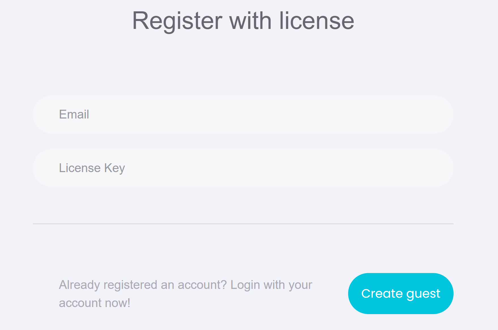

# Registration
[TOC]

## Register with MakerCloud with Authorization Code
 Registering with MakerCloud using an Authorization Code  
[https://makercloud.scaleinnotech.com/]()  
{:width="60%"}

Select “Register Account with Authorization Code”  
{:width="60%"}

Enter “Email Address” and “Authorization Code”，then click “Create Guest Account”  
It is recommended to use a Google email address, it will be more convenient in the future
{:width="60%"}

After successfully creating an account, you can view the details of the authorization code  
{:width="40%"}

## Register with MakerCloud with the Activity Code
Go to the MakerCloud homepage and click "Register Account"
[https://makercloud.scaleinnotech.com/]()  
{:width="60%"}

Select "Register Account with Activity Code"  
{:width="60%"}

Enter “Email Address” and “Authorization Code”，then click “Create Guest Account”  
It is recommended to use a Google email address, it will be more convenient in the future
{:width="60%"}

After successfully creating an account, you can view the details of the activity code  
{:width="40%"}

## Changing the Password
If you registered with a Google Account, just log in with Google on the homepage, no need to change your password

{:width="60%"}

Non-Google users can open the menu on the avatar in the corner
{:width="60%"}

If you do not have an existing password, leave the "existing password" blank for the first time  
{:width="60%"}

## Log in to MakerCloud
If you register with a Google account, just log in with Google on the homepage, no password is required

{:width="60%"}

For non-Google users, you can enter your username, email address and password to log in  
{:width="60%"}