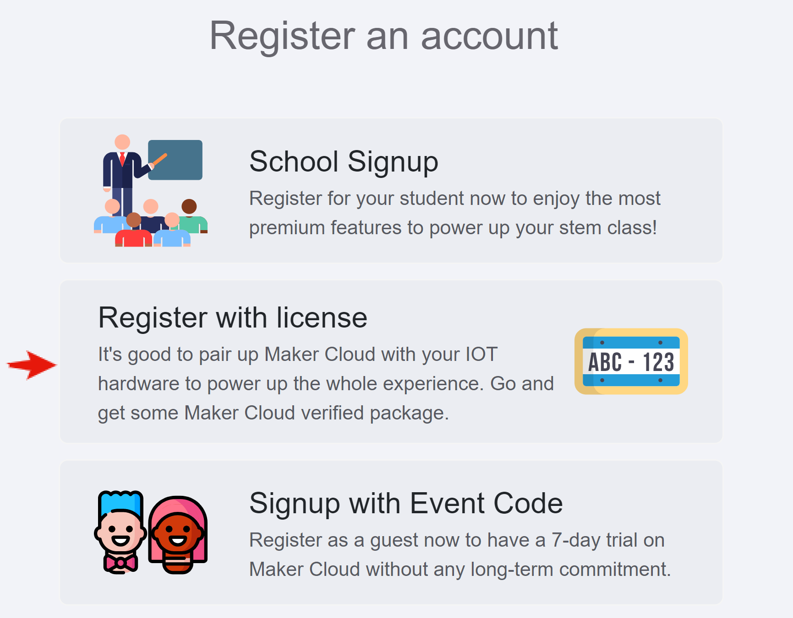
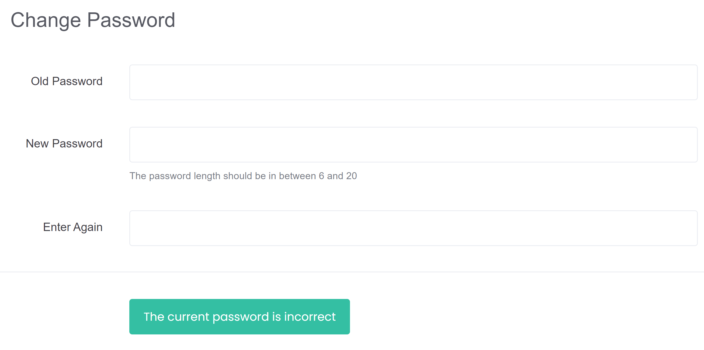

# Registration
[TOC]

## Registering with MakerCloud with an Authorization Code
 Registering with MakerCloud using an Authorization Code  
[https://makercloud.scaleinnotech.com/]()

{:width="60%"}

Select “Register Account with Authorization Code”

{:width="60%"}

Enter your “Email” and “License Key”，then click “Create Guest”  
We recommend using a Google email address, it will be more convenient in the future

{:width="60%"}

After successfully creating an account, you can view the details of the authorization code

{:width="40%"}

## Registering with MakerCloud with an Activity Code
Go to the MakerCloud homepage and click "Register an Account"
[https://makercloud.scaleinnotech.com/]()

{:width="60%"}

Select "Register Account with Activity Code"

{:width="60%"}

Enter your “Email” and “Event Code”，then click “Create Guest”  
It is recommended to use a Google email address, it will be more convenient in the future

{:width="60%"}

After successfully creating an account, you can view the details of the activity code

{:width="40%"}

## Changing Your Password
If you registered with a Google Account, just log in with Google on the homepage, no need to change your password

{:width="60%"}

Non-Google users can access the "Change Password" button by clicking on the avatar in the upper right corner

{:width="60%"}

If you do not have an existing password, leave the "old password" blank for the first time

{:width="60%"}

## Logging in to MakerCloud
If you registered with a Google account, just log in with Google on the homepage, no password is required

{:width="60%"}

Non-Google users can enter their email address and password to log in

{:width="60%"}