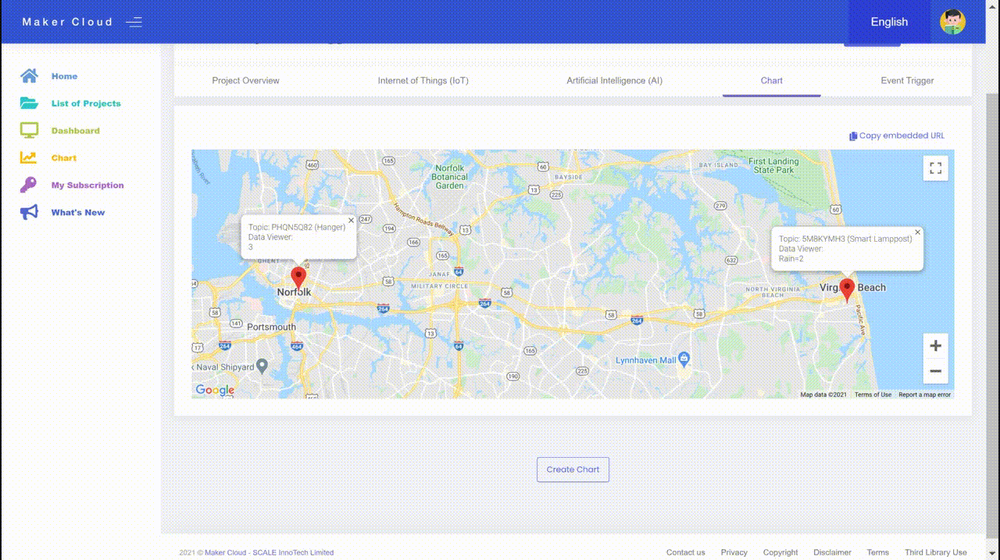
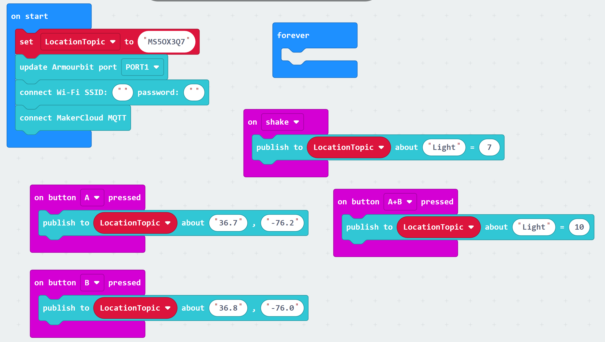
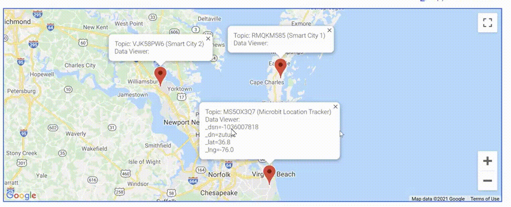
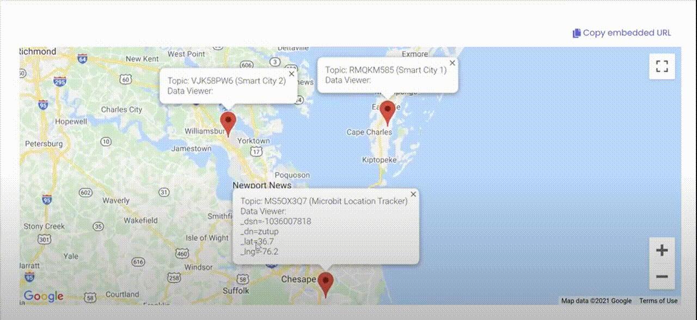

# Exploring the Location Based Features of MakerCloud

[TOC]

Using MakerCloud's location features, users can record and monitor the locations of their topics, and view their topic locations and data through an automatically created map in MakerCloud.

### Recording Topic Location

- Go to a project in MakerCloud, and enter the IoT homepage. Scroll down to the map.
- There you can update the topic by navigating around the map and clicking where you want your topic to be virtually located.

###### If you complete these steps with more than one topic on the same project, you can view all of their locations.
- Go to the "Chart" Tab in your Project. You will be able to see the topics, as well as any data that those topics receive.
- For example, you can see smart lamppost data when it is being published.

### Exercise: Changing location from Microbit
#### Goal: To use the buttons on your micro:bit to update the location information on MakerCloud, and view the location changes in MakerCloud

#### Preparation on MakerCloud and with micro:bit
Create a project, topic and data type.
Connect your micro:bit to the KittenWifi, Armourbit and battery pack.

#### Programming on MakeCode
You are going to program your microbit to send three different locations to MakerCloud.
- First have the connection code
- Then create a variable that is called "LocationTopic". 
- In the "On Start" block, set it to the name of your topic that you can copy in MakerCloud.
- Then, add four input blocks (when button A, button B,button A+B is pressed, and when the microbit is shook).
- In these input blocks, add two latitude/longitude location updates, and two publishing key-value message blocks to the data type you created.

Once you download the program to your micro:bit, you should see the location updating in the chart feature.

