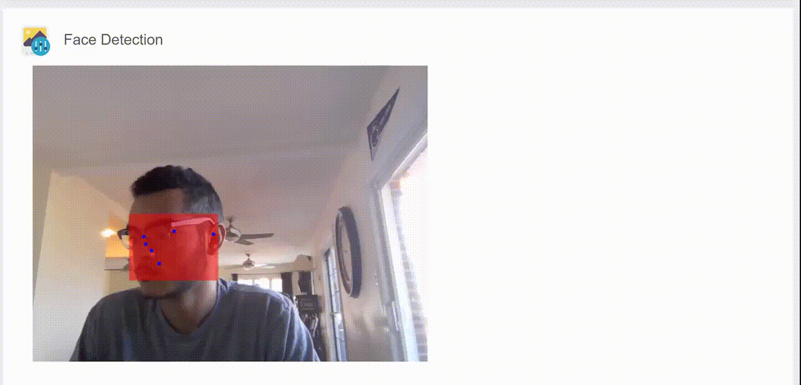
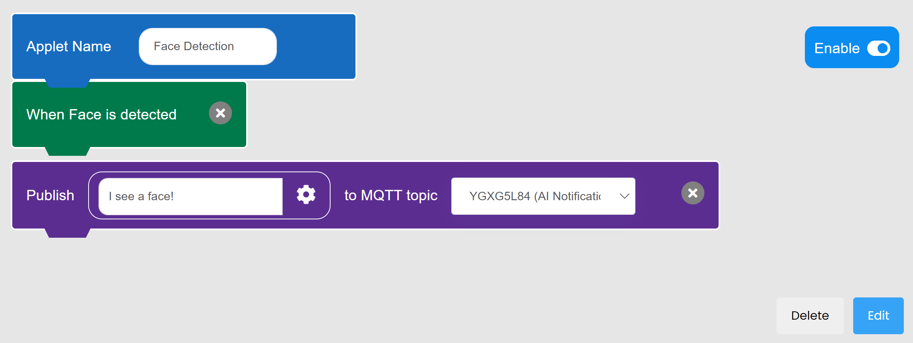
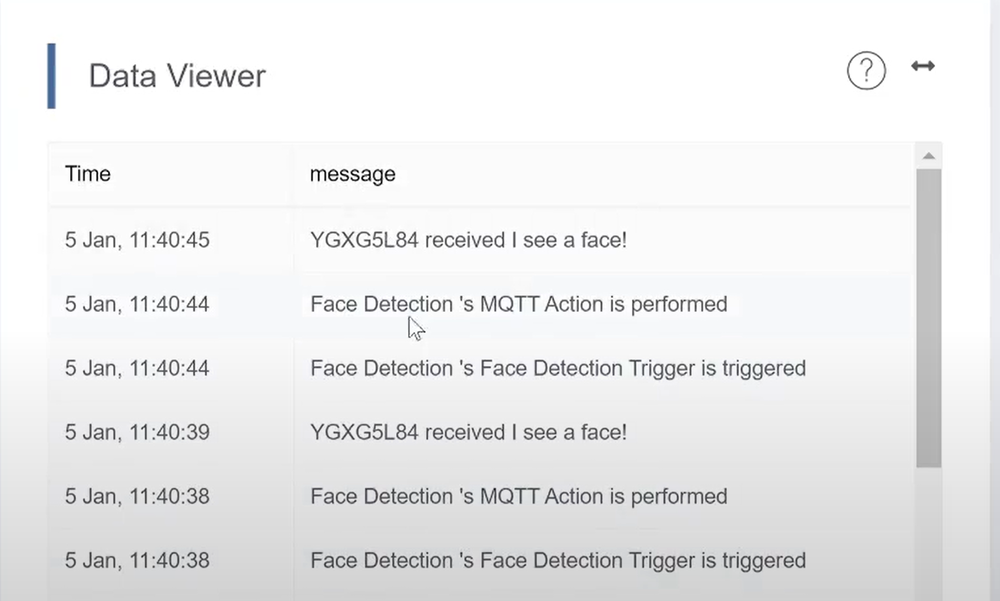

# Exploring MakerCloud's AI Face Detection Feature

[TOC]

## Using AI Face Detection

- MakerCloud uses AI and your computer's camera to analyze your face and pinpoint your eyes, ears, nose and mouth. It superimposes dots over those parts of your face on the screen.
- This illustrates the ability of AI to analyze images and learn about the human face.
- Here is a demonstration. Notice that it still puts a dot over where both ears are even when it can only see one.

## Exercise: Using Face Detection with Event Trigger

#### Goal:
- To Make an Event Trigger Applet that sends an MQTT message when AI on MakerCloud detects a Face

#### Instructions:
1. Create a project and topic in MakerCloud
2. Create a new event trigger applet in your project
3. Add an AI Face Detection trigger
4. Add an MQTT action that sends a notification message to the topic you created
5. It should look like this

When you use Face Detection in MakerCloud with this applet enabled, your data viewer receive messages like this:

