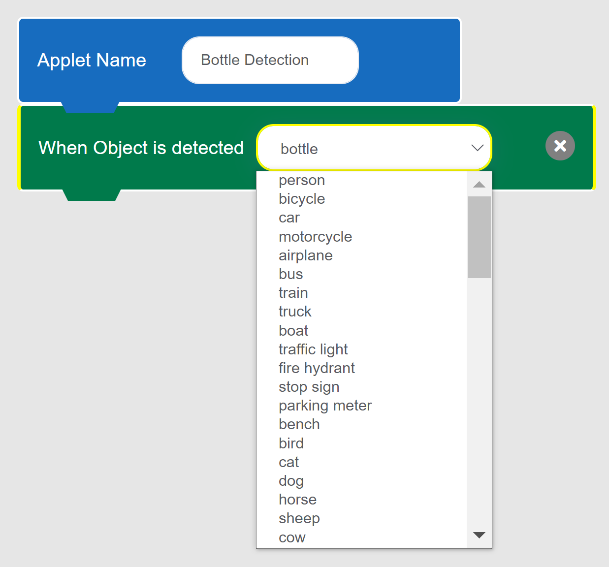
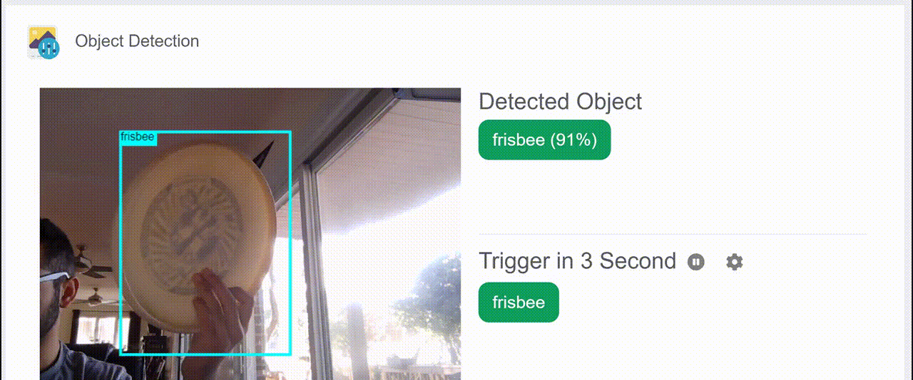
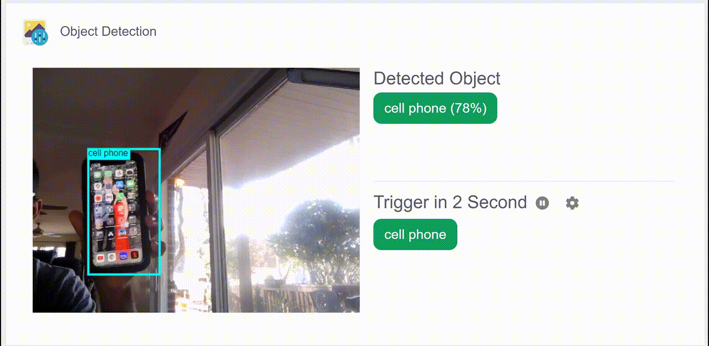
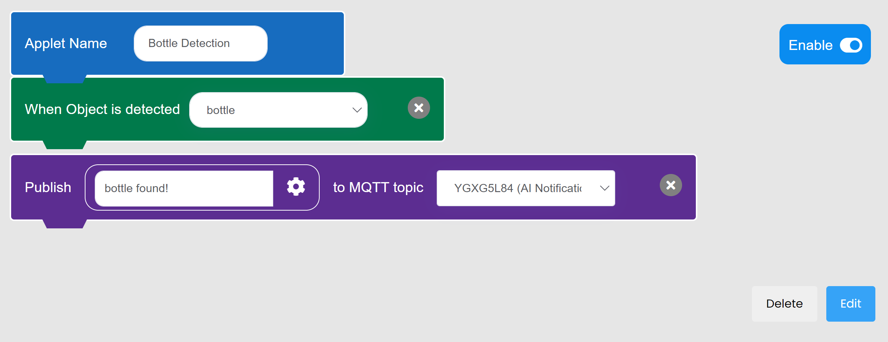
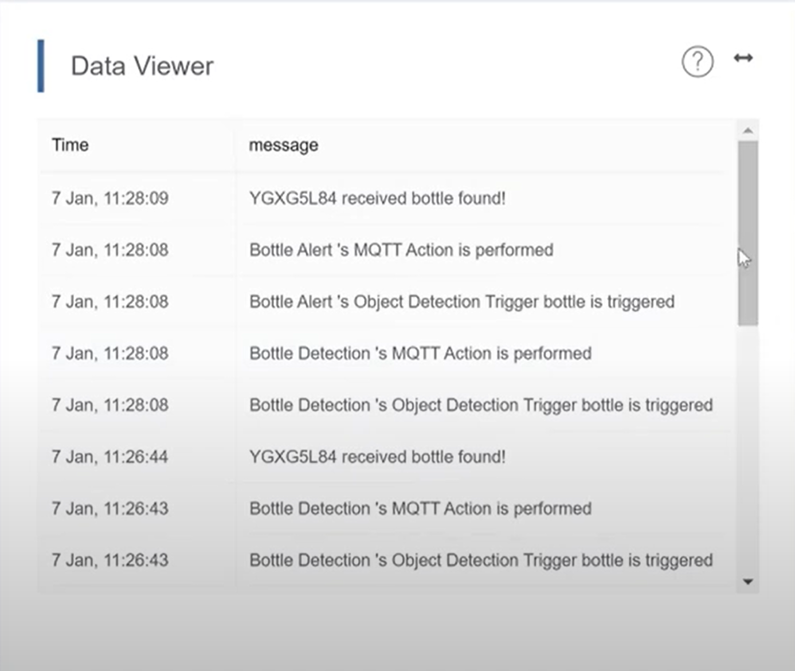

## Exploring MakerCloud's AI Object Detection Feature

In addition to face detection, MakerCloud's AI can detect a list of objects. The AI has learned about these objects by seeing and analyzing many pictures of them. 

For a list of the objects the AI can detect, view the options in Event Trigger for the Object Detection Trigger.

Here are a few examples of how it detects objects:

## Exercise: Using Object Detection With Event Trigger

#### Goal:
- To create an event trigger applet that notifies us via MQTT when an object is detected by MakerCloud's AI.

#### Instructions:
- If you have completed the Face Detection exercise, go to that project and create a new applet
- If you have not completed the Face Detection exercise, create a new project and topic and create a new applet
- Add an object detection trigger with an object of your choice. The provided example is with a bottle.
- Add an MQTT action that sends a notification message to the topic that you created.

When MakerCloud's AI detects the object that you chose, your data viewer will show these messages.

