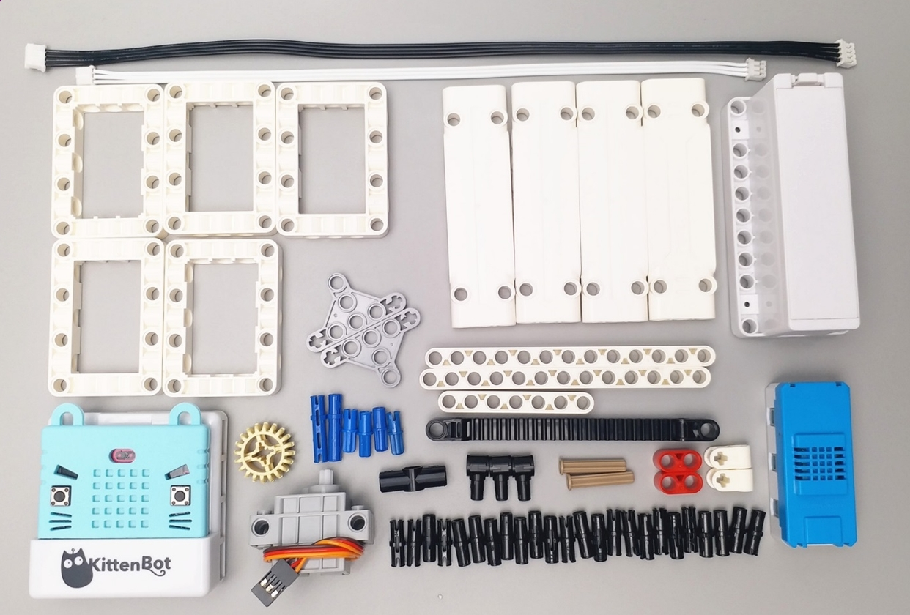
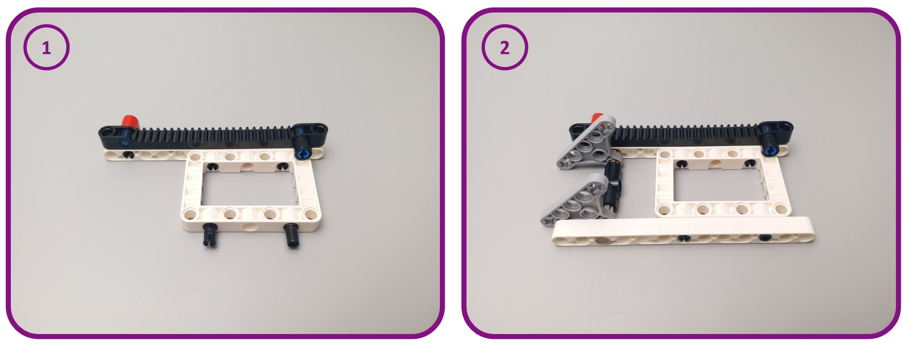
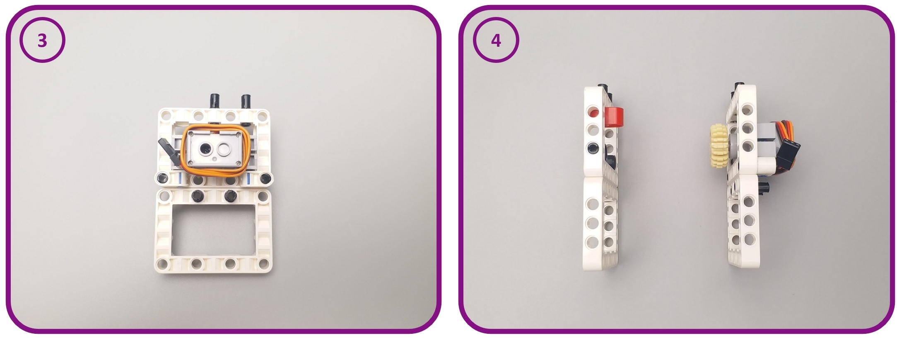
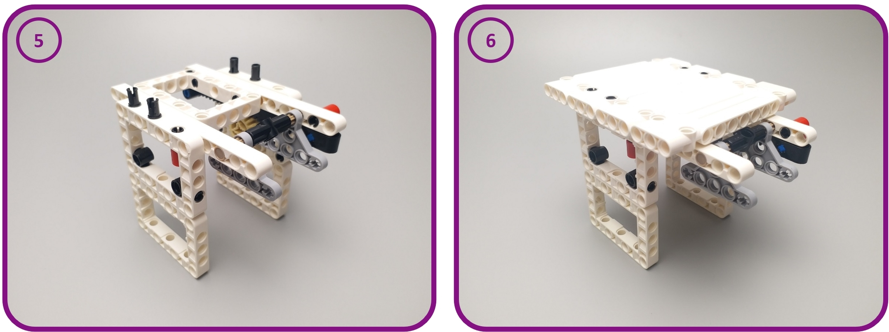
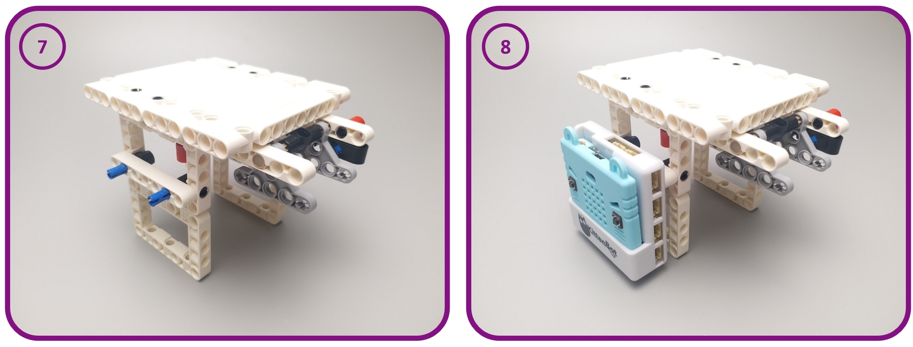
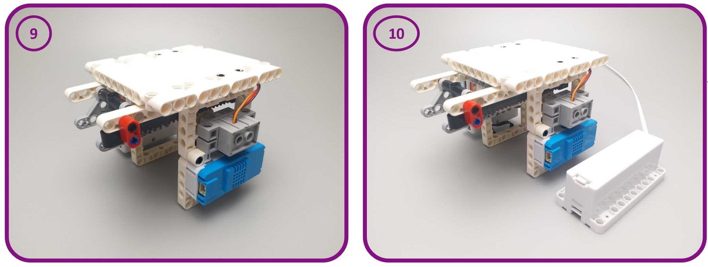
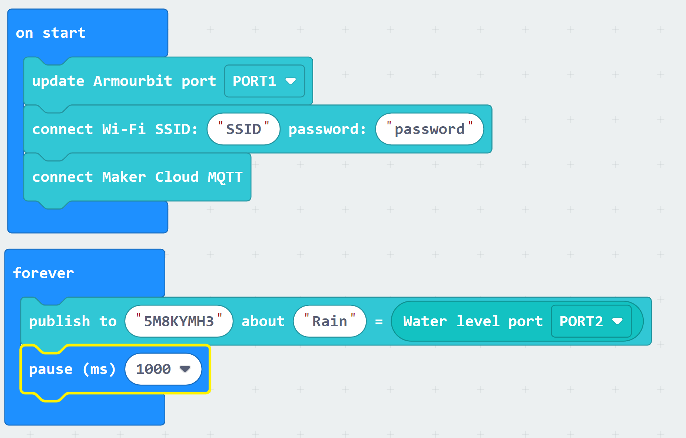
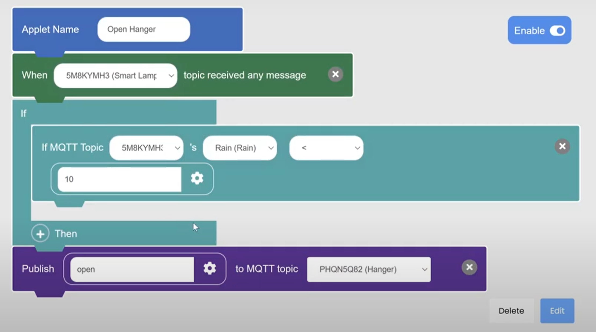
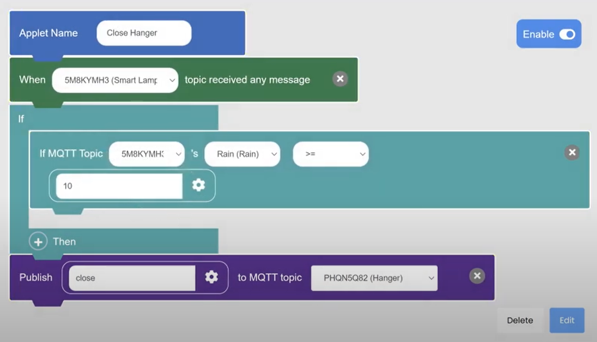

# Instructions for the Smart Hanger

[TOC]

The smart hanger connects to the smart lamppost through MakerCloud and the use of MQTT and helps demonstrate the helpfulness of a smart city when used in connection with the smart lamppost.

The smart hanger is a model of a programmable clothing hanger that can open close on command. 

Here are instructions on how to construct the smart hanger

### Parts Needed

Here are all of the parts you need for the smart Hanger:
- the Powerbrick parts are:
- micro:bit and armourbit
- kittenwifi
- 1 4PIN cord
- 1 3PIN cord
- 1 battery pack
- 1 servo motor

Here is how the connections will work:

### Assembly

Here are some sequential steps on how to put the parts together:

Here is an example of what a completed smart hanger can look like:

### Connecting with Smart Lamppost

First make sure that you have constructed the smart lamppost. For instructions, click [here](ch12_smart_city/lamppost/smart_lamppost.md)

Then, program the connection between the smart lamppost and smart hanger using event trigger.

###### Programming for Smart Lamppost:
Program the lamppost to constantly publish rain data to MakerCloud

###### Programming for Smart Hanger:
Program the hanger to open and close based on messages it receives from MakerCloud

#### Programming the Applets on MakerCloud:

###### Program an "Opening" applet that:

- Triggers when it receives a key-value message on the "Rain" data type that your lamppost is publishing to.
- Uses logic to check if the rain level is above a threshold and:
    - Sends an "open" message to the hanger topic the rain level is under the threshold

###### Program a "Closing" applet that:

- Triggers when it receives a key-value message on the "Rain" data type that your lamppost is publishing to.
- Uses logic to check if the rain level is above a threshold and:
    - Sends a "close" message to the lamppost topic if the rain level is above the threshold

Note that there must be two topics, one for the hanger and one for the lamppost. They cannot operate on the same topic.

This should connect the smart lamppost and smart hanger; here is an example of what it should look like:

