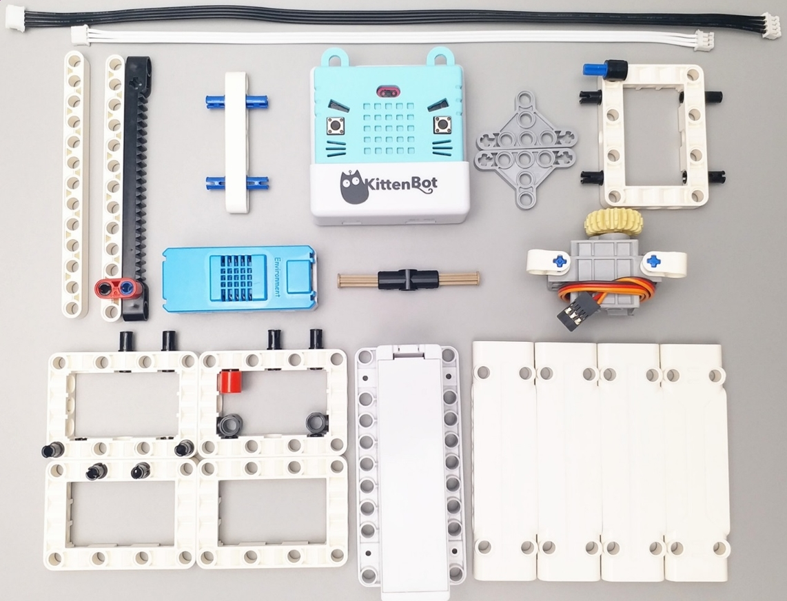

# Instructions for the Smart Hanger

[TOC]

The smart hanger connects to the smart lamppost through MakerCloud and the use of MQTT and helps demonstrate the helpfulness of a smart city when used in connection with the smart lamppost.

The smart hanger is a model of a programmable clothing hanger that can open close on command. 

Here are instructions on how to construct the smart hanger

### Parts Needed

Here are all of the parts you need for the smart Hanger:
- the Powerbrick parts are:
- micro:bit and armourbit
- kittenwifi
- 1 4PIN cord
- 1 3PIN cord
- 1 battery pack
- 1 servo motor

Here is how the connections will work:

### Assembly

Here are some sequential steps on how to put the parts together:

Here is an example of what a completed smart hanger can look like:

