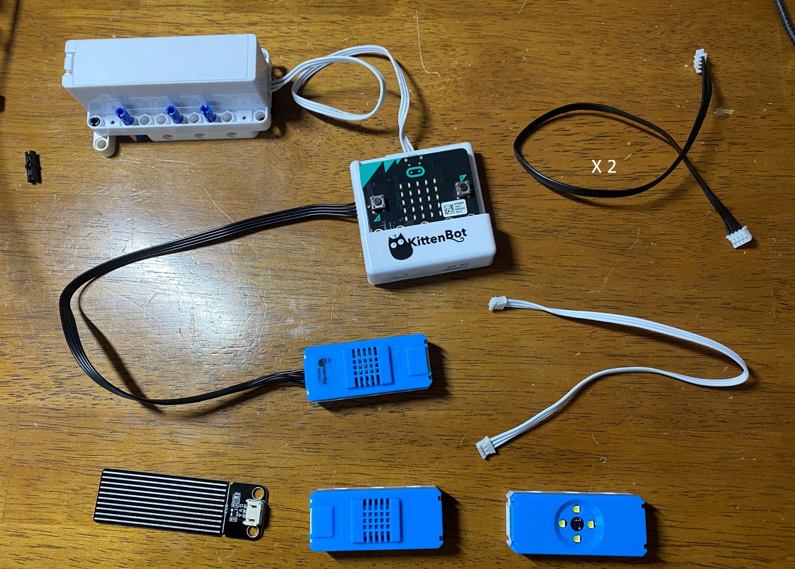
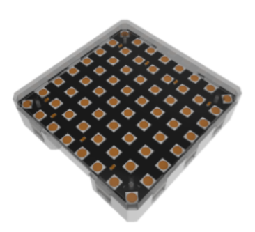
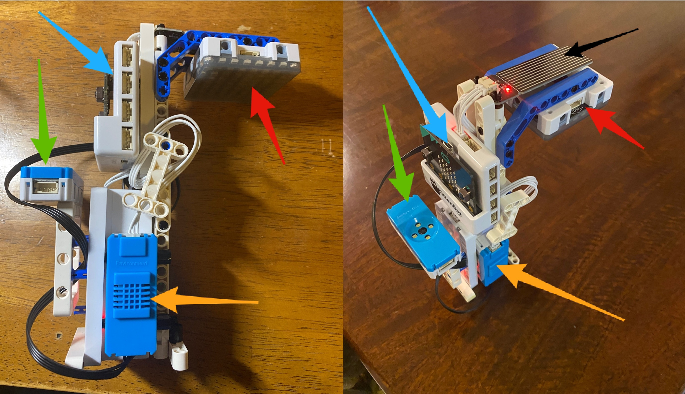
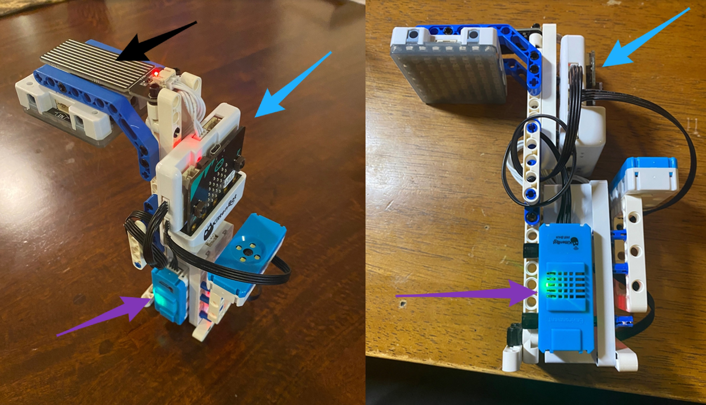
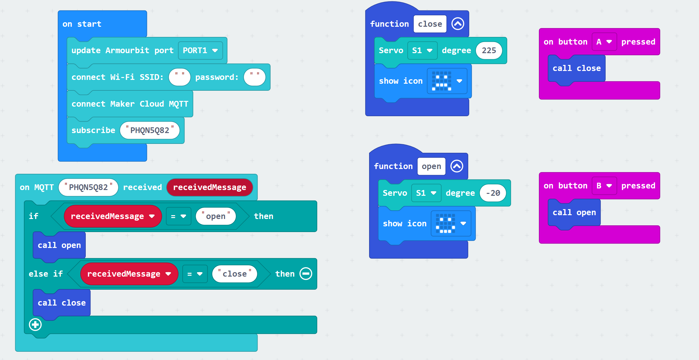

# Instructions for Building the Smart Lamppost

[TOC]

The smart lamppost is a structure meant to demonstrate the concept of a smart device in a smart city.

It is designed to hold several different sensors (that are connected to the armourbit) in an accessible way so that students can utilize MakerCloud and Makecode in coordination with the Powerbrick sensors.

Here are more instructions on how to construct the smart lamppost:

### Parts Needed
Here are images of all the sensors and wires you will need:

{:width="40%"}

- In the upper left are the micro:bit, armourbit, kittenwifi and battery pack, all connected as usual.
- On the upper right, there are two 4PIN cords and one 3 pin cord
- On the bottom are the sensors you will need: the rain level sensor, temperature sensor, color/gesture sensor.
- The second image shows the RGB light that you will need.

You will also need various parts to build the structure of the smart lamppost. the images below are simply an example of what you can build.

### Assembly

##### Some Connection Notes:
- The rain level sensor will need to connect to the temperature/humidity sensor via the 3PIN cord.
- The color/gesture sensor will need to be connected to the I2C port on top of the armourbit.
- You do not need to plug in or use the RGB light for the projects we are doing on Learn.MakerCloud, it is there for appearance only.
- We recommend using extra parts to keep the wires concealed and organized. You will see this in the images.

- The blue arrows point to the micro:bit inside the armourbit.
- The red arrows point to the RGB light.
- The green arrows point to the color/gesture sensor.
- The orange arrows point to the temperature/humidity sensor.
- The black arrow points to the rain level sensor.

- Once again, the blue arrows point to the micro:bit inside the armourbit.
- Once again, the black arrow points to the rain level sensor.
- The purple arrows point to the kittenwifi.

As you can see, some parts were added to the structure to keep the wires organized.

Using these sensors, build a structure based on your own ingenuity and add and connect the sensors. Have fun using this on your next project.

### Connecting with Smart Hanger

First make sure that you have constructed the smart hanger. For instructions, click [here](ch12_smart_city/hanger/smart_hanger.md)

Then, program the connection between the smart lamppost and smart hanger using event trigger.

Create a project, topic and data type in MakerCloud. For instructions on creating a project, click [here.](ch1_project/project.md) For instructions on creating a topic and data type, click [here.](ch3_topic/topic.md)

###### Programming for Smart Lamppost:
Program the lamppost to constantly publish rain data to MakerCloud

###### Programming for Smart Hanger:
Program the hanger to open and close based on messages it receives from MakerCloud

#### Programming the Applets on MakerCloud:

###### Program an "Opening" applet that:

- Triggers when it receives a key-value message on the "Rain" data type that your lamppost is publishing to.
- Uses logic to check if the rain level is above a threshold and:
    - Sends an "open" message to the hanger topic the rain level is under the threshold

###### Program a "Closing" applet that:

- Triggers when it receives a key-value message on the "Rain" data type that your lamppost is publishing to.
- Uses logic to check if the rain level is above a threshold and:
    - Sends a "close" message to the lamppost topic if the rain level is above the threshold

Note that there must be two topics, one for the hanger and one for the lamppost. They cannot operate on the same topic.

This should connect the smart lamppost and smart hanger; here is an example of what it should look like:

