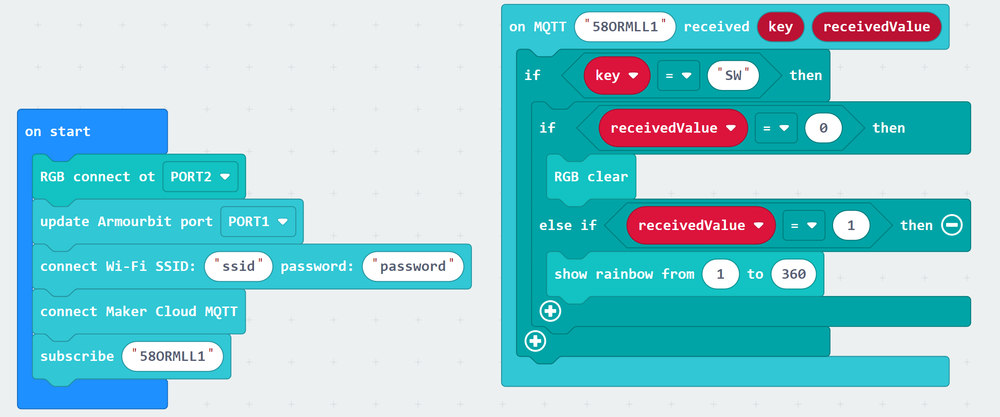

# Instructions for a Smart Light

[TOC]

When learning about push and toggle buttons on MakerCloud, you learned how to control the lights on your micro:bit with buttons on MakerCloud.

This page has some instructions on building a smart light using the Powerbrick RGB light.

### Construction
##### You will need:
- a micro:bit inside an armourbit
- a Powerbrick RGB light
- a kittenwifi
- a battery pack
- 1 3PIN cord
- 2 4PIN cords
- miscellaneous parts to build the structure itself

##### A Note on Connection:
- the RGB light can connect to the armourbit with a 4PIN cord (We recommend using ports 1-4)
- the kittenwifi and battery pack connect the same way as normal

Using your creativity, build a structure that holds these parts together. Here is an example of a structure.
- Notice that there is space inside the structure for the wires to be contained.

### Programming
You can create push and/or toggle buttons like you have previously learned. For instructions on push and toggle buttons, click [here.]()

On MakeCode, create a program that turns on the RGB light when a message of 1 is received and turns it off when a message of 0 is received.

You should be able to turn your smart light on and off like this:

