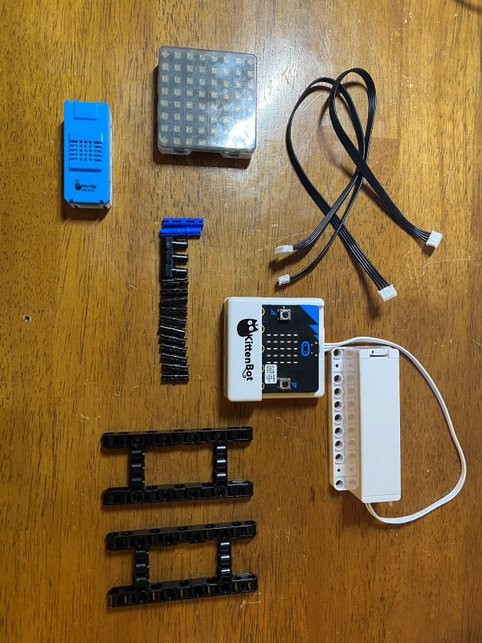
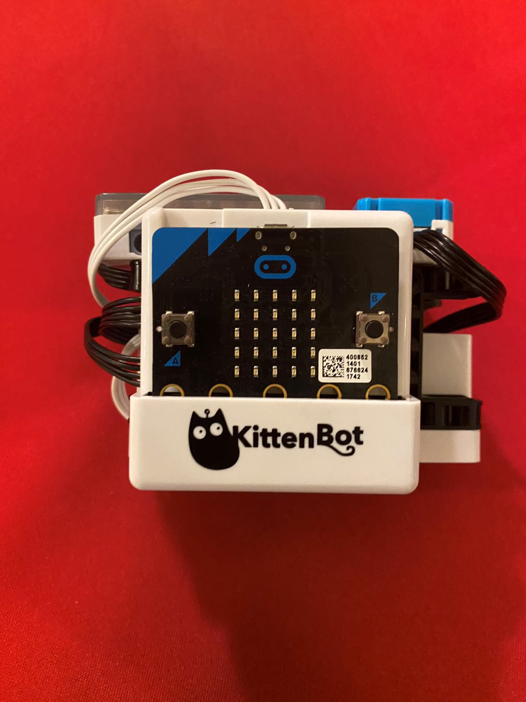
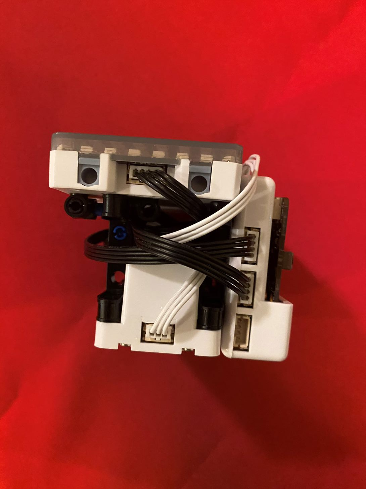
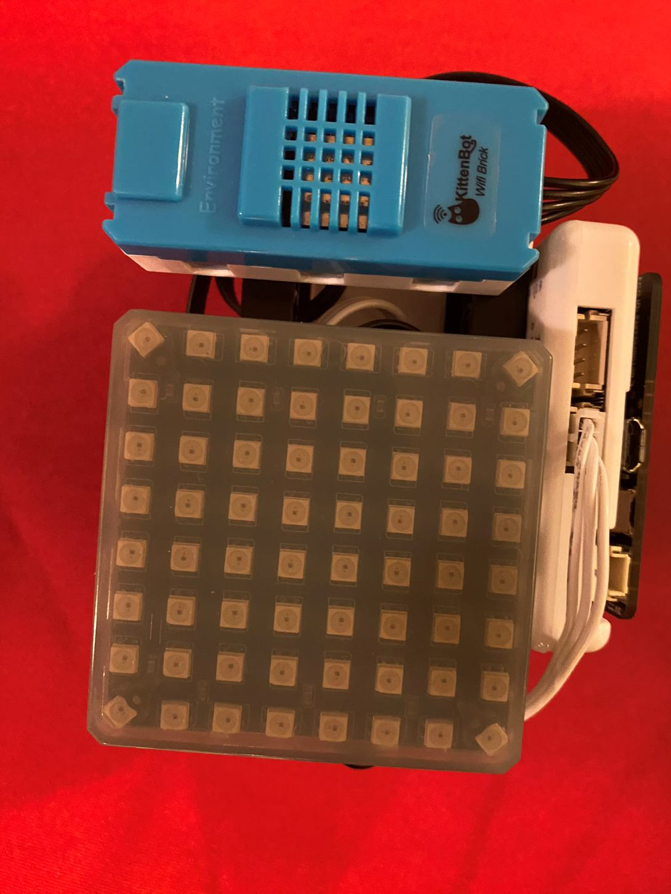
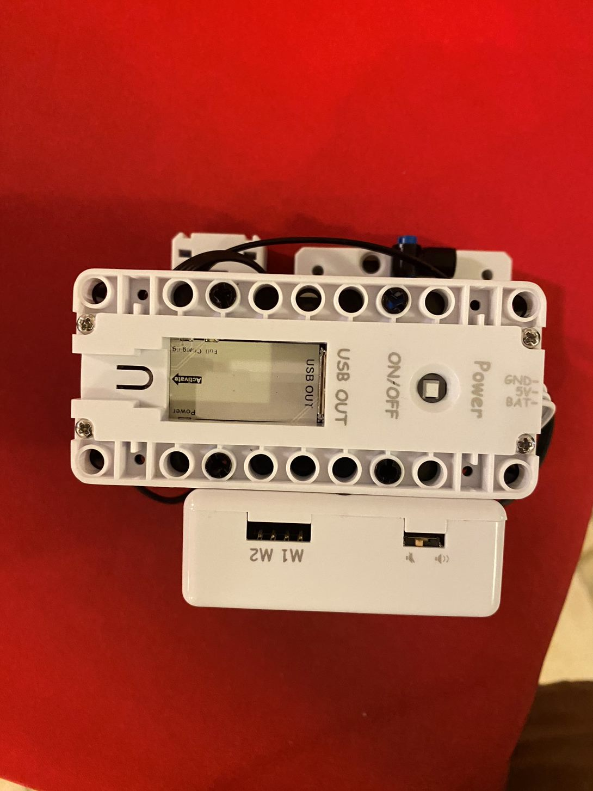
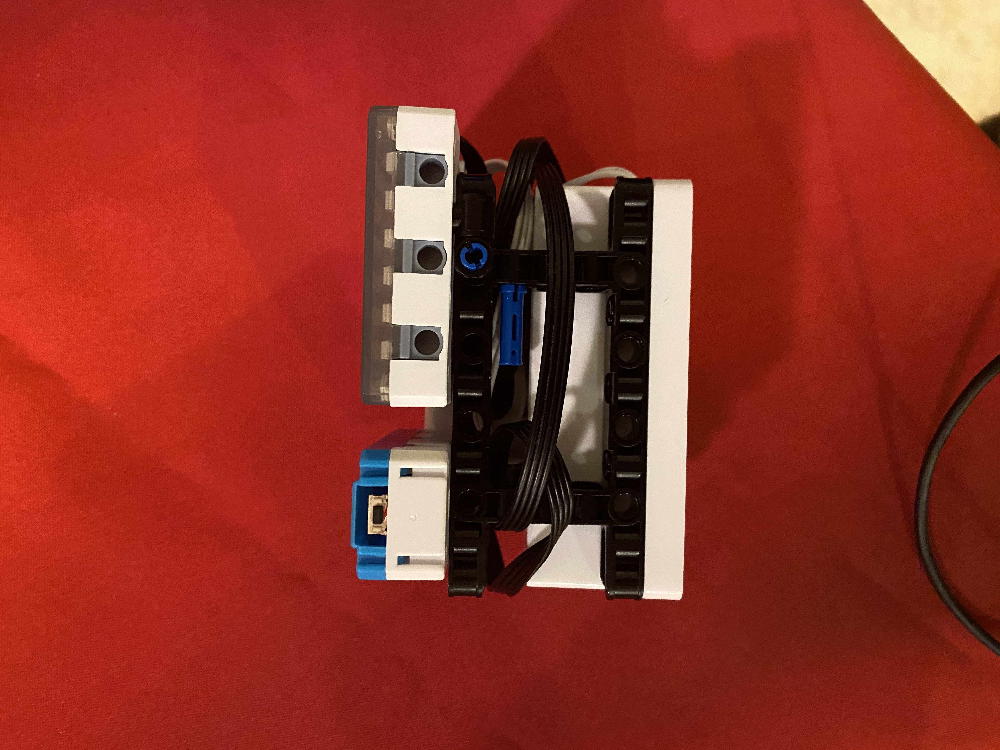

# Instructions for a Smart Light

[TOC]

This page has some instructions on building a smart light using the Powerbrick RGB light and controlling the smart light with widgets on MakerCloud.

### Construction
##### You will need:
- a micro:bit inside an armourbit
- a Powerbrick RGB light
- a kittenwifi
- a battery pack
- 1 3PIN cord
- 2 4PIN cords
- miscellaneous parts to build the structure itself

##### A Note on Connection:
- the RGB light can connect to the armourbit with a 4PIN cord (We recommend using ports 1-4)
- the kittenwifi and battery pack connect the same way as normal

Using your creativity, build a structure that holds these parts together. Here is an example of a structure.
- Notice that there is space inside the structure for the wires to be contained.

### Programming
Create a project, topic and data type in MakerCloud. For instructions on creating a project, click [here.](../../ch1_project/project.md) For instructions on creating a topic and data type, click [here.](../../ch3_Topic/topic.md)

Make a two push buttons or one toggle button that send messages of 1 and 0 to a data type of your selection.
For instructions on making push and toggle buttons on MakerCloud, click [here.](../../ch6.1_widgets/microbit_light.md)

On MakeCode, create a program that turns on the RGB light when a message of 1 is received and turns it off when a message of 0 is received.

You should be able to turn your smart light on and off like this:

