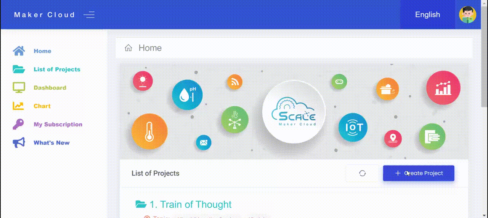
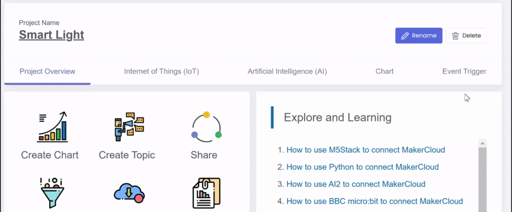
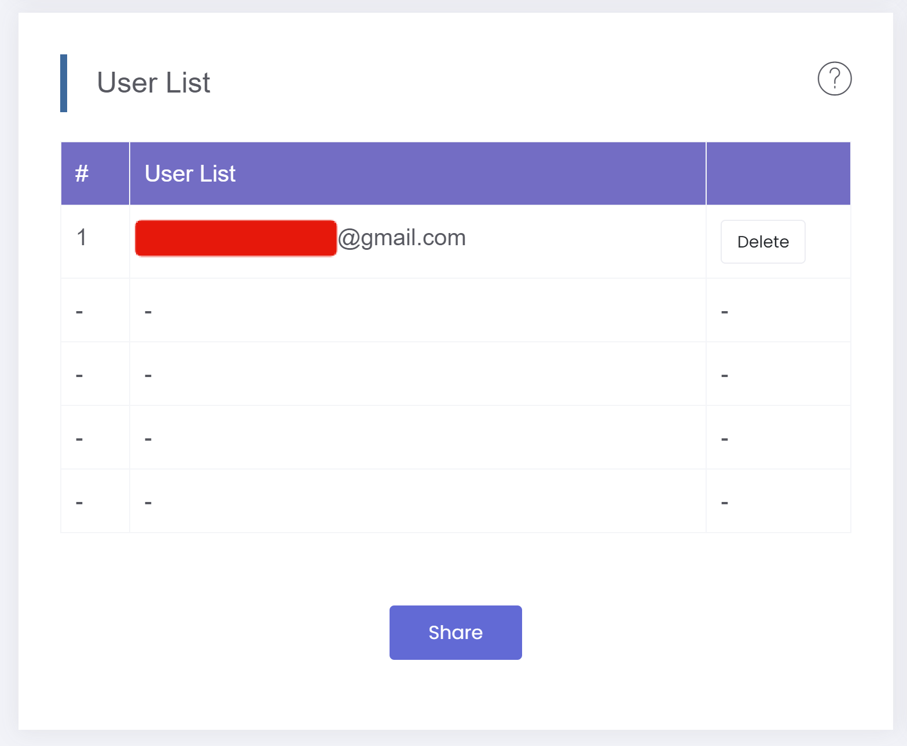
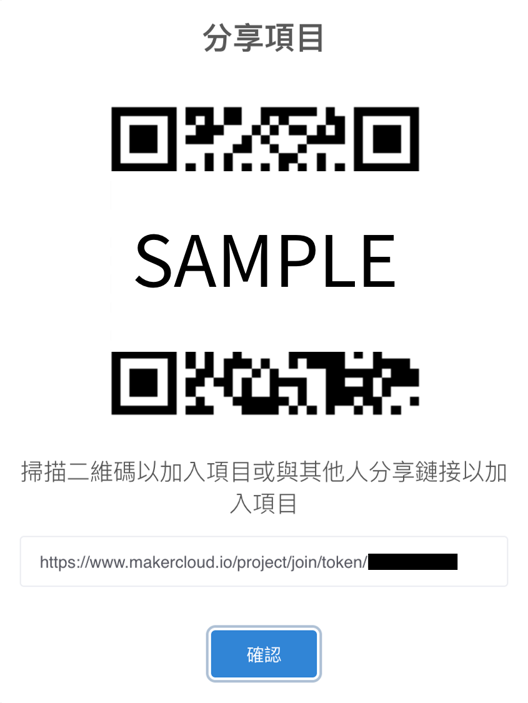
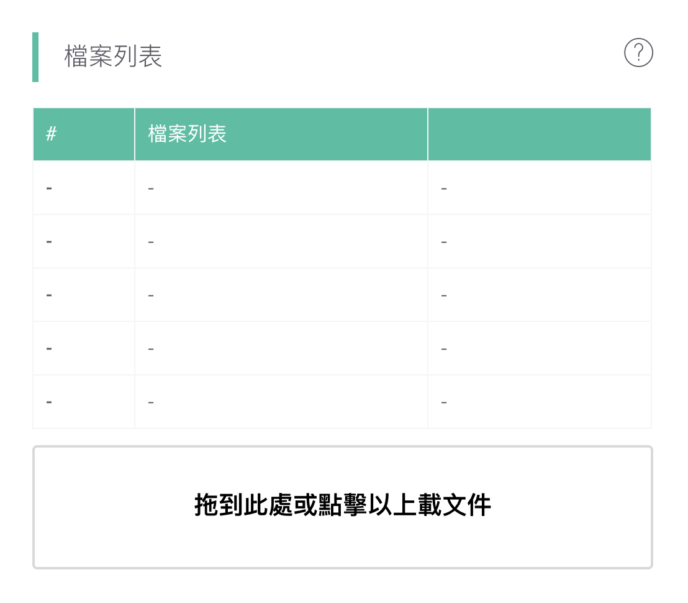

# 項目
[TOC]
## 創建項目
1. 登入創客雲後，按下「創建項目」按鈕。
2. 輸入項目名稱，按下「確認」按鈕。
3. 按下「OK」按鈕。

成功建立項目後，便會進入項目主頁。  

## 更改項目名稱
1. 進入項目主頁，按下「更改名稱」按鈕。
2. 更改項目名稱，按下「確認」按鈕。
3. 按下「OK」按鈕。

## 項目分享
使用者可以透過分享連結或QR code給其他使用者，因此不同的使用者可以共同協作同一個項目。

1. 在用戶列表中，按下「分享」按鈕。  
{:width="70%"}
  
2. 把連結或QR code傳送給其他創客雲使用者。  
{:width="50%"}

當其他創客雲使用者加入了項目後，便可以在用戶列表中看到其他使用者的電郵地址。  
{:width="70%"}  
成功加入項目的使用者，可以與其他擁有同一項目的使用者共同協作。

## 上載檔案

使用者可能上載與項目有關的檔案到創害雲，如micro:bit編程、筆記等，方便與項目共同者分享檔案。

在檔案列表中，按下「上載文件」按鈕或直接把文件拖到檔案列表中，便可以上載檔案。  
{:width="70%"}