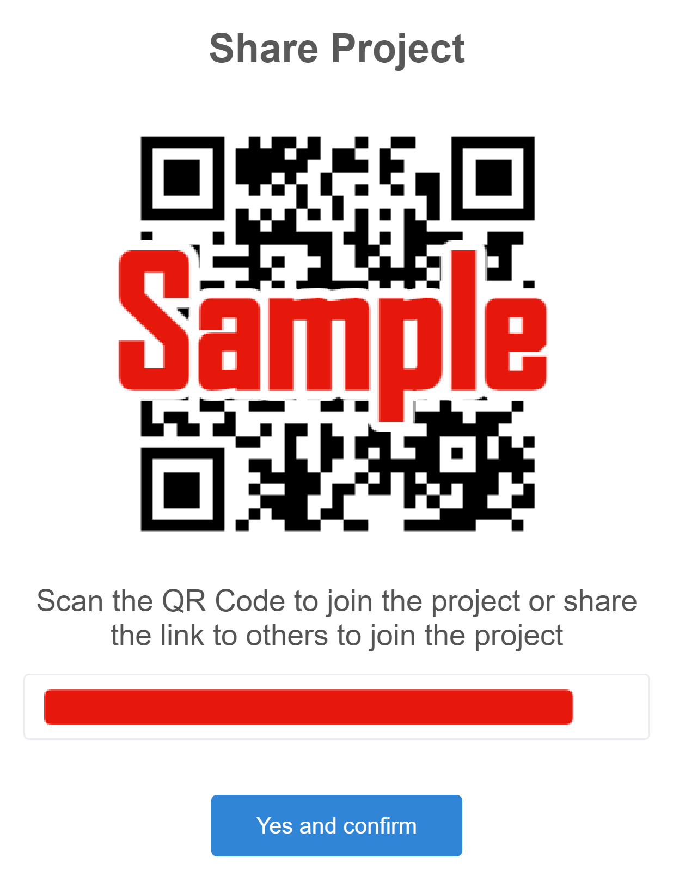
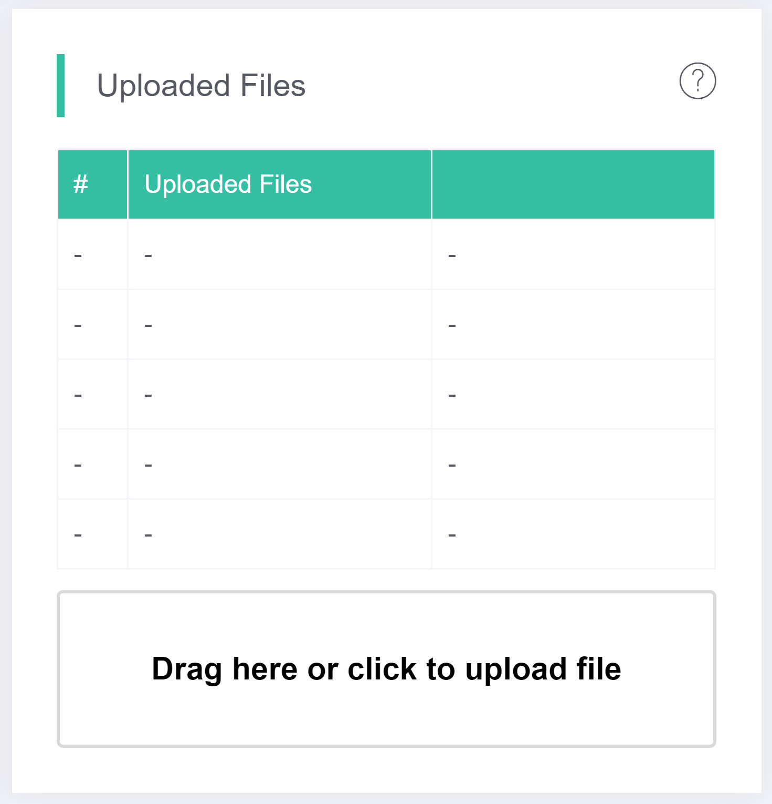

# 項目
[TOC]
## 創建項目
登入創客雲後，按下「創建項目」  
{width="60%"}

選擇「物聯網項目」，然後輸入項目名稱並按下「創建項目」  
{width="100%"}

看到項目主頁便完成了創建項目  
{width="100%"}

## 更改項目名稱
按下在項目名稱右上角的設定按鈕  
{width="60%"}

選擇「編輯」  
{width="60%"}

更改名稱後，按下「確認」  
{width="60%"}

回到項目主頁便會看到項目名稱已經更改  
{width="60%"}

## 項目分享
使用者可以透過分享連結或QR
code給其他使用者，因此不同的使用者可以共同協作同一個項目。

在項目主頁，按下「分享」按鈕  
{width="100%"}

把頁面中的QR code或 連結 分享給其他使用者，邀請加入項目  
{width="50%"}

當被邀請者掃瞄QR code或按下分享連結，然後再按下「確認」按鈕便成功加入項目  
{width="40%"}

成功加入項目的使用者，可以與其他擁有同一項目的使用者共同協作。

## 上載檔案
在項目主頁，按下「我的檔案」按鈕。  

把檔案拖曳到或點擊指定地方以上載文件  
{width="50%"}

上載成功後，使用者點擊檔案名稱便下載檔案  
{width="50%"}

使用者可能上載與項目有關的檔案到創害雲，如micro:bit編程、筆記等，方便與項目共同者分享檔案。
