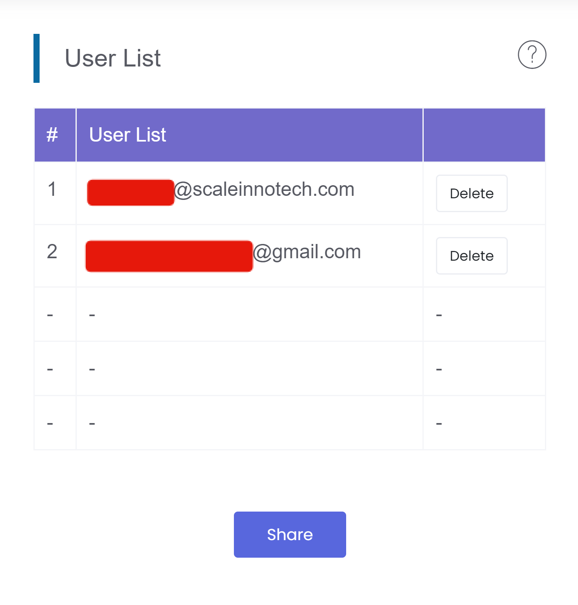

# Projects
[TOC]
## Creating a Project
1. After logging into MakerCloud, click "Create Project".
2. Enter the project name and click "OK".
3. Click "OK".

After successfully creating the project, you will enter the project homepage.  

## Changing the Project Name
1. Go to the project homepage and click the "Change Name" button.
2. Change the project name and click "OK".
3. Click "OK".

## Sharing your Project
Users can share links or QR codes with other users so different users can collaborate on the same project.

1. Press the Share button.

{:width="70%"}
  

2. Send the link or QR code to other MakerCloud users.  
{:width="50%"}

When other MakerCloud users join the project, they can see their email addresses in the user list.

{:width="70%"}  
Joining the same project allows for collaboration between users.

## Uploading Files

Users may upload files related to the project to MakerCloud, such as micro:bit programming files, notes, etc., to make them available to all the project's collaborators.

In the file list, click "Upload File" or drag the selected file into the file list to upload the file.

{:width="70%"}