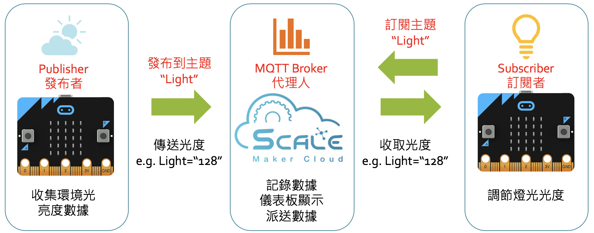

# MQTT簡介
MQTT 在使用創客雲之前，我們必先基本認識MQTT。

MQTT是物聯網(IoT)業界中常用的傳輸協定。使用者能夠使用MQTT來建立MQTT物聯網、M2M(Machine-to-Machine)通訊等。
現時IBM、小米、FacebookMessager等使用MQTT作為傳輸協定，而創客雲亦是使用MQTT來進行通訊。
{:width="70%"}

而在創客雲的MQTT中，主要有三個角色：

- **發布者 Publisher**  
  向創客雲發送資訊的一方是發布者Publisher
- **訂閱者Subscriber**  
  從創客雲獲取資訊的一方則是訂閱者Subscriber
- **主題Topic**  
  發布者Publisher 與 訂閱者Subscriber之間透過主題Topic來取得需要的資訊

以下圖為例，傳送感測器資料的一邊是發布者，接收感測器資料的一邊則是訂閱者。  
每個感測器∕微控器的訊息都需要有個主題名稱以利識別，像下圖的「Light」。  

