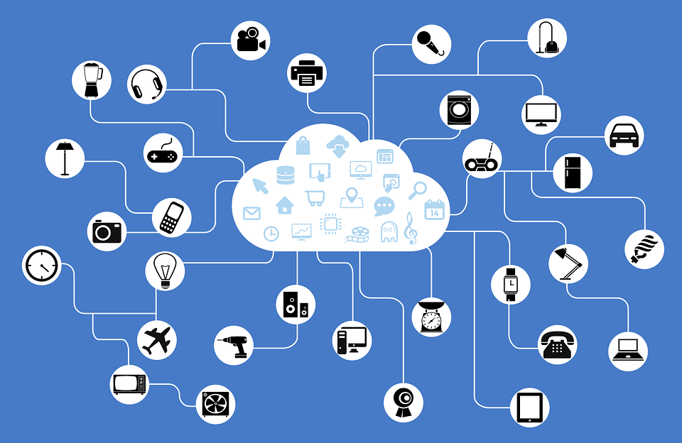

# Introduction to MQTT
Before using MakerCloud, we must have a basic understanding of MQTT.

MQTT is a commonly used transmission protocol in the Internet of Things (IOT) industry. Users can use MQTT to establish IOT, M2M (Machine to Machine) communication, etc. At present, IBM, Xiaomi, Facebook Messenger, etc. user MQTT as the transmission protocol, and MakerCloud also uses MQTT for communication.
{:width="70%"}

When using MQTT in MakerCloud, there are mainly three roles:

- **Publisher**  
  The party sending information to MakerCloud is the publisher
- **Subscriber**  
  The party who receives information from MakerCloud is the subscriber
- **Topic**  
  The publisher and the subscriber obtain the required information through the topic.

Take the following image, for example; the side sending sensor data is the publisher, and the side receiving sensor data is the subscriber.
Each sensor/microcontroller message needs to have a theme name for easy identification, like the "Light" in the picture below.

