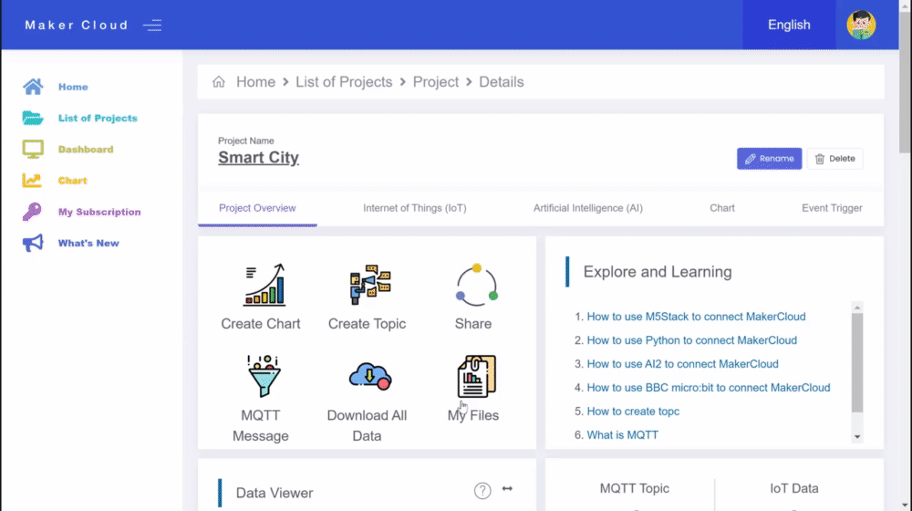
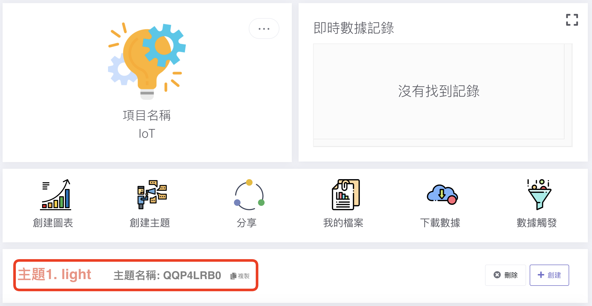
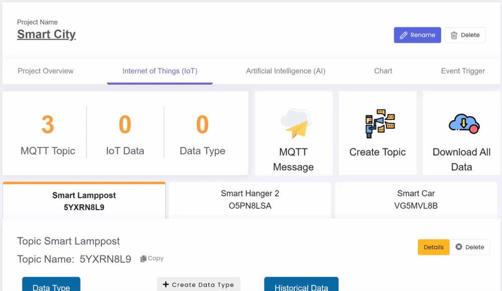
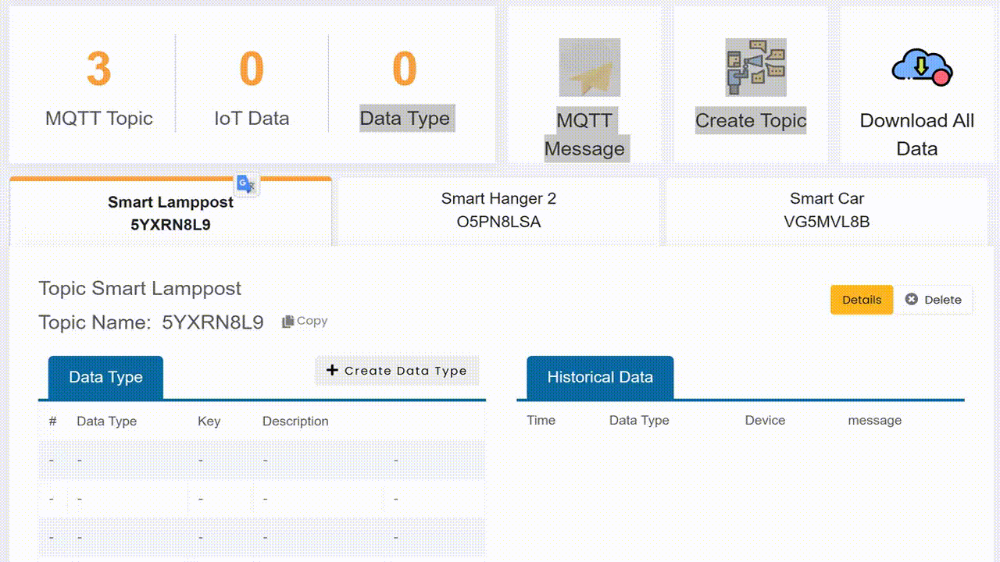
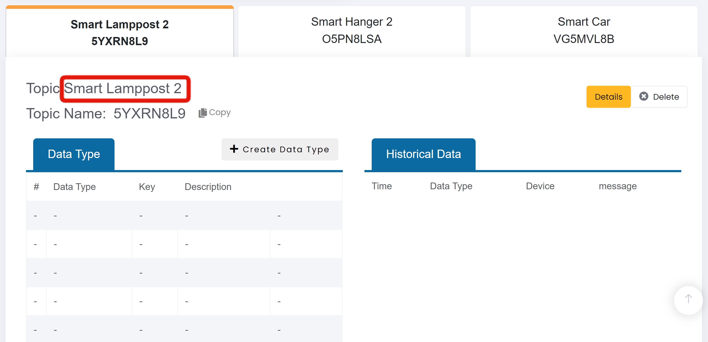

# Topic
[TOC]
## Create Topic
1. On the project homepage, click "Create Topic"
2. Enter the topic description and click "Yes and confirm".
3. Click "OK".

{:width="75%"}

After creating the topic, press the "Internet of Things" tab to enter the Internet of Things (IoT) homepage, and you can see the created topic.

{:width="100%"}

After creating more than one topic, you can switch between the different topic tabs on the Internet of Things homepage to access your different topics.

{:width="100%"}

## Changing the Topic Description
1. Press the "Details" button to enter the topic homepage
2. Click "Update Topic"
3. Change the description and click "Yes and confirm".
4. Click "OK".

{:width="100%"}

After changing the topic subscription, go back to the IoT homepage, and you will see that the topic description has been changed.

{:width="100%"}