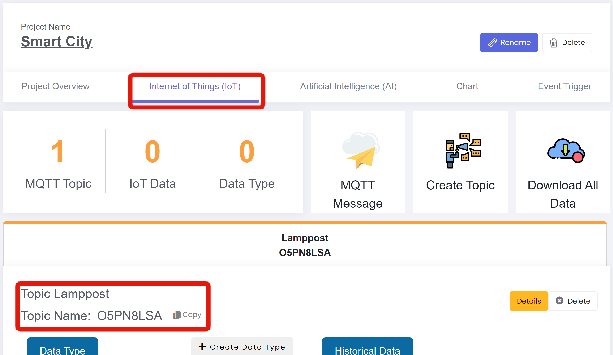

# 主題Topic
[TOC]
## 創建主題
1. 在項目主頁，按下「創建主題」按鈕。
2. 輸入主題描述，按下「確認」按鈕。
3. 按下「OK」按鈕。

{:width="75%"}

成功創建主題後，按下物聯網進入物聯網主頁，便可看到創建的主題。  
{:width="100%"}

在建創多於一個的主題後，可在物聯網主頁中按下不同的主題以轉換主題頁面。
{:width="100%"}

## 更改主題描述
1. 按下「詳細資料」按鈕，進入主題主頁
2. 按下「更新主題」
3. 更改主題名稱，按下「確認」按鈕。
4. 按下「OK」按鈕。

{:width="100%"}

成功更改主題描述後，回到物聯網主頁中便可看到主題描述已經更改。
{:width="100%"}