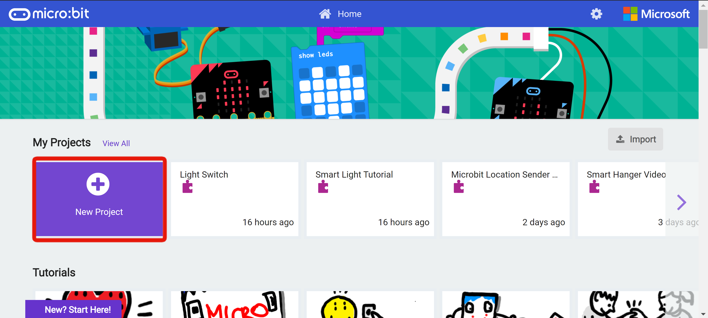

# 使用KOI連接創客雲
KOI是小喵科技針對中小學和愛好者開發一款可圖形化程式設計的離線人工智慧模組，硬體含
有鏡頭、麥克風、喇叭、IPS屏模、Wi-Fi模組等等…… 可實現視覺識別、語音辨識、語音合成、
物聯網等功能。模組集成了Wi-Fi功能，可以讓你的人工智慧作品連接雲端。

#### 連接micro:bit
此教學將會使用micro:bit連接KOI。在Kittenbothk的官方教學網站中，有詳細的連接教學。
如果大家不懂得如果連接，可到以下連結學習：  
[KOI官方連接教學](https://kittenbothk.readthedocs.io/en/latest/functional_module/AI%20Cam/makecodeQs.html)

## 創客雲KOI擴展
雖然KOI擴展中有MQTT的積木，但使用上有一定的難道。為了方便使用者連接創客雲，我們編寫了創客雲KOI的專用MakeCode擴展。

#### Makecode for micro:bit
連接了KOI到micro:bit後，到MakeCode上開始編程。  
[https://makecode.microbit.org/]()

#### 新增專案

#### 加入KOI擴展
創客雲KOI擴展必須配合Kittenbot的KOI擴展使用。

1. 點撃「進階」->「擴展」
2. 複製並貼上「Koi」的擴展連結  
   [https://github.com/KittenBot/pxt-koi]()

#### 加入創客雲KOI擴展
在加入KOI擴展後，加入創客雲KOI擴展。這樣KOI便可以利用其Wi-Fi功能連接創客雲MQTT。

1. 點撃「進階」->「擴展」
2. 複製並貼上「Koi」的擴展連結  
   [https://github.com/scaleinnotech/pxt-makercloud-koi]()

#### 連接Wi-Fi及創客雲
**當啟動時**  
首先要在micro:bit啟動時設定好KOI連接Wi-Fi及創客雲MQTT。

1. 設定引腳
2. 連接Wi-Fi設定: 輸入SSID和密碼
3. 暫停5秒，確保Wi-Fi連接成功
4. 連接創客雲MQTT
5. 暫停2秒，確保創客雲MQTT連接成功

{:width="40%"}

完成編程後，使用者便可以把編程下載到micro:bit。如果不懂如何把編程下載到micro:bit，可以到以下教學網頁:  
[https://microbit.org/get-started/first-steps/set-up/]()

當成功連接創客雲後，使用者便可以加入其他編程令micro:bit進行其他MQTT指令。  
***注意每次編程必須要先連接Wi-Fi和創客雲MQTT。**
