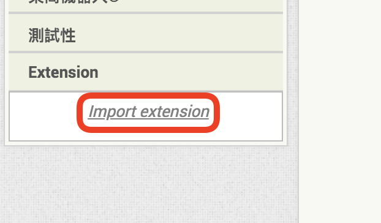

# 使用App Inventor 2連接創客雲

[TOC]

## 創客雲 AI2 extension
由於App Inventor 2本身並沒有MQTT功能，所以必先下載extension才能連接MQTT。  
為了方便使用者使用AI2連接創客雲，我們為AI2編寫了創客雲專用的extension:

[創客雲 AI2 extension](extension/scale.MakerCloud.aix) (按右鍵另存新檔）

## 連接創客雲

#### 加入創客雲 AI2 extension
在extension欄目中，按下「import extension」  
{:width="40%"}

