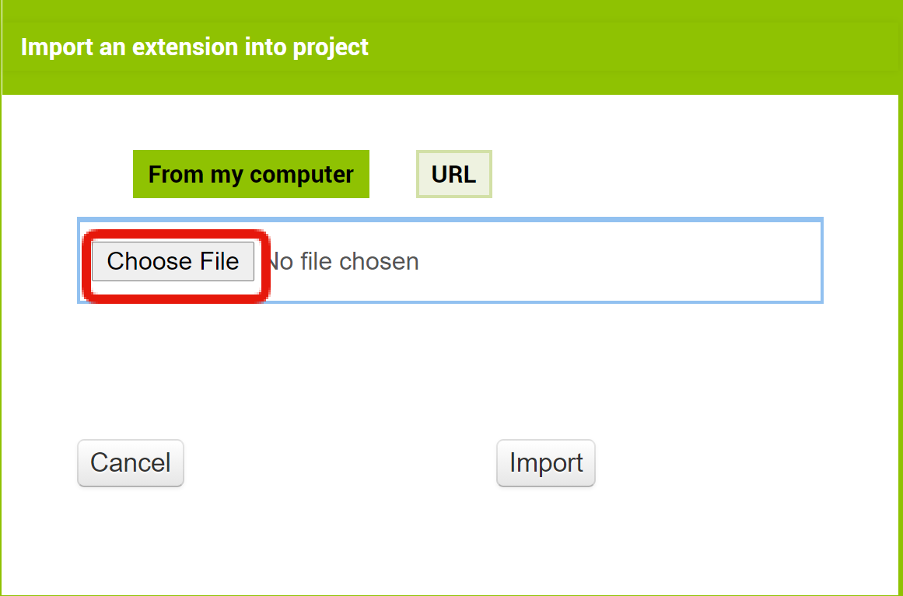
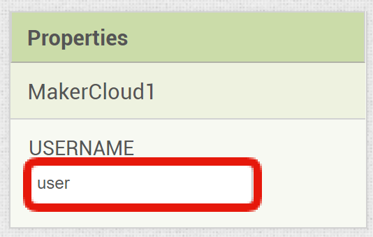

# 使用App Inventor 2連接創客雲

[TOC]

## 創客雲 AI2 extension
由於App Inventor 2本身並沒有MQTT功能，所以必先下載extension才能連接MQTT。  
為了方便使用者使用AI2連接創客雲，我們為AI2編寫了創客雲專用的extension:

[創客雲 AI2 extension](extension/scale.MakerCloud.aix) (按右鍵另存新檔）

## 連接創客雲

#### 加入創客雲 AI2 extension
在extension欄目中，按下「import extension」  
{:width="40%"}

按下「choose file」  
{:width="60%"}

選擇下載了的「scale.MakerCloud.aix」，然後按下「import」
{:width="60%"}

#### 加入MakerCloud元件
把MakerCloud元件拖曳到Screen中  
{:width="100%"}

#### 修改USERNAME
創雲會紀錄使用者的名稱，所以需要在元件屬性中修改一個屬於你的USERNAME  
{:width="40%"}

#### 加入連接創客雲積木
加入創客雲 AI2 extension後，轉到程式設計頁面
當screen初始化，執行「呼叫MakerCloudMQTT」  
{:width="100%"}

這樣便成功連接創客雲MQTT