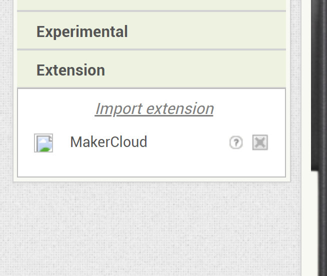
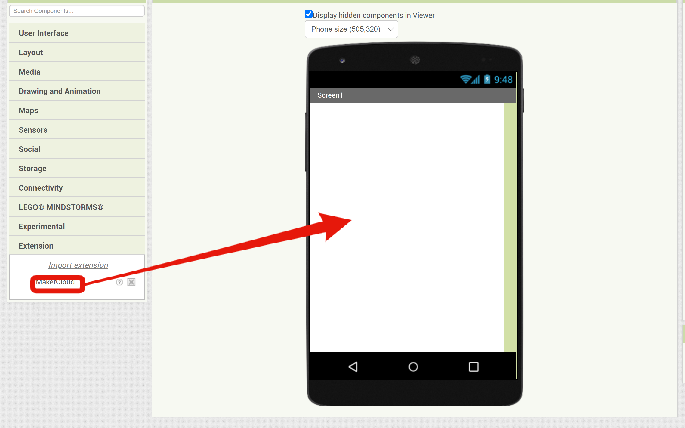
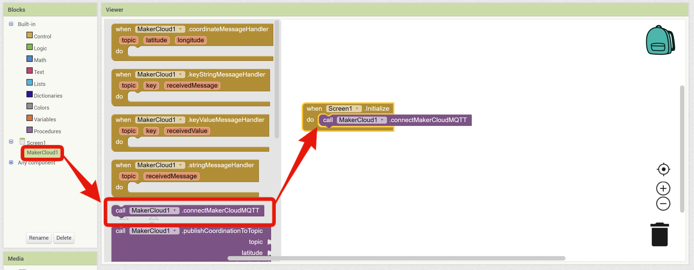

# Using App Inventor 2 to Connect to MakerCloud

[TOC]

## MakerCloud AI2 extension
- Since App Inventor 2 does not use MQTT, you need to download the extension before connecting via MQTT.
- To facilitate using AI2, we have made a special extension for MakerCloud connecting to AI2:

[MakerCloud AI2 extension](extension/scale.MakerCloud.aix) (right click to save as new file）

## Connecting to MakerCloud

#### Join AI2 extension
In the extension column, click "import extension".

{:width="40%"}

Click "choose file".

{:width="60%"}

Select the downloaded "scale.MakerCloud.aix", then click "import".

{:width="60%"}

#### Join MakerCloud Components
Drag the MakerCloud component to the screen.

{:width="100%"}

#### Modifing your Username
MakerCloud will record the username, so you need to make a unique username in the component properties.

{:width="40%"}

#### Join the Connected MakerCloud Building Block
After joining the MakerCloud AI2 extension, go to the programming tab.
When Screen1 is initialized, execute "Call MakerCloud MQTT".

{:width="100%"}

This will successfully connect AI2 to MakerCloud via MQTT.