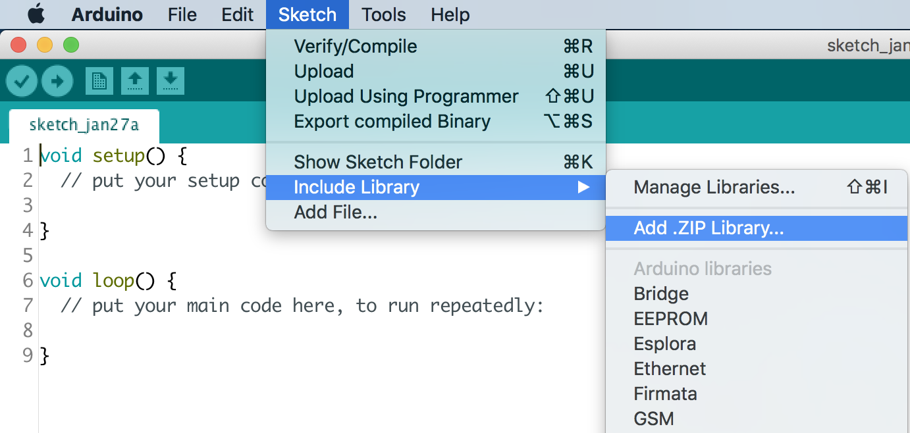
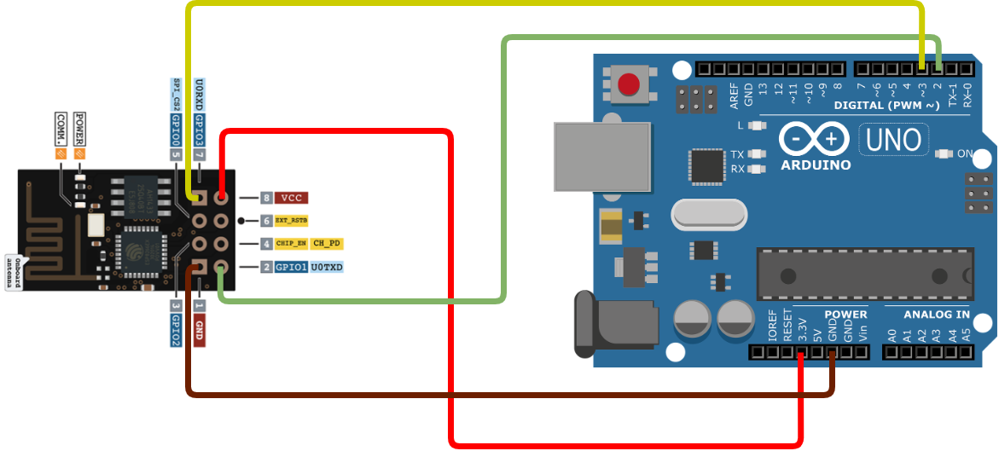
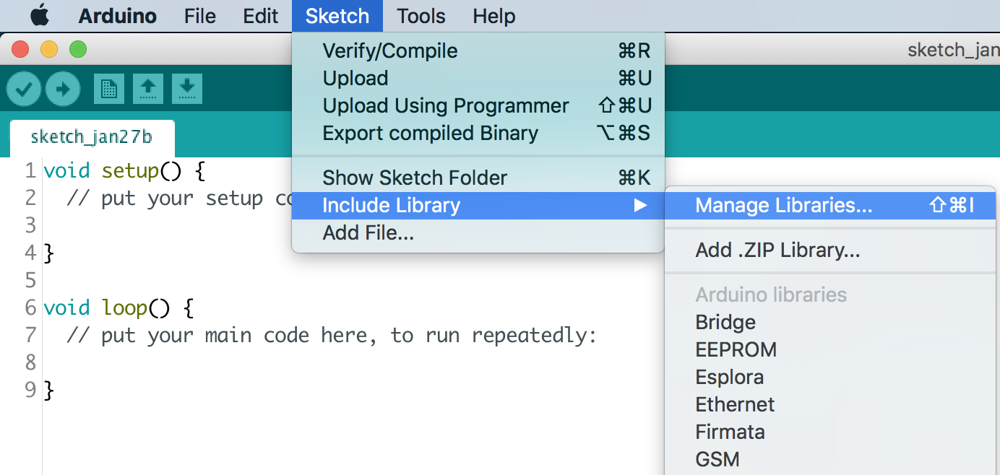
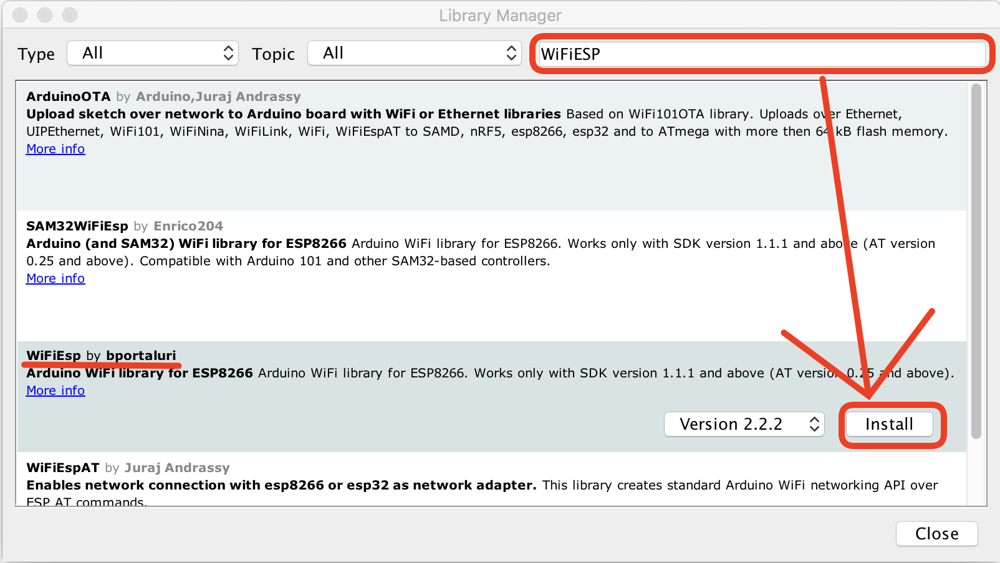
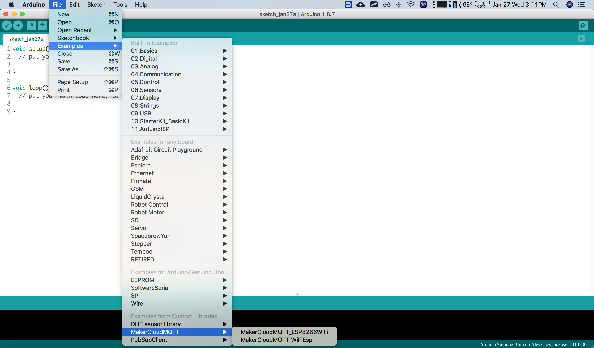

# Using Arduino to connect to MakerCloud
Arduino is a popular micro-control board, and can be used with various types of sensors and motors.
Recently, Arduino has introduced a model that can be connected to Wi-Fi. There are also other WiFi models that allow Arduino to connect to Wi-Fi.
Therefore, Arduino can use Wi-Fi and different accessories to create IoT topics.

[TOC]

## Arduino's MakerCloudMQTT Library
Although Arduino has a library that supports MQTT, there can be difficulties in its general use. In order to facilitate an easy connection to MakerCloud, we have written a library for MakerCloud called MakerCloudMQTT.

First, download the MakerCloud Arduino Library:
[MakerCloudMQTT Library](library/MakerCloudMQTT.zip)


##### Install Arduino IDE
You must **pre-install** Arduino IDE before using MakerCloudMQTT

Users can download the installation program from the Arduino official website: [Download Arduino IDE](https://www.Arduino.cc/en/software)

After downloading, open the installer and follow the instructions to complete the installation.

### Importing the MakerCloudMQTT Library
1. **Create a New Project**
   File -> New
2. **Import MakerCloudMQTT**
   Sketch -> Include Library -> Add .ZIP Library

   

## Connecting to Maker Cloud
There are many different ways to connect to Wi-Fi with Arduino.
The following teaching will demonstrate using Arduino with the ESP-01 (ESP8266 module).

### Arduino ESP-01 connect to Wi-Fi
#### Connection



* ESP01 ------------> Arduino
* VCC --------------> 3.3v
* GND -------------> GND
* TX ----------------> P2
* RX ----------------> P3

After connecting the wires, use the following AT command to set the **Baud Rate of ESP01 to 9600bps**:
```
AT+UART_DEF=9600,8,1,0,0
```

#### Install WiFiESP Library
EPS-01 needs to use WiFiESP Library to connect to WiFi.

1. Sketch -> Include Library -> Manage Libraries

   
   <br><br>

2. Search and install "WiFiESP"

   

#### Connection Programming
```cpp
#include <SoftwareSerial.h>
#include <WiFiEsp.h>
#include <MakerCloudMQTT.h>

// Change the credentials below, so your ESP8266 connects to your router
const char* ssid = "ssid";
const char* password = "password";


// Setting ESP8266 Serial Port(TX-P2, RX-P3)
SoftwareSerial ESP8266(2, 3);

// Initializes the espClient.
WiFiEspClient espClient;
MakerCloudMQTT MakerCloudClient(espClient);

// WiFi Status
int WiFi_Status = WL_IDLE_STATUS;

// This functions connects your ESP8266 to your router
void setup_wifi() {
  //Setting ESP8266 Baud Rate(9600bps)
  ESP8266.begin(9600);

  //Init ESP8266
  WiFi.init(&ESP8266);

  Serial.print("Processing WiFi Setting!\r\n");
  do {
    Serial.println("WiFi Connecting ...");
    WiFi_Status = WiFi.begin(ssid, password);
    delay(500);
  } while (WiFi_Status != WL_CONNECTED);

  Serial.println("ＷiFi Connected!");
  Serial.print("IP Address: ");
  Serial.println(WiFi.localIP());
  Serial.print("SSID: ");
  Serial.println(WiFi.SSID());
  Serial.println("WiFi Setting Done");
}

void setup() {
  Serial.begin(115200);

  // MakerCloudMQTT Configuration
  MakerCloudClient.setUsername("Max");
  // Enable to print extra log
  MakerCloudClient.setLog(true);

  // Connect ESP8266 to router
  setup_wifi();

  // Connect to MakerCloud
  MakerCloudClient.connect();
}
```

### Universal Connection Instructions
In addition to the aforementioned Wi-Fi Library, MakerCloud also supports other different Wi-Fi libraries.

#### Connection programming (Another Example)
```cpp
EthernetClient ethClient;
MakerCloudMQTT MakerCloudClient(ethClient);

// This function connects Wi-Fi
void setup_wifi() {

}

void setup() {
  Serial.begin(115200);

  // MakerCloudMQTT Configuration
  MakerCloudClient.setUsername("Max");
  // Enable to print extra log
  MakerCloudClient.setLog(true);
  
  // Connect Wi-Fi
  setup_wifi();

  // Connect to MakerCloud
  MakerCloudClient.connect();
}
```

## MakerCloud/MQTT instructions
In "Examples from Custom Libraries", there are examples written by ESP8266WiFi and WiFiEsp Library.
The examples include programming demonstrations for connection, publishing and subscription.

