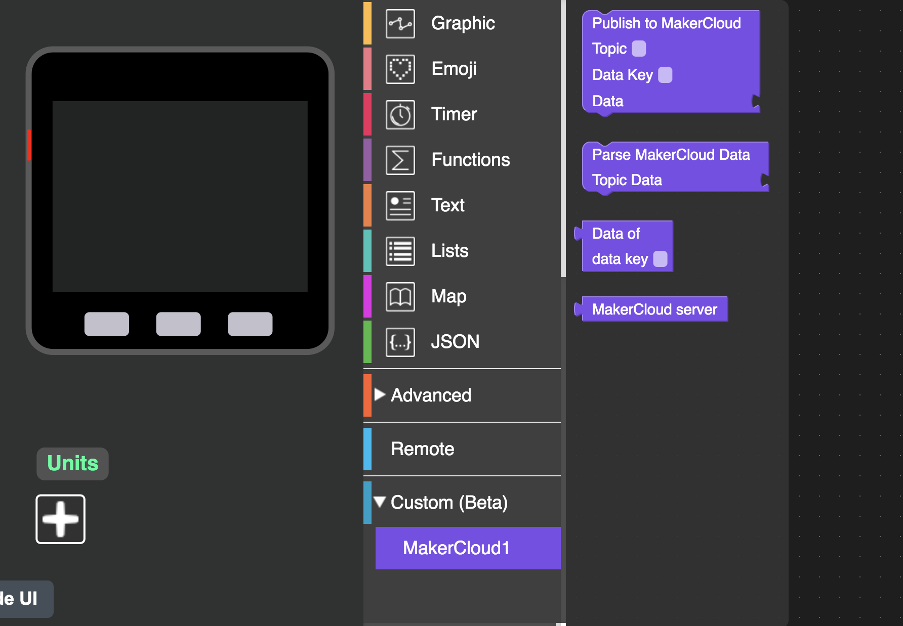
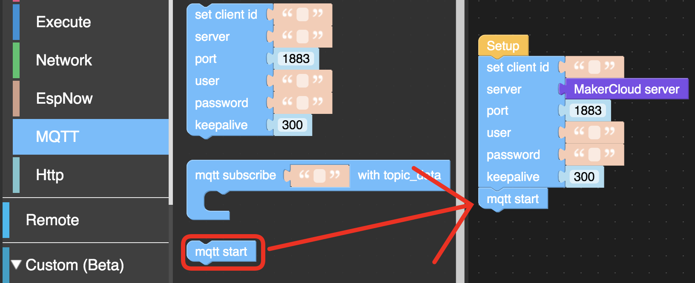
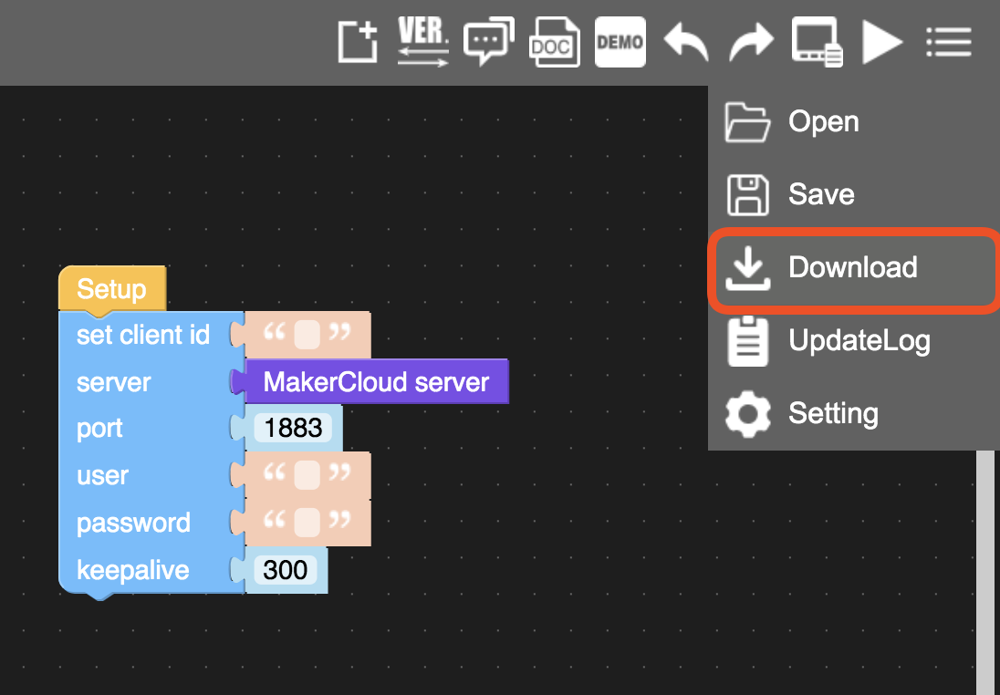

# 使用M5Stack連接創客雲

[TOC]

## 創客雲 UiFlow Custom
UiFlow已預載了MQTT功能，但連接創客雲的步驟較為複雜。  
為了方便使用者使用M5Stack連接創客雲，使用者可以下載並使用創客雲專用的Custom:

[創客雲 UiFlow Custom](https://cutt.ly/makercloud)

## 連接創客雲

#### 加入創客雲 UiFlow Custom
1. 按下Custom(Beta)欄目，然後選擇「Open *.m5b file」
2. 打開下載了的「MakerCloud1.m5b」

  
3. 成功打開後，在Custom內便可以找到創客雲的Custom blocks

#### 連接創客雲
1. 點選「Advanced」欄目，然後點選「MQTT」欄目
2. 在Setup下，加入設定MQTT的積木
3. 點選「MakerCloud」欄目，把「MakerCloud server」積木加入設定MQTT積木的「server」中  

  
4. 加入「mqtt start」到設定MQTT積木之下  
{:width="80%"}
5. 當使用MQTT積木，編程必須下載到M5Stack。點選右上角的選項，然後點選「download」
{:width="70%"}

下載成功後，M5Stack便已經連接到創客雲。