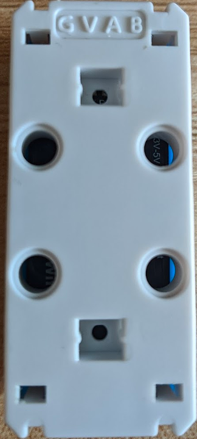
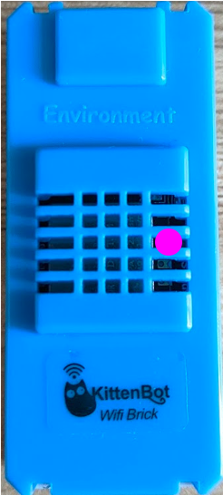
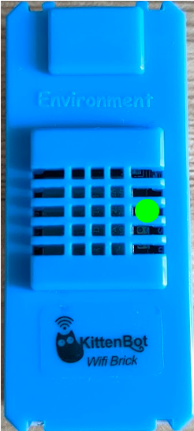
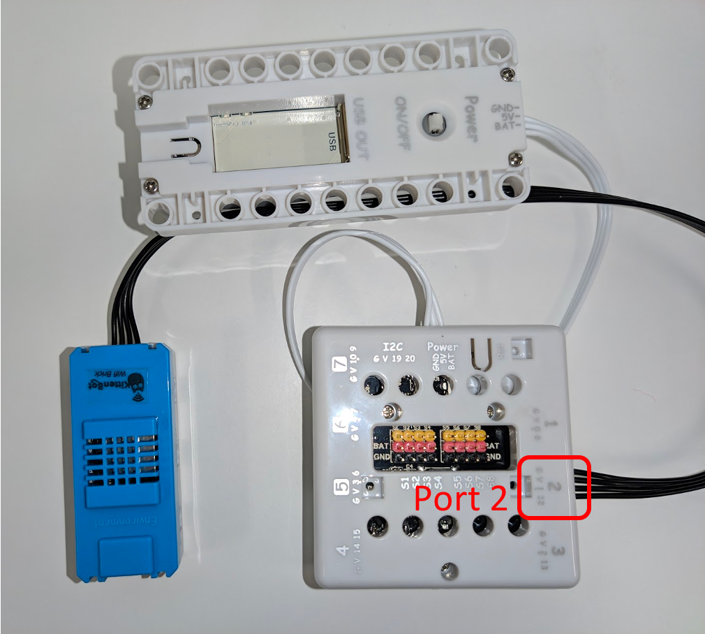
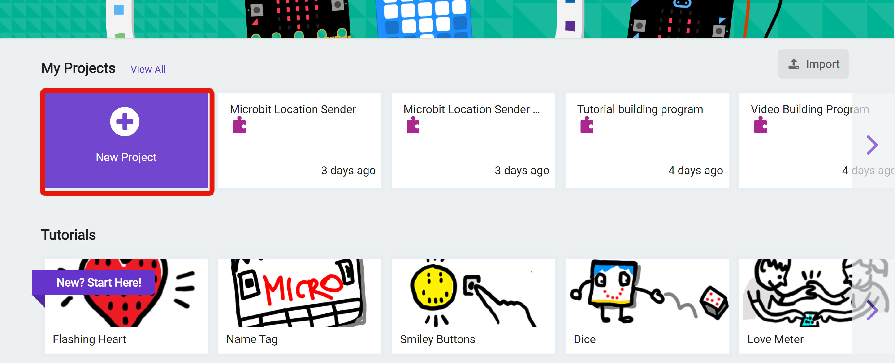
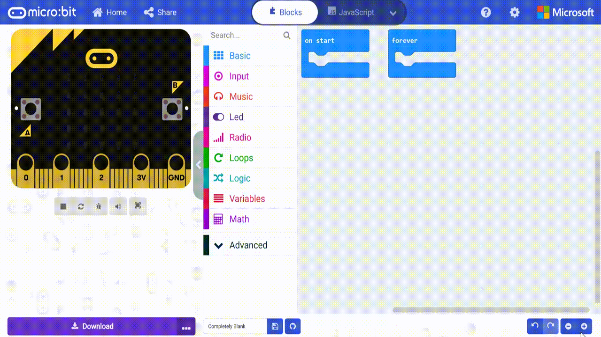
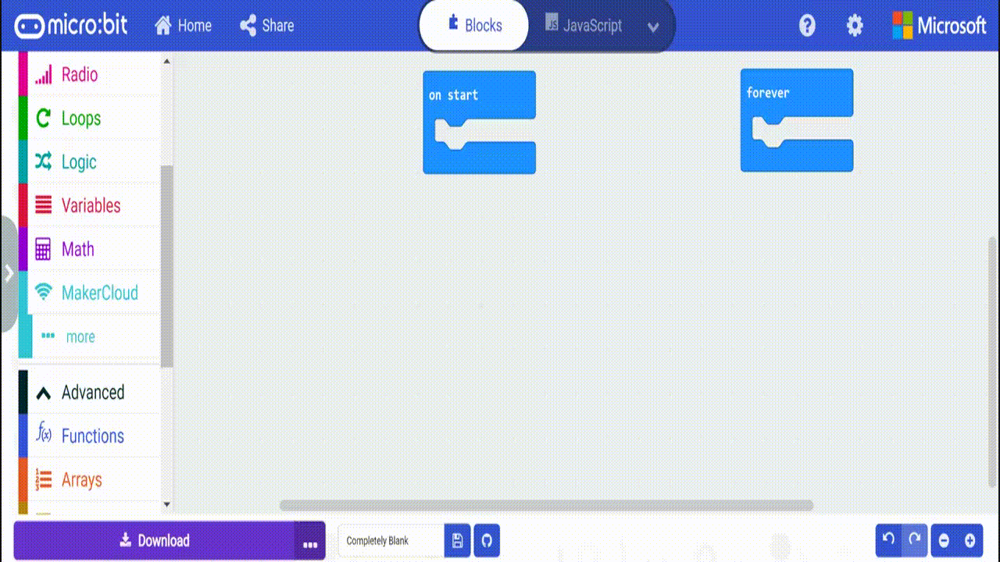
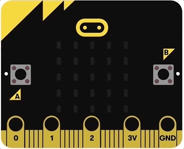
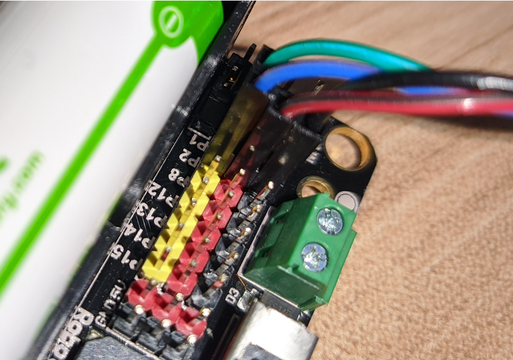

# Using BBC micro:bit to connect to MakerCloud
Since the BBC micro:bit cannot connect to the Internet, a Wi-Fi module must be added to enable the micro:bit to connect to the Internet.
At the same time, as long as there are building blocks supporting MQTT in the expansion of the Wi-Fi module, data can be published to the MakerCloud.
There are many Wi-Fi modules on the market that support MQTT, but the steps to connect to MQTT are usually complicated.
In order to simplify the connection to MakerCloud, MakerCloud provides a micro:bit expansion for commonly used Wi-Fi modules in the market. The KittenWiFi module made by KittenBot is the recommended Wi-Fi module.

[TOC]
## KittenWiFi
KittenWiFi can be used with several different micro:bit expansion boards, but KittenBot's Armour:bit and Robot:bit are recommended.

{:width="50%"}

KittenWiFi uses a 4pin anti-reverse interface; the 4 interfaces are G, V, A, B.

* G ------------> Ground
* V ------------> 3.3v/5v
* A ------------> TX
* B ------------> RX

{:width="15%"}

#### KittenWiFi Connection Status
There are two indicator lights on the front of the KittenWiFi block. The indicator light to the right indicates the connection status of the KittenWiFi.

|                  Red Light                  |               Purple Light                |                Green Light                |
|:-------------------------------------------:|:-----------------------------------------:|:-----------------------------------------:|
|  {:width="40%"}  | {:width="40%"} | {:width="40%"} |
|           Not Connected to Wi-Fi            |           Connecting to Wi-Fi             |             Connected to Wi-Fi            |

With a brief understanding of KittenWiFi, we can connect it to different micro:bit expansion boards.

### Armour:bit
Since Armour:bit also uses a 4pin anti-reverse interface, it will be convenient to use.
Connect KittenWiFi to Port 2 of the Armour:bit.  
  
Then you can start programming on Makecode.

#### Makecode for micro:bit
[https://makecode.microbit.org/]()

#### New Project

#### Join MakerCloud KittenWiFi extension
1. Click "Advanced" -> "Extensions"
2. Copy and paste the extension link of "MakerCloud KittenWiFi"
   [https://github.com/scaleinnotech/pxt-makercloud-v2]()

#### Connect Wi-Fi and MakerCloud
**On Start:**
First, set up KittenWiFi when the micro:bit starts.

1. Configure the Armour:bit interface
2. Connect Wi-Fi settings: Enter SSID and password
3. Connect to MakerCloud MQTT

After completing the programming, the user can download the program to the micro:bit. If you don’t know how to download code to a micro:bit, you can go to the following tutorial webpage:
[https://microbit.org/get-started/first-steps/set-up/]()

After downloading the programming, users can watch to the LED lights on the micro:bit. The micro:bit will have different LED animations according to the connection status:

|                Connecting to Wi-Fi                 |        Connected to Wi-Fi，Connecting to MQTT        |
|:-------------------------------------------:|:-------------------------------------------:|
| {:width="70%"} | {:width="70%"} |

After successfully connecting to MakerCloud, users can add other programming to make micro:bit perform other MQTT commands.
**Note that you must first connect Wi-Fi and MakerCloud MQTT every time you program.**

### Robot:bit V2.0
KittenWiFi can also be connected to the micro:bit using the DuPont connector, so users can use different micro:bit expansion boards on the market to connect to the micro:bit.
But it should be noted that most expansion boards on the market do not provide additional power. **If you only rely on the micro:bit for power supply, it will cause insufficient power supply and thenKittenWiFi will not work properly.**
Therefore, if you need to use the DuPont connector to connect to KittenWiFi, you must provide additional power to KittenWiFi.

**The Robot:bit has a lithium battery for additional power supply, so it is recommended to use Robot:bit to connect to KittenWiFi, and Robot:bit will also be used as a demonstration below.** If users are using other expansion boards with DuPont interface, they can also follow the instructions below.
#### Connection
First, users need to know the interface information of KittenWiFi. The 4 interfaces are G, V, A, B:
* G ------------> Ground
* V ------------> 3.3v/5v
* A ------------> TX
* B ------------> RX

In MakerCloud KittenWiFi extension, the default settings are:

* TX ------------> P2
* RX ------------> P1

For ease of use, users can connect to KittenWiFi with the default settings.
{:width="70%"}

Then you can start programming on MakeCode

#### Makecode for micro:bit
[https://makecode.microbit.org/]()

#### Create Project

#### Join MakerCloud KittenWiFi extension
1. Click "Advanced" -> "Extensions"
2. Copy and paste the extension link of "MakerCloud KittenWiFi"  
   [https://github.com/scaleinnotech/pxt-makercloud-v2]()

#### Connect Wi-Fi and MakerCloud
**On Start**
First, set up KittenWiFi when the micro:bit starts.

1. Setting the pin
2. Connect Wi-Fi settings: Enter SSID and password
3. Connect to MakerCloud MQTT

After completing the programming, the user can download the program to the micro:bit. If you don’t know how to download code to a micro:bit, you can go to the following tutorial webpage:  
[https://microbit.org/get-started/first-steps/set-up/]()

After downloading the programming, users can watch to the LED lights on the micro:bit. The micro:bit will have different LED animations according to the connection status:

|                Connecting to Wi-Fi                 |        Connected to Wi-Fi，Connecting to MQTT        |
|:-------------------------------------------:|:-------------------------------------------:|
| {:width="70%"} | {:width="70%"} |

After successfully connecting to MakerCloud, users can add other programming to make their micro:bits perform other MQTT commands.
**Note that you must first connect Wi-Fi and MakerCloud MQTT every time you program.**