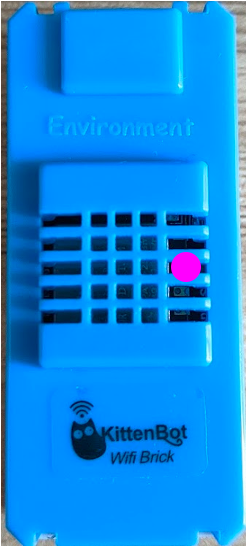
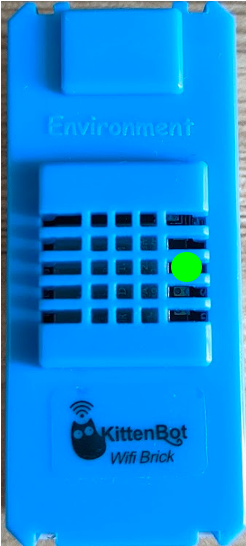
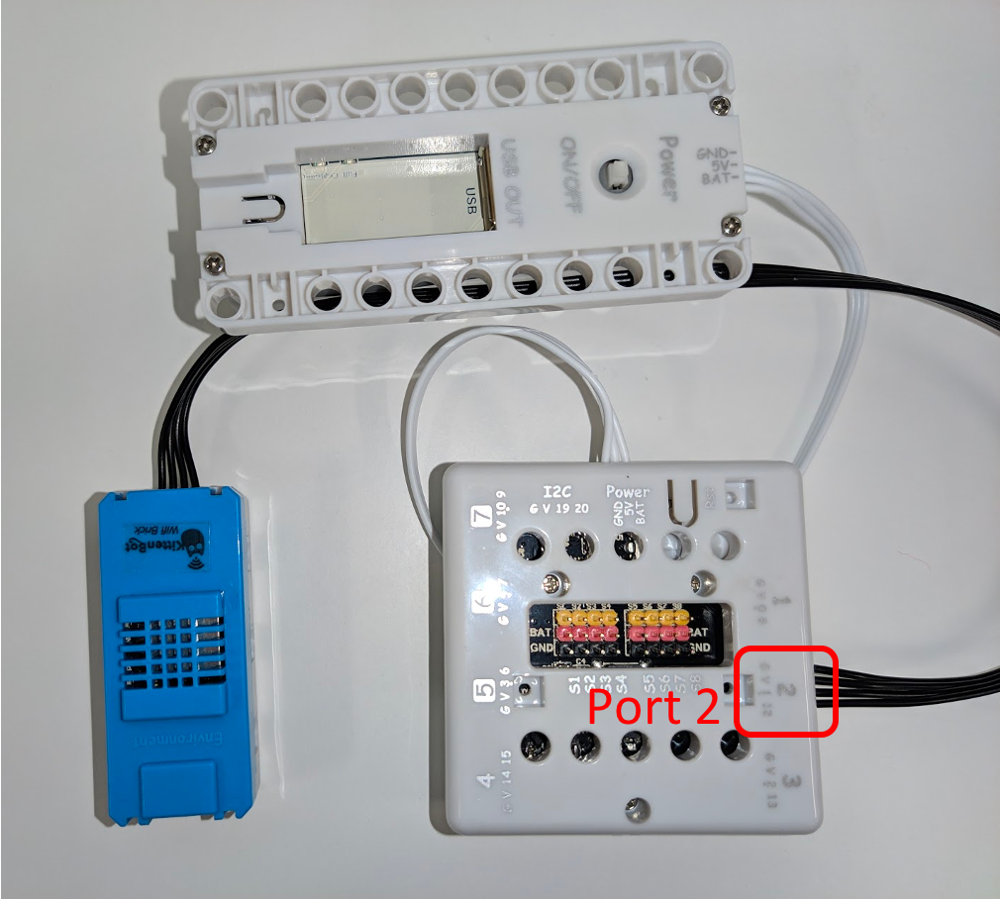

# BBC micro:bit發布
由於BBC
micro:bit本身並沒有連接網絡的功能，所以必須加上Wi-Fi模組令micro:bit能夠連接網絡。
同時只要在該Wi-Fi模組的擴展有支援MQTT的積木便可以發布資料到創客雲。
現時市面上有不少Wi-Fi模組是支援MQTT的，但連接MQTT的步驟通常比較繁複。
而為了簡化連接創客雲，創客雲為市面常用的Wi-Fi模組提供micro:bit擴展。KittenBot的KittenWiFi模組是推薦使用的Wi-Fi模組。

[TOC]
## KittenWiFi
KittenWiFi能配合不同的micro:bit擴展板使用，而KittenBot的Armour:bit和Robot:bit是推薦使用的。  
{:width="50%"}

KittenWiFi使用4pin的防反接接口。4個接口分別是G、V、A、B。

* G ------------> Ground
* V ------------> 3.3v/5v
* A ------------> TX
* B ------------> RX

{:width="15%"}

#### KittenWiFi連接狀況
在KittenWiFi的正面有兩顆指示燈。在中間偏右的指示燈是指示KittenWiFi的連接狀況。

|                    紅色                    |                   紫色                    |                    綠色                    |
|:-----------------------------------------:|:-----------------------------------------:|:-----------------------------------------:|
| {:width="40%"} | {:width="40%"} | {:width="40%"} |
|                未連接Wi-Fi                 |              正嘗試連接Wi-Fi               |               已成功連接Wi-Fi               |

簡單認識了KittenWiFi後，我們便可以把KittenWiFi配合不同的擴展板連接到micro:bit上使用。

### Armour:bit
由於Armour:bit亦是使用4pin防反接接口，所以使用上會較為方便。  
把KittenWiFi連接到Armour:bit的Port2。
  
然後到Makecode上開始編程。

#### Makecode for micro:bit
[https://makecode.microbit.org/]()

##### 新增專案

##### 加入創客雲KittenWiFi擴展
1. 點撃「進階」->「擴展」
2. 複製並貼上「創客雲KittenWiFi」的擴展連結  
   [https://github.com/maxwong-scale/pxt-makercloud-V2]()

##### 連接Wi-Fi及創客雲
**當啟動時**  
首先要在micro:bit啟動時設定好KittenWiFi。

1. 設定Armour:bit接口
2. 連接Wi-Fi設定: 輸入SSID和密碼
3. 連接創客雲MQTT

完成編程後，使用者便可以把編程下載到micro:bit。如果不懂如何把編程下載到micro:bit，可以到以下教學網頁:  
[https://microbit.org/get-started/first-steps/set-up/]()

下載編程後，使用者可以留意micro:bit上的LED燈，micro:bit會因應連接狀況而有不同的LED動畫:

|                正在連接Wi-Fi                 |        成功連接Wi-Fi，正在連接創客雲MQTT        |
|:-------------------------------------------:|:-------------------------------------------:|
| {:width="70%"} | {:width="70%"} |

### Robot:bit
