# Using KOI to publish message
Before publishing messages to MakerCloud, users must first learn how to connect KOI to MakerCloud via MQTT:
[Use KOI to connect to MakerCloud](../../ch4_connect/KOI/connect_KOI.md)

[TOC]
## KOI
As long as you successfully connect to MakerCloud, you can use the same publishing blocks to publish messages.
**Note that you must connect to Wi-Fi and MakerCloud when you start each program.**

### Publishing blocks
In the MakerCloud expansion, there are different types of publish blocks to allow different data types to be sent to MakerCloud.

**Publish a text message**

{:width="45%"}

Publishes a text message to a topic via KOI on MakerCloud

**Publish key text to message**

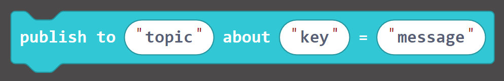{:width="60%"}

Publishes a key text message to a topic through KOI on MakerCloud

**Publish key-value pair message**

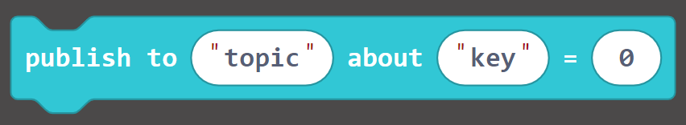{:width="50%"}

Publishes a key-value pair message to a topic through KOI to MakerCloud, and the corresponding line chart will be automatically created on MakerCloud

**Publish latitude and longitude update**

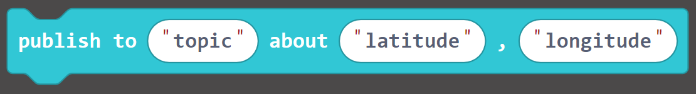{:width="70%"}

Publishes a latitude/longitude message to a topic through KOI on MakerCloud

## Exercises
### Publishing text messages
#### Learning Focus
- Learn how to publish text messages to MakerCloud topics through KOI

#### Say "hello" to MakerCloud
##### Goals
When you press the A button on your micro:bit, the micro:bit will publish the text message "hello" to MakerCloud.

{:width="70%"}

**Preparation on MakerCloud:**

1. Create a project
2. Create a topic

**Programming on MakeCode:**

1. Create a new project
2. Join KOI extension
   [https://github.com/KittenBot/pxt-koi]()
3. Join MakerCloud KOI Extension
   [https://github.com/scaleinnotech/pxt-makercloud-koi]()
4. On start:
   Update KOI interface, connect to WiFi and MakerCloud
5. When button "A" is pressed:
   publish text message
   
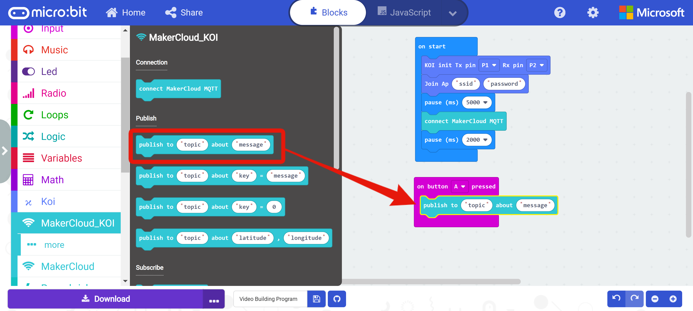
     

6. Copy the topic name in MakerCloud

   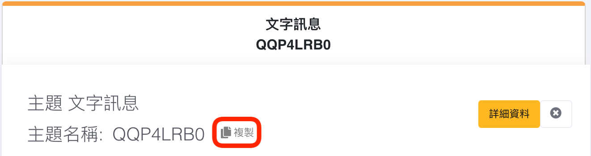{:width="80%"}
     

7. Paste in the "topic" of the publish text message block
8. Enter "hello" in "message"

   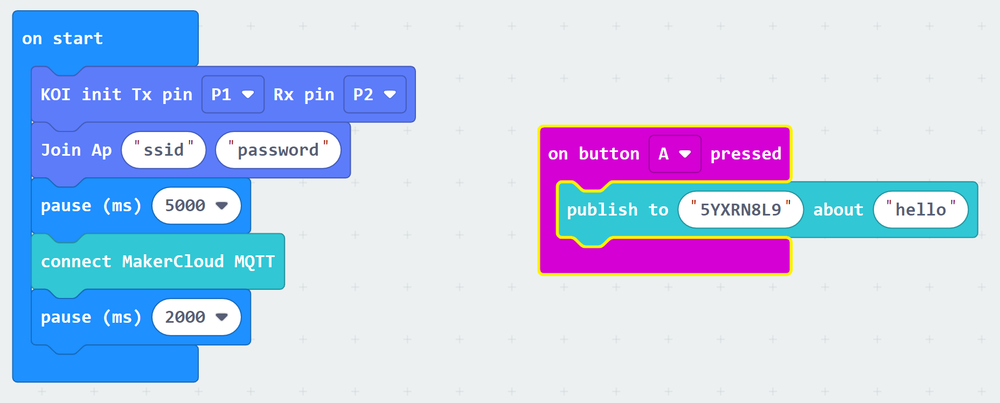{:width="90%"}
     

9. Download the program to micro:bit

When finished, return to your project's homepage of MakerCloud.
After pressing button A on your micro:bit, you should see the text messages from the micro:bit in the real-time data log.

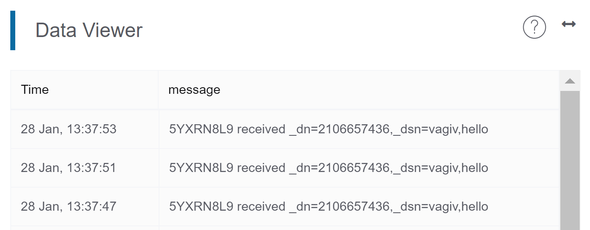{:width="70%"}

### Publishing key-value pair messages
#### Learning Focus
- Learn how to publish key-value pairs to topics on MakerCloud through KOI
- Learn to create a line graph on MakerCloud to display and record key-value pair messages

#### Publishing random numbers
##### Goals
- When you press button A on your micro:bit, the micro:bit will publish a key-value pair (random number) to MakerCloud
- Create a line graph on MakerCloud to display and record key-value pairs

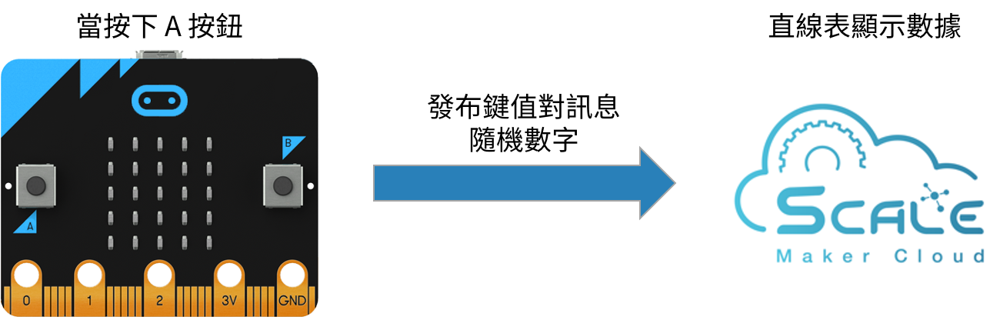{:width="80%"}

**Preparation on MakerCloud:**

1. Create a project
2. Create a topic

**Programming on MakeCode:**

1. Create a new
2. Join KOI extension
   [https://github.com/KittenBot/pxt-koi]()
3. Join MakerCloud KOI Extension
   [https://github.com/scaleinnotech/pxt-makercloud-koi]()
4. On start:
   Update KOI interface, connect to WiFi and MakerCloud
5. When button "A" is pressed:
   Publish a key-value pair

   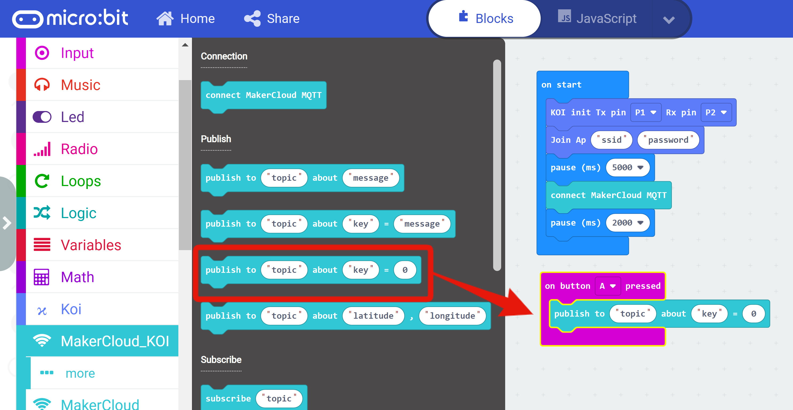
     

   Note: There are **publish key text pairs** and **publish key-value pairs** in the publish blocks. You can use either one.
6. Copy the topic name in MakerCloud

   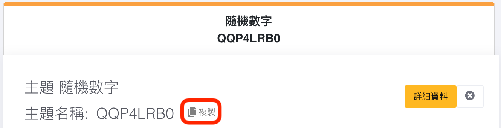{:width="80%"}
     

7. Paste in the "topic" of the publish text message block
8. Enter "num" in "key", and add "random number 0-10" in 0

   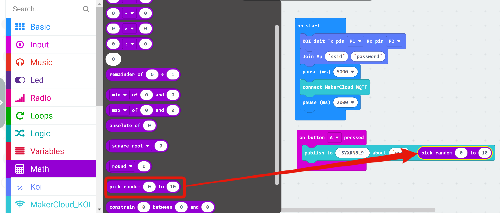
     

9. Download the program to micro:bit

When finished, return to your project's homepage on MakerCloud.
After pressing button A on your micro:bit, you should see the key-value pair messages from the micro:bit in the real-time data viewer.

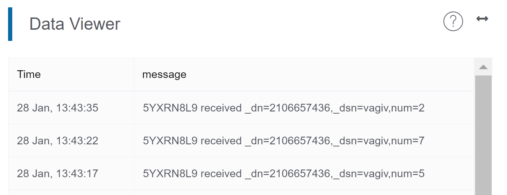{:width="70%"}

Then refresh your project's homepage and go to the chart homepage.
{:width="100%"}

MakerCloud will automatically record the name of the key and create a chart for it.

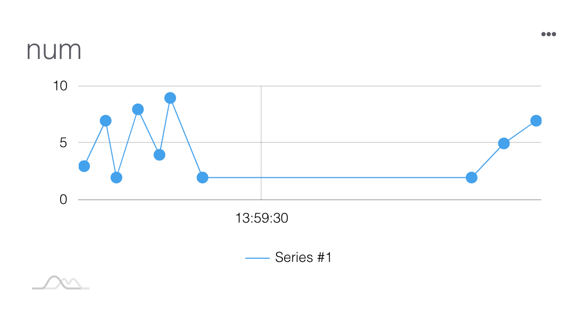{:width="60%"}