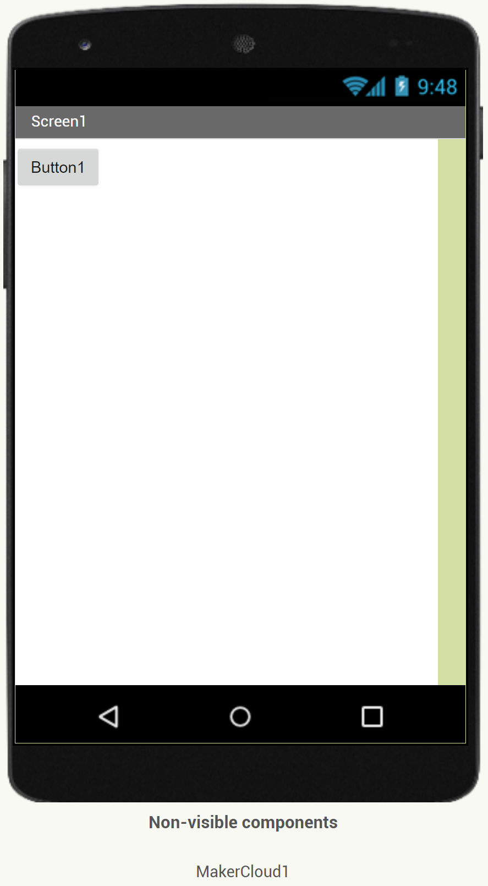

# 使用App Inventor 2發布訊息
在編程發布訊息到創客雲前，使用者必先學習如何令App Inventor 2連接創客雲MQTT，連接方法可參考上面的教學。  
[使用App Inventor 2連接創客雲](../../ch4_connect/ai2/connect_ai2.md)

[TOC]

## 發布訊息積木
在創客雲 AI2 extension 中，有不同類型的發布積木。

**發布文字訊息**  
{:width="40%"}  
向創客雲發布一個文字訊息到主題

**發布鍵文字對訊息**  
{:width="55%"}  
向創客雲發布一個鍵文字對訊息到主題

**發布鍵值對訊息**  
{:width="50%"}  
向創客雲發布一個鍵值對訊息到主題，創客雲上會自動建立對應的直線圖表

**發布經緯度訊息**  
{:width="55%"}  
透過KittenWiFi向創客雲發布一個經緯度訊息到主題

使用者可以根據數據類型使用相對應的發布積木。

## 發布文字訊息
#### 學習重點
- 學習如何利用App Inventor 2發布文字訊息到創客雲主題中

#### 練習
當點選按鈕後，便會發布在文字輸入盒中的文字到創客雲。

{:width="90%"}

**在AI2編程前，我們需要在創客雲上:**

1. 創建項目
2. 創建主題

**然後便可到AI2編程:**

1. 新增專案
  
2. 加入創客雲 AI2 extension  
   [創客雲 AI2 extension](../../ch4_connect/ai2/extension/scale.MakerCloud.aix) (按右鍵另存新檔）
  
3. 加入"輸入文字盒", "按鈕" 和 "MakerCloud" 到 "Screen1"中  
   {:width="50%"}
  
4. 在MakerCloud的元件屬性中，修改USERNAME  
   {:width="35%"}

**程式設計**

1. 加入連接創客雲積木  
   當screen初始化，執行「呼叫MakerCloudMQTT」
2. 當點選"按鈕1"後，發布在文字輸入盒中的文字到創客雲  
   {:width="70%"}
3. 在創客雲複製主題名稱  
   {:width="80%"}
  
4. 在AI2，把主題名稱貼上到"topic"
   {:width="70%"}

這樣便完成了發布文字的AI2編程了。

回到創客雲的項目主頁，在即時數據紀錄視窗中便可看到從APP發布的文字訊息。
{:width="70%"}

## 發布鍵值對訊息
#### 學習重點
- 學習如何利用App Inventor 2發布鍵值對到創客雲主題中
- 學習在創客雲上創建直線圖表達鍵值對訊息

#### 練習 - 發布隨機數字
- 當按下按鈕便會發布鍵值對訊息(隨機數字)到創客雲
- 在創客雲上創建直線圖以顯示鍵值對

{:width="90%"}

**在AI2編程前，我們需要在創客雲上:**

1. 創建項目
2. 創建主題

**然後便可到AI2編程:**

1. 新增專案
  
2. 加入創客雲 AI2 extension  
   [創客雲 AI2 extension](../../ch4_connect/ai2/extension/scale.MakerCloud.aix) (按右鍵另存新檔）
  
3. 加入"按鈕" 和 "MakerCloud" 到 "Screen1"中  
{:width="40%"}
  
4. 在MakerCloud的元件屬性中，修改USERNAME  
   {:width="35%"}

**程式設計**

1. 加入連接創客雲積木  
   當screen初始化，執行「呼叫MakerCloudMQTT」
2. 在「當點選 按鈕1」，加入「publishKeyValueToTopic」積木  
   
   注意: 發布積木中分別有**發布鍵文字對**和**發布鍵值對**，使用者可按數據類型使用
      
3. 在創客雲複製主題名稱  
   {:width="80%"}
      
4. 在"Topic"中貼上主題名稱，在"key"中輸入"num"，在"value中加入"隨機整數從0到10"
   {:width="90%"}
  

完成後，回到創客雲的項目主頁。  
當按下按鈕後，在即時數據紀錄便可以看到來自App的鍵值對訊息。  
{:width="70%"}

然後重新整理項目主頁，並轉到圖表主頁。
{:width="100%"}

創客雲會為鍵值對自動紀錄鍵的名字和創建圖表。  
{:width="60%"}

