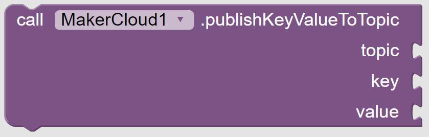
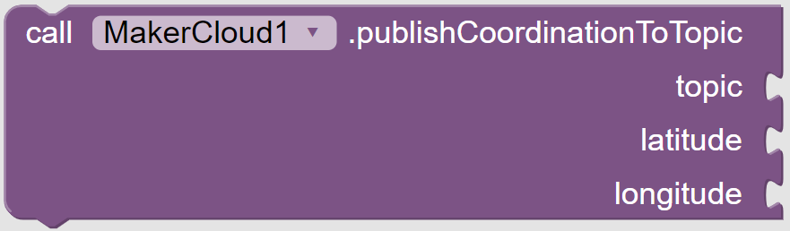
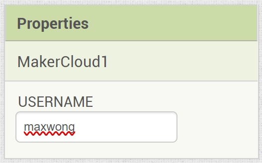
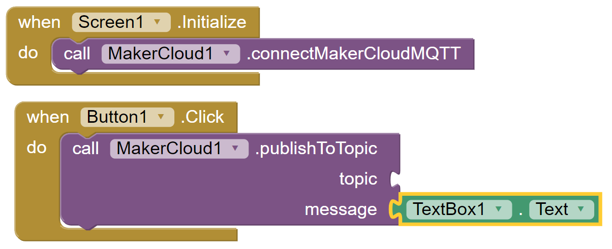
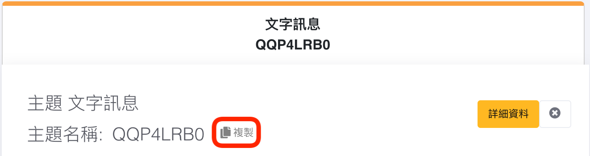
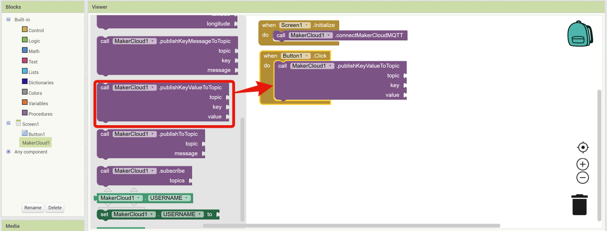
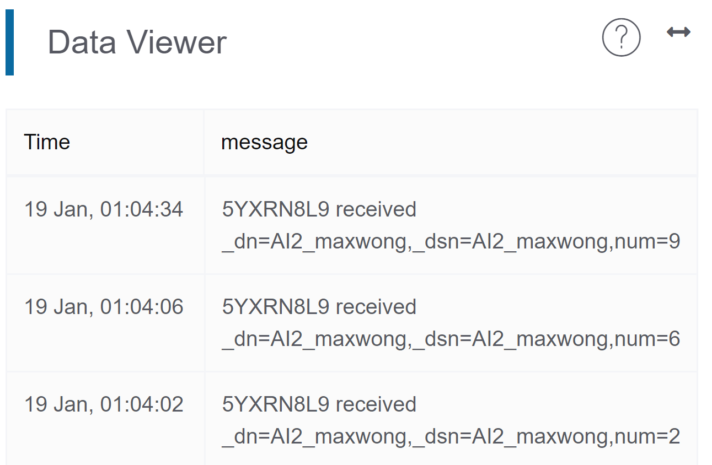
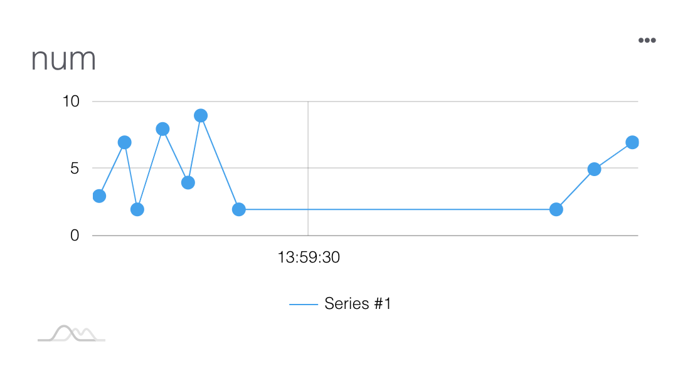

# Using App Inventor 2 pubish messages
Before programming messages to MakerCloud, users must first learn how to connect App Inventor 2 to MakerCloud MQTT. For the connection method, please refer to the above instruction.
[Using App Inventor 2 to Connect to MakerCloud](../../ch4_connect/ai2/connect_ai2.md)

[TOC]

## Publish Message Program Blocks
In the AI2 extension of MakerCloud, there are different types of publish program blocks.

**Publish a text message**
{:width="40%"}
Post a text message to a topic on MakerCloud

**Publish a text message with a key**
{:width="55%"}
Publish a text message with a key to a topic on MakerCloud

**Post key-value pair message**
{:width="50%"}
Publish a key-value pair message on MakerCloud to a topic, and a corresponding line chart will be automatically created on MakerCloud

**Post latitude and longitude information**
{:width="55%"}
Publish a latitude and longitude message to a topic via KittenWiFi on MakerCloud

Users can use the corresponding publishing program blocks according to the type of data they want to publish.

## Posting a text message
#### Learning Focus
- Learn how to use App Inventor 2 to publish text messages to a topic on MakerCloud

#### Exercise
Make a button that publishes the text in the input box on MakerCloud when clicked.

{:width="90%"}

**Before programming on AI2, we need to be prepared on MakerCloud:**

1. Create a project
2. Create a theme

**Then you can program on AI2:**

1. Add project
     
2. Join MakerCloud AI2 extension
   [MakerCloud AI2 extension](../../ch4_connect/ai2/extension/scale.MakerCloud.aix) (right click to save a new file)
     
3. Add a "text input box", "button" and add the "MakerCloud" extension
   {:width="50%"}
     
4. In the component properties of MakerCloud, set the USERNAME to "maxwong"
   {:width="35%"}

**Designing the program**
1. Place the Connect MakerCloud program Block so that it executes when the screen is initialized.
2. When "Button 1" is clicked, publish the text in the input box to MakerCloud
   {:width="70%"}
3. Copy the topic name in MakerCloud
   {:width="80%"}
     
4. In AI2, paste the topic name in "topic"
   {:width="70%"}

This completes the AI2 programming of publishing text.

On the project homepage of MakerCloud, you can see the text messages published from your app in the real-time data viewer.
{:width="70%"}

## Publishing a key-value pair message
#### Learning Focus
-Learn how to use App Inventor 2 to publish key-value pairs to a MakerCloud topic
-Learn to create a line graph on MakerCloud to express key-value pair messages

#### Exercise: Post random numbers
Make a button that publishes a random key-value pair to MakerCloud when clicked
- Create a line graph on MakerCloud to display key-value pairs

{:width="90%"}

**Before programming on AI2, we need to be prepared on MakerCloud**

1. Create a project
2. Create a theme

**Then you can program on AI2:**

1. Add a project
     
2. Add the MakerCloud AI2 extension
   [MakerCloud AI2 extension](../../ch4_connect/ai2/extension/scale.MakerCloud.aix) (right click to save a new file)
     
3. Add a "Button" and add the "MakerCloud" extension
   {:width="40%"}
     
4. In the properties section of MakerCloud, set the USERNAME to "maxwong"
   {:width="35%"}
   
**Designing the Program**

1. Add the Connecting to MakerCloud block so that it executes when the screen is initialized
2. Add the "publishKeyValueToTopic" block to "When button1 is clicked"
   
   Note: There are **publish key text pair** and **publish key-value pair** blocks, and users can use them according to the data type they would like to publish
     
3. Copy the topic name in MakerCloud
   {:width="80%"}
     
4. Paste the topic name in "Topic", enter "num" in "key", and add a "random integer from 0 to 10" block in "value"
   {:width="90%"}
     

When Finished, return to the project homepage of MakerCloud.
When you click the button, you can see the key-value pair message from your app in the real-time data viewer.
{:width="70%"}

Then refresh the project home page and go to the chart home page.
{:width="100%"}

MakerCloud will automatically record the name of the key and create a chart for that key, recording it as a data type.
{:width="60%"}