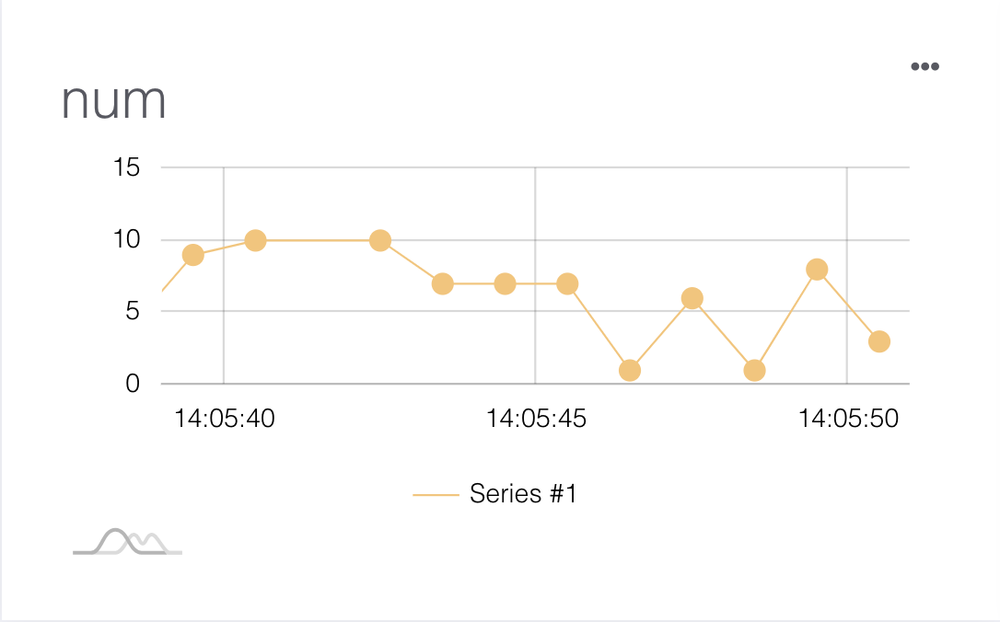

# Using Arduino to publish messages
Before programming and publishing messages to MakerCloud, users must first learn how to connect Arduino to MakerCloud MQTT. For instructions, please refer here:
[Connecting to MakerCloud with Arduino](../../ch4_connect/arduino/connect_arduino.md)

[TOC]

## Publish a message
The following instructions demonstrate how to publish different kinds of data to MakerCloud.

#### MakerCloudClient.publish_message()
Publishes a text message to a topic on MakerCloud
```cpp
MakerCloudClient.publish_message(topic, message)
```
**Topic:**
The topic name pasted from MakerCloud

**Message:**
The text message that is being published

#### MakerCloudClient.publish_key_message()
Publishes a key text message to a topic on MakerCloud
```cpp
MakerCloudClient.publish_key_message(topic, key, message)
```
**Topic:**
The topic name pasted from "MakerCloud"

**Key:**
The key the message is being published on

**Message:**
The text message that is being published

#### MakerCloudClient.publish_key_value()
Publish a key-value pair message to a topic on MakerCloud, which automatically creates a corresponding line chart on MakerCloud
```cpp
MakerCloudClient.publish_key_value(topic, key, value)
```
**Topic:**
The topic name pasted from "MakerCloud"

**Key:**
The key that the message is being published on

**Value:**
The value that is being published

#### MakerCloudClient.publish_coordination()
Publishes a key-value pair message to a topic on MakerCloud, which automatically creates a corresponding line chart on MakerCloud
```cpp
MakerCloudClient.publish_coordination(topic, latitude, longitude)
```
**Topic:**
The topic name pasted from "MakerCloud"

**Latitude:**
The latitude being published

**Longitude:**
The longitude being published

## Exercise - Publishing to MakerCloud
### Publishing Text Messages
#### Learning Focus
- Learn how to use Arduino to publish text messages to topics on MakerCloud

#### Exercise
Receive text input and publish it to a topic on MakerCloud

**Preparation on MakerCloud:**

1. Create a project and topic
2. Copy the topic name in MakerCloud
   
   {:width="80%"}

**Programming in Arduino IDE:**
```cpp
EthernetClient ethClient;
MakerCloudMQTT MakerCloudClient(ethClient);

// This function connects Wi-Fi
void setup_wifi() {

}

void setup() {
  Serial.begin(115200);

  // MakerCloudMQTT Configuration
  MakerCloudClient.setUsername("Max");
  // Enable to print extra log
  MakerCloudClient.setLog(true);
  
  // Connect Wi-Fi
  setup_wifi();

  // Connect to MakerCloud
  MakerCloudClient.connect();
}

// The looping function will allow sending message to MakerCloud
void loop() {
  // Publish message
  MakerCloudClient.publish_message(topic, "hello from arduino");
  delay(2000);
}
```

After uploading the programming, return to the project homepage on MakerCloud.
In the real-time data viewer, you should see the text messages published from the Arduino.

{:width="70%"}

### Publishing key-value pair messages
#### Learning Focus
- Learn how to publish key-value pairs to MakerCloud topics via Arduino
- Learn how to create a line graph on MakerCloud to display and record key-value pair messages

#### Exercise-Publish random numbers
##### Goals
- Publish key-value pair messages (random numbers) to MakerCloud
- Create a line graph on MakerCloud to display key-value pairs

**Preparation on MakerCloud:**

1. Create a project
2. Create a topic
3. Copy the topic name in MakerCloud
   
   {:width="80%"}

**Programming in Arduino IDE:**
```cpp
EthernetClient ethClient;
MakerCloudMQTT MakerCloudClient(ethClient);

// This function connects Wi-Fi
void setup_wifi() {

}

void setup() {
  Serial.begin(115200);
  randomSeed(analogRead(0));

  // MakerCloudMQTT Configuration
  MakerCloudClient.setUsername("Max");
  // Enable to print extra log
  MakerCloudClient.setLog(true);
  
  // Connect Wi-Fi
  setup_wifi();

  // Connect to MakerCloud
  MakerCloudClient.connect();
}

// The looping function will allow sending key-value to MakerCloud
void loop() {
  // Publish Key-Value Pair
  int randNumber = random(0, 9);
  MakerCloudClient.publish_key_value(topic, "num", randNumber);
  delay(2000);
}
```
After uploading the programming, return to your project's homepage on MakerCloud.
You should see the key-value pair messages that have been published from the Arduino in the real-time data viewer.

{:width="70%"}

Then refresh the project homepage and go to the chart homepage.

{:width="100%"}

MakerCloud will automatically record the key and create a chart for it.

{:width="60%"}