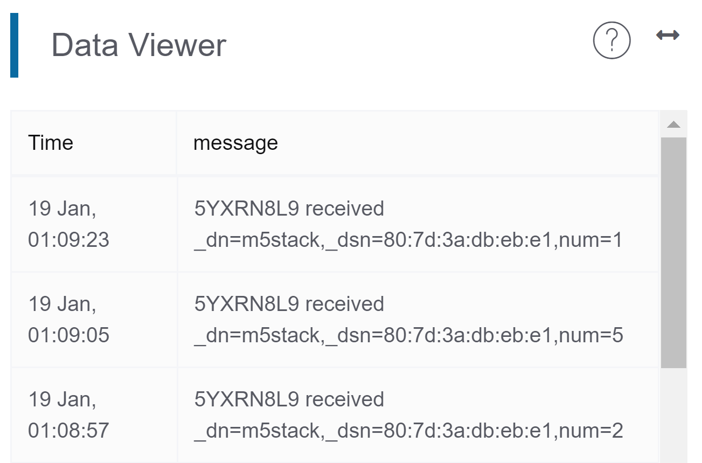

# 使用M5Stack發布訊息
在編程發布訊息到創客雲前，使用者必先學習如何令M5Stack連接創客雲MQTT，連接方法可參考上面的教學。  
[使用M5Stack連接創客雲](../../ch4_connect/m5stack/connect_m5stack.md)

[TOC]

## 發布訊息積木

使用者可以使用MakerCloud Custom的發佈積木發佈訊息到創客雲。

**發布鍵值對訊息**  
{:width="30%"}  
向創客雲發布一個鍵值對訊息到主題。  
如果值是數字，創客雲上會自動建立對應的直線圖表。

## 發布鍵值對訊息
#### 學習重點
- 學習如何利用M5Stack發布鍵值對到創客雲主題中
- 學習在創客雲上創建直線圖表達鍵值對訊息

#### 練習 - 發布隨機數字
- 當按下按鈕便會發布鍵值對訊息(隨機數字)到創客雲
- 在創客雲上創建直線圖以顯示鍵值對

**在UiFlow編程前，我們需要在創客雲上:**

1. 創建項目
2. 創建主題

**然後便可到UiFlow編程:**

1. M5Stack連接Wi-Fi，然後把M5Stack連接到UiFlow
2. 加入創客雲 UiFlow Custom  
   [下載創客雲 UiFlow Custom](https://cutt.ly/makercloud)

3. 雙擊UiFlow中的M5Stack的B Button以加入「Button B was pressed」積木
{:width="100%"}
  
4. 在「Button B was pressed」積木中，加入MakerCloud Custom中的發布鍵值對訊息積木。
   {:width="60%"}
  
5. 在創客雲複製主題名稱  
   {:width="60%"}
6. 在"Topic"中貼上主題名稱，在"key"中輸入"num"，在"value中加入"random integer from 0 to 10"
   {:width="65%"}
  

完成後，回到創客雲的項目主頁。  
當按下按鈕後，在即時數據紀錄便可以看到來自App的鍵值對訊息。  
{:width="80%"}

然後重新整理項目主頁。  
創雲會為鍵值對自動紀錄鍵的名字和創建圖表。  
{:width="80%"}

