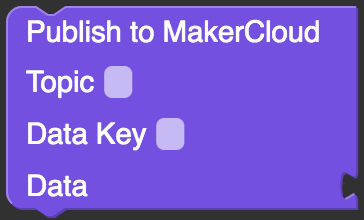

# Using M5Stack to publish messages to MakerCloud
Before publishing messages to MakerCloud, users must first learn how to connect M5Stack to MakerCloud via MQTT. For instructions on connecting, please refer to the following link.
[Using M5Stack to connect to MakerCloud](../../ch4_connect/m5stack/connect_m5stack.md)

[TOC]

## Publish message programing block

Users can use the MakerCloud programming blocks from Custom to publish messages to MakerCloud.

**Publishing a  key-value pair message**

{:width="30%"}

- Publishes a key-value pair or key-text message to the topic on MakerCloud.
- If the data sent is a number, a corresponding line chart will be automatically created on MakerCloud.

## Publishing a key-value pair message
#### Learning Focus
- Learn how to use M5Stack to publish key-value pairs to a topic on MakerCloud
- Create a line graph on MakerCloud that displays and records key-value messages

#### Exercise: publish random numbers
- Make a button that publishes a random key-value message when clicked.
- Create a line graph on MakerCloud to display and record key-value messages

**Preparation on MakerCloud:**

1. Create a project
2. Create a topic

**Programming on UiFlow:**

1. Connect M5Stack to Wi-Fi, then connect M5Stack to UiFlow
2. Add MakerCloud UiFlow Custom
   [(Download MakerCloud UiFlow Custom)](https://cutt.ly/makercloud)

3. Double-click the B Button of M5Stack in UiFlow to add the "Button B wasPressed" block
   
   {:width="100%"}
     
   
4. In the "Button B wasPressed" building block, place the key-value pair message block from MakerCloud Custom.
   
   {:width="60%"}
     
   
5. Copy the topic name in MakerCloud
   
   {:width="80%"}
     
   
6. Paste the topic name in "Topic", enter "num" in "key", and add a "random integer from 0 to 10" block in "value"
   
   {:width="65%"}
     
   
When finished, return to the project homepage of MakerCloud.
When you press the button, you should see the key-value pair message from your app in the data viewer.

{:width="70%"}

Then refresh the project home page and go to the chart home page.

{:width="100%"}

MakerCloud will automatically record the name of the key and create a chart to display and record the key-value pair.

{:width="80%"}
