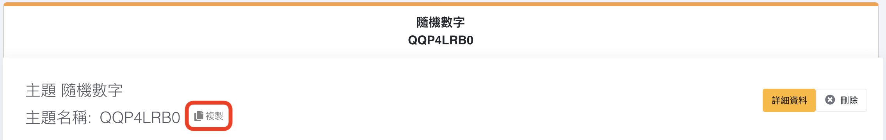

# 使用BBC micro:bit發布訊息
在編程發布訊息到創客雲前，使用者必先學習如何令micro:bit連接創客雲MQTT，連接方法可根據硬件參考上面的教學。  
[使用BBC micro:bit連接創客雲](../../ch4_connect/microbit/connect_microbit.md)

[TOC]

## KittenWiFi
即使使用不同的micro:bit擴展板，只要成功連接創客雲後，便可以使用以下同樣的發布積木編程發布訊息。而以下使用Armour:bit作為示範。  
**注意每次編程必須要在當啟動時先連接Wi-Fi和創客雲MQTT。**
### 發布訊息積木
在創客雲擴展中，有不同類型的發布積木。

**發布文字訊息**  
{:width="45%"}  
透過KittenWiFi向創客雲發布一個文字訊息到主題

**發布鍵文字對訊息**  
{:width="60%"}  
透過KittenWiFi向創客雲發布一個鍵文字對訊息到主題

**發布鍵值對訊息**  
{:width="50%"}  
透過KittenWiFi向創客雲發布一個鍵值對訊息到主題，創客雲上會自動建立對應的直線圖表

**發布經緯度訊息**  
{:width="70%"}  
透過KittenWiFi向創客雲發布一個經緯度訊息到主題

使用者可以根據數據類型使用相對應的發布積木。

### 發布文字訊息
#### 學習重點
- 學習如何透過KittenWiFi發布文字訊息到創客雲主題中

#### 練習 - 向創客雲打招呼
##### 目標
當按下micro:bit的A按鈕，micro:bit便會發布文字訊息「hello」到創客雲。

{:width="70%"}

**在Makecode編程前，我們需要在創客雲上:**

1. 創建項目
2. 創建主題

**然後便可到Makecode編程:**

1. 新增專案
2. 加入創客雲KittenWiFi擴展  
   [https://github.com/maxwong-scale/pxt-makercloud-V2]()
3. 當啟動時:  
   更新KittenWiFi接口、連接WiFi及創客雲MQTT
4. 當按鈕「A」被按下:  
   發布文字訊息

  
5. 在創客雲複製主題名稱  
{:width="70%"}
  
6. 貼上發佈文字訊息積木的"topic"中
7. 在"message"中輸入"hello"  
{:width="90%"}
  
8. 下載編程到micro:bit

完成後，回到創客雲的項目主頁。  
當按下micro:bit的A按鈕後，在即時數據紀錄便可以看到來自micro:bit的文字訊息。  
{:width="70%"}

### 發布鍵值對訊息
#### 學習重點
- 學習如何透過KittenWiFi發布鍵值對到創客雲主題中
- 學習在創客雲上創建直線圖表達鍵值對訊息

#### 練習 - 發布隨機數字
##### 目標
- 當按下micro:bit的A按鈕，micro:bit便會發布鍵值對訊息(隨機數字)到創客雲
- 在創客雲上創建直線圖以顯示鍵值對

{:width="80%"}

**在Makecode編程前，我們需要在創客雲上:**

1. 創建項目
2. 創建主題

**然後便可到Makecode編程:**

1. 新增專案
2. 加入創客雲KittenWiFi擴展  
   [https://github.com/maxwong-scale/pxt-makercloud-V2]()
3. 當啟動時:  
   更新KittenWiFi接口、連接WiFi及創客雲MQTT
4. 當按鈕「A」被按下:  
   發布鍵值對  

  
注意: 發布積木中分別有**發布鍵文字對**和**發布鍵值對**，使用者可按數據類型使用
5. 在創客雲複製主題名稱  
{:width="70%"}
6. 貼上發佈文字訊息積木的"topic"中
7. 在"key"中輸入"num"，在0中加入"隨機取數0-10"

  
8. 下載編程到micro:bit

完成後，回到創客雲的項目主頁。  
當按下micro:bit的A按鈕後，在即時數據紀錄便可以看到來自micro:bit的鍵值對訊息。  
{:width="70%"}

然後重新整理項目主頁。  
創雲會為鍵值對自動紀錄鍵的名字和創建圖表。  

