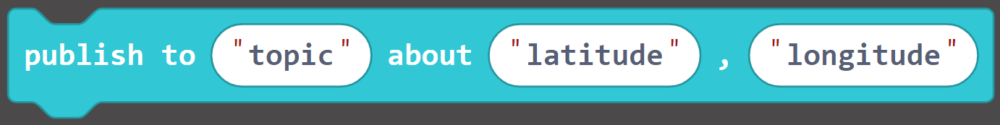
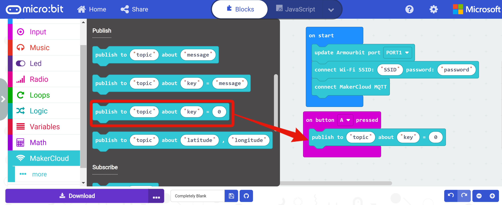
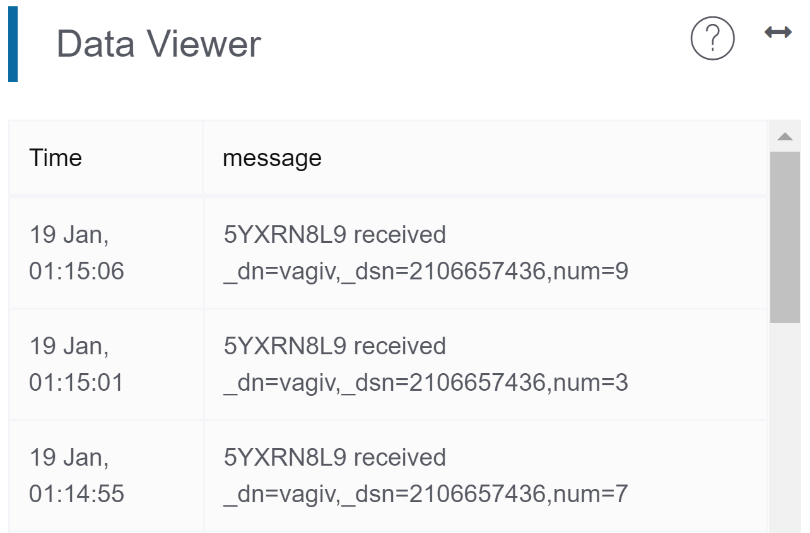

# Use BBC micro:bit to post messages
Before programming and publishing messages to MakerCloud, users must first connect micro:bit to MakerCloud via MQTT. For instructions, refer to the following link.
[Using BBC micro:bit to connect to MakerCloud](../../ch4_connect/microbit/connect_microbit.md)

[TOC]

## KittenWiFi
Even if you use different micro:bit expansion boards, they can use the same program blocks to program and publish messages as long as they are successfully connected to MakerCloud. The following uses Armour:bit as a demonstration.
**Note that each program must initially connect to Wi-Fi and MakerCloud MQTT. **
### Post message blocks
In the MakerCloud extension, there are different types of publishing program blocks.

**Publishing a text message**
{:width="45%"}
Publish a text message to a topic via KittenWiFi on MakerCloud

**Publish a key text message**
{:width="60%"}
Publish a key text message to a topic via KittenWiFi on MakerCloud

**Publish a  key-value pair message**
{:width="50%"}
Publish a key-value message to a topic via KittenWiFi on MakerCloud, and a corresponding line chart will be automatically created on MakerCloud

**Publishing latitude and longitude data points**
{:width="70%"}
Publish a latitude and longitude message to a topic via KittenWiFi on MakerCloud

Users can use the corresponding publishing blocks according to the data type they would like to send.

### Publishing a text message
#### Learning Focus
- Learn how to publish text messages to a topic on MakerCloud via KittenWiFi
#### Exercise: Say hello to MakerCloud
##### Goal:
When you press "A" on your micro:bit, it will post the text message "hello" to a topic on MakerCloud.

{:width="70%"}

**Before programming on Makecode, we need to be prepared on MakerCloud**

1. Create a project
2. Create a topic

**Then you can program on MakeCode:**

1. Create a project
2. Add the MakerCloud KittenWiFi extension:
   [https://github.com/maxwong-scale/pxt-makercloud-V2]()
3. On start:
   Update armour:bit port (put which port you have the KittenWifi plugged into), connect WiFi and MakerCloud MQTT
4. When the button "A" is pressed:
   Publish a text message
   
     
5. Copy the topic name in MakerCloud
   {:width="80%"}
     
6. Paste in the "topic" of the publish text message block
7. Enter "hello" in "message"
   {:width="90%"}
     
8. Download the program to your micro:bit
   When finished, return to your project homepage on MakerCloud.
   After pressing A on your micro:bit, you can see the text messages sent from your micro:bit in the real-time data viewer.
   {:width="70%"}

### Publishing a key-value pair message
#### Learning Focus
- Learn how to publish key-value pairs to a MakerCloud topic via KittenWiFi
- Learn to create a line graph on MakerCloud to display and record key-value pair messages

#### Exercise: Post random numbers
##### Goals
-When you press A on your micro:bit, the micro:bit will publish a key-value pair message (a random number value) on MakerCloud
-Create a line graph on MakerCloud to display and record key-value pairs
{:width="80%"}

**Before programming on MakeCode, we need to be prepared on MakerCloud:**

1. Create a project
2. Create a theme

**Then you can program on MakeCode:**

1. Create a project
2. Add the MakerCloud KittenWiFi extension:
   [https://github.com/maxwong-scale/pxt-makercloud-V2]()
3. On start:
   Update armourbit port, connect WiFi and MakerCloud MQTT
4. When button "A" is pressed:
   Publish a key-value pair
   
     
   Note: There are **publish key text pair** and **publish key-value pair** blocks available. Users can decdide which to use according to the type of data that they want to send.
5. Copy the topic name in MakerCloud
   {:width="80%"}
     
6. Paste in the "topic" of the publish text message building block
7. Enter "num" in "key" and add "random number 0-10" in 0
   
     
8. Download the program to micro:bit
   
When finished, return to the project homepage of MakerCloud. 
After pressing A on your micro:bit, you can see the key-value pair messages from your micro:bit in the real-time viewer record.
   {:width="70%"}

Then refresh the project home page and go to the chart home page.
{:width="100%"}

MakerCloud will automatically record the name of the key and create a chart for the key-value pair.
{:width="60%"}