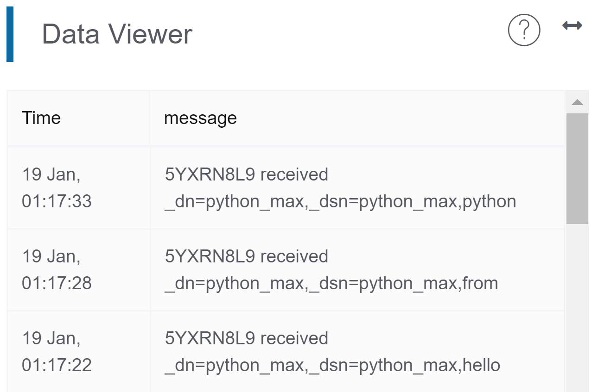
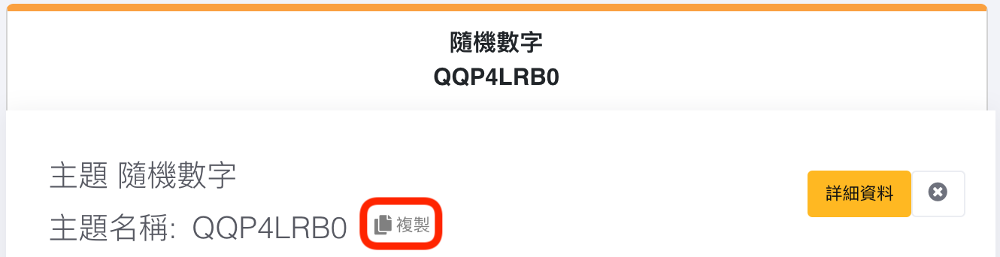

# Using Python to publish messages to MakerCloud
Before publishing messages to MakerCloud, users must first learn how to connect Python to MakerCloud via MQTT. For instructions, refer to the following link:
[Using Python to connect to MakerCloud](../../ch4_connect/python/connect_python.md)

[TOC]

## Publishing a message

##### MakerCloudMQTT.publish_message()
Publishes a text message to a topic on MakerCloud:
```python
MakerCloudMQTT.publish_message(topic, message)
```
**Topic -**
the topic name created on "MakerCloud"

**Message -**
the text message that you want to publish

##### MakerCloudMQTT.publish_key_message()
Publishes a key text message to the topic on MakerCloud:
```python
MakerCloudMQTT.publish_key_message(topic, key, message)
```
**Topic -**  
the topic name created on "MakerCloud"

**Key -**
the key that you want to use

**Message -**
The text message that you want to publish

##### MakerCloudMQTT.publish_key_value()
Publishes a key-value message to MakerCloud to the topic (the corresponding line chart will be automatically created on MakerCloud):
```python
MakerCloudMQTT.publish_key_value(topic, key, value)
```
**Topic -**
the topic name created on "MakerCloud"

**Key -**
the key that you want to use

**Value -**
the value that you want to publish

##### MakerCloudMQTT.publish_coordination()
Publishes a latidude/longitude message to MakerCloud to a topic (a corresponding line chart will be automatically created on MakerCloud):
```python
MakerCloudMQTT.publish_coordination(topic, latitude, longitude)
```
**Topic -**
the topic name created on "MakerCloud"

**Latitude -**
the latitude you want to publish

**Longitude -**
the longitude you want to publish

Users can use the publishing function that corresponds to the type of data they want to send.

### Application: Publishing a text message
#### Learning Focus
- Learn how to use Python to publish text messages to topics on MakerCloud

#### Exercise:
- Receive text input and publish it to a topic on MakerCloud.

**Preparation on MakerCloud:**

1. Create a project
2. Create a topic
3. Copy the topic name in MakerCloud

{:width="80%"}
   
**Programming in Python:**
```python
import MakerCloudMQTT

MakerCloudMQTT.username ='Max'
# Paste the topic name
topic ='QQP4LRB0'

while 1:
     # Read input crossword
     message = input('Message:')
     # Post text message to MakerCloud theme
     MakerCloudMQTT.publish_message(topic, message)
```

After running the programming, enter the text message you want to publish
```
Message: hello
Message: from
Message: Python
```

On the project homepage of MakerCloud, you should see the text messages published from python in the real-time data viewer.

{:width="70%"}
### Application: Publishing a key-value pair message
#### Learning Focus:
- Learn how to publish key-value pairs to MakerCloud topics through Python
- Create a line graph on MakerCloud to display and record key-value pair messages

#### Exercise: Publishing random numbers
##### Goals:
- Publish key-value pair messages (random numbers) to MakerCloud
- Create a line graph on MakerCloud to display and record key-value pairs

**Preparation on MakerCloud:**

1. Create a project
2. Create a topic
3. Copy the topic name in MakerCloud

{:width="80%"}

**Programming in python:**
```python
import MakerCloudMQTT
import random
import time
MakerCloudMQTT.username = 'Max'
# Place the topic name inside a variable
topic ='QQP4LRB0'

while 1:
     # Generate random numbers (1-10)
     randomInt = random.randint(1, 10)
     # Publish key-value pairs (random numbers) to the Makercloud theme
     MakerCloudMQTT.publish_key_value(topic,'num', randomInt)
     print('Published: num =',randomInt)
     # Pause for 1 second
     time.sleep(1)

```
When finished, return to the project homepage of MakerCloud.
You should see the key-value pair messages from python in the real-time data viewer.

{:width="70%"}

Then refresh the project home page and go to the chart home page.

{:width="100%"}

MakerCloud will automatically record the name of the key and create a chart for the key-value messages.

{:width="60%"}