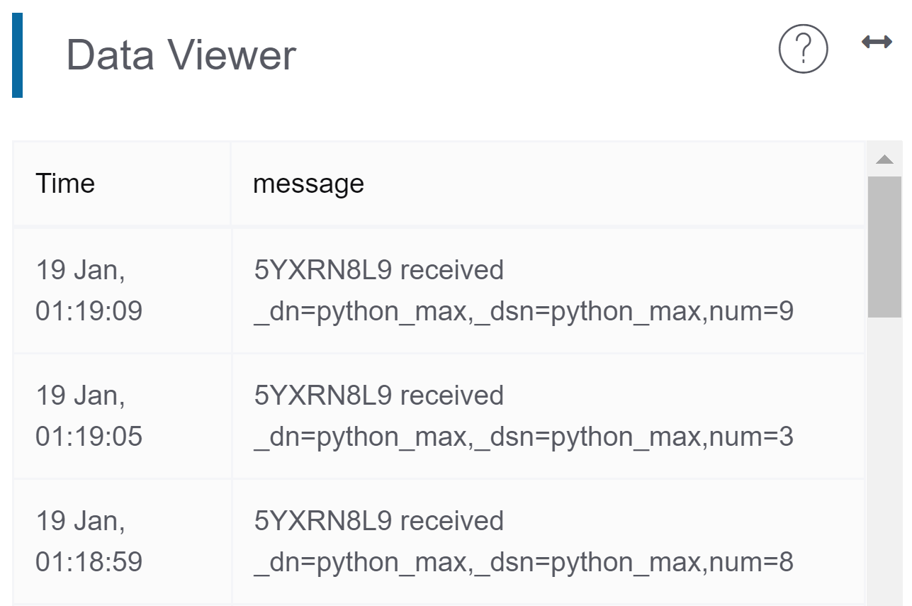

# 使用Python發布訊息
在編程發布訊息到創客雲前，使用者必先學習如何令Python連接創客雲MQTT，連接方法可參考上面的教學。  
[使用Python連接創客雲](../../ch4_connect/python/connect_python.md)

[TOC]

## 發布訊息

#### MakerCloudMQTT.publish_message()
向創客雲發布一個文字訊息到主題
```python
MakerCloudMQTT.publish_message(topic, message)
```
**topic**  
在「創客雲」上創建的主題名稱

**message**  
需要發佈的文字訊息

#### MakerCloudMQTT.publish_key_message()
向創客雲發布一個鍵文字對訊息到主題
```python
MakerCloudMQTT.publish_key_message(topic, key, message)
```
**topic**  
在「創客雲」上創建的主題名稱

**key**  
需要發佈的鍵

**message**  
需要發佈的文字訊息

#### MakerCloudMQTT.publish_key_value()
向創客雲發布一個鍵值對訊息到主題，創客雲上會自動建立對應的直線圖表
```python
MakerCloudMQTT.publish_key_value(topic, key, value)
```
**topic**  
在「創客雲」上創建的主題名稱

**key**  
需要發佈的鍵

**value**  
需要發佈的數值

#### MakerCloudMQTT.publish_coordination()
向創客雲發布一個鍵值對訊息到主題，創客雲上會自動建立對應的直線圖表
```python
MakerCloudMQTT.publish_coordination(topic, latitude, longitude)
```
**topic**  
在「創客雲」上創建的主題名稱

**latitude**  
需要發佈的緯度

**longitude**  
需要發佈的經度

使用者可以根據數據類型使用相對應的發布函數。

## 發布文字訊息
#### 學習重點
- 學習如何利用Python發布文字訊息到創客雲主題中

#### 練習
讀取輸入文字，然後發布到創客雲主題中。

**在Python編程前，我們需要在創客雲上:**

1. 創建項目
2. 創建主題
3. 在創客雲複製主題名稱  
{:width="60%"}

**然後便可到Python編程:**
```python
import MakerCloudMQTT

MakerCloudMQTT.username = 'Max'
# 貼上主題名稱
topic = 'QQP4LRB0'

while 1:
    # 讀取輸入交字
    message = input('Message: ')
    # 發佈文字訊息到創客雲主題
    MakerCloudMQTT.publish_message(topic, message)
```

運行編程後，輸入需要發佈的文字訊息
```
Message: hello
Message: from
Message: Python
```

回到創客雲的項目主頁，在即時數據紀錄視窗中便可看到從APP發布的文字訊息。
{:width="65%"}

### 發布鍵值對訊息
#### 學習重點
- 學習如何透過Python發布鍵值對到創客雲主題中
- 學習在創客雲上創建直線圖表達鍵值對訊息

#### 練習 - 發布隨機數字
##### 目標
- 發布鍵值對訊息(隨機數字)到創客雲
- 在創客雲上創建直線圖以顯示鍵值對

**在AI2編程前，我們需要在創客雲上:**

1. 創建項目
2. 創建主題
3. 在創客雲複製主題名稱  
   {:width="60%"}

**然後便可到Python編程:**
```python
import MakerCloudMQTT
import random
import time

MakerCloudMQTT.username = 'Max'
# 貼上主題名稱
topic = 'QQP4LRB0'

while 1:
    # 產生隨機數字(1-10)
    randomInt = random.randint(1, 10)
    # 發佈鍵值對(隨機數字)到創客雲主題
    MakerCloudMQTT.publish_key_value(topic, 'num', randomInt)
    print('Published: num =',randomInt)
    # 暫停1秒
    time.sleep(1)

```
完成後，回到創客雲的項目主頁。  
在即時數據紀錄便可以看到來自App的鍵值對訊息。  
{:width="70%"}

然後重新整理項目主頁。  
創雲會為鍵值對自動紀錄鍵的名字和創建圖表。  
{:width="60%"}