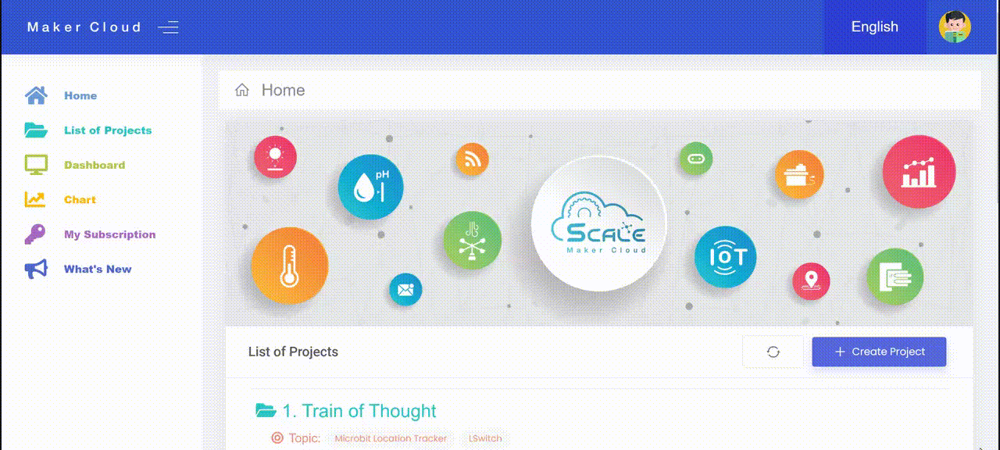
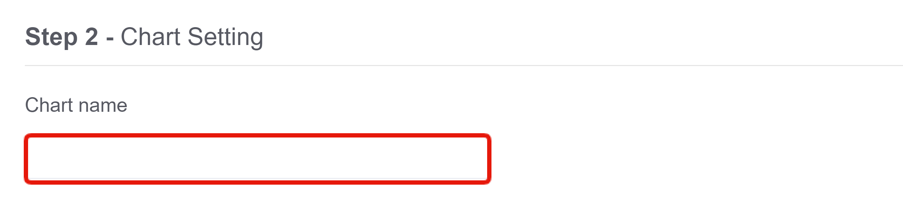
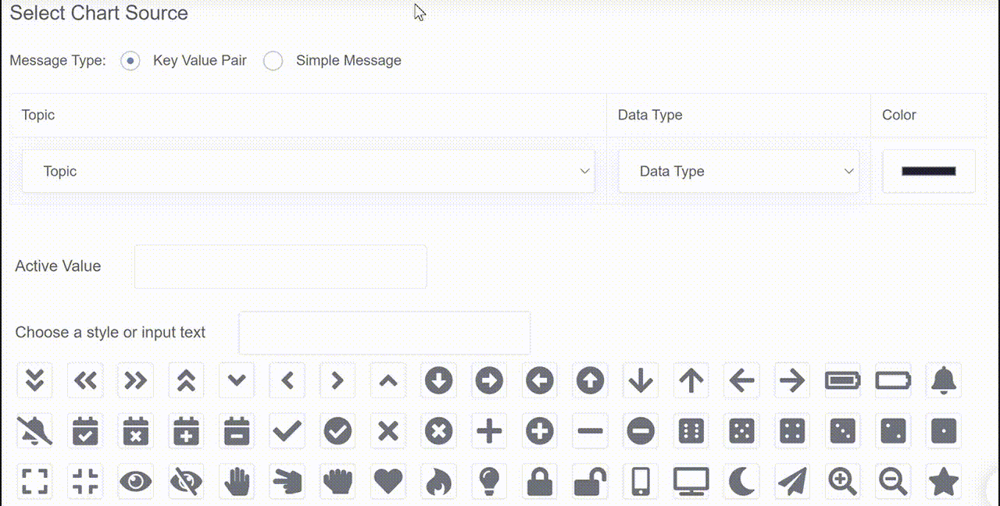
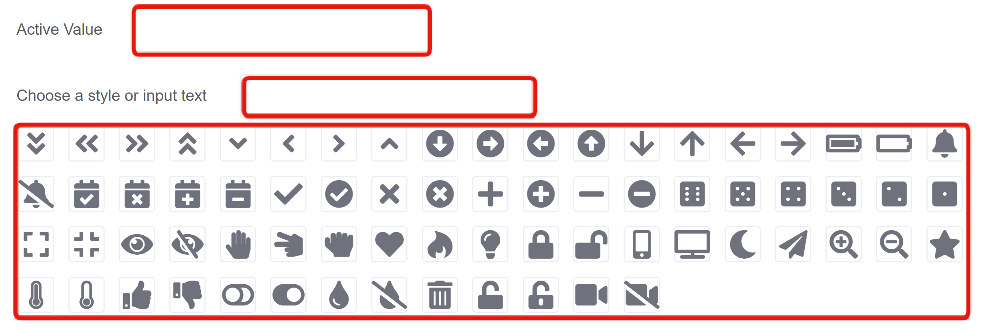
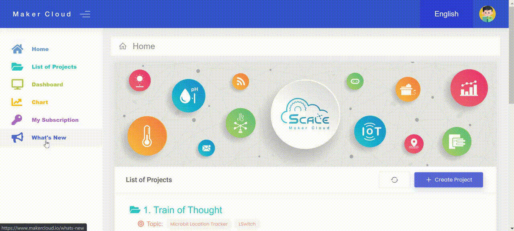
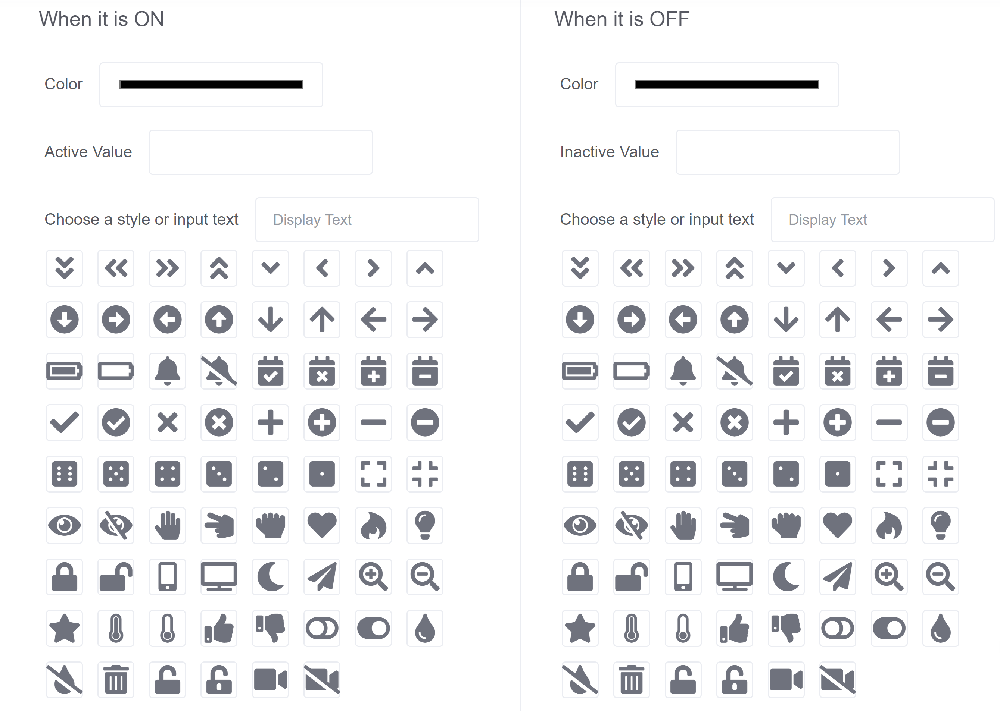
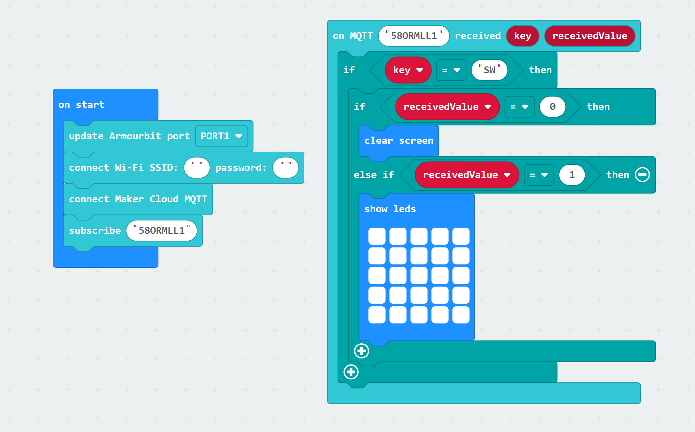

# Creating Push and Toggle Buttons in MakerCloud

[TOC]

Users can create push and toggle buttons in MakerCloud
These buttons can:
- send values and messages to topics and data types
- be used in coordination with other programs, such as makecode with micro:bit

## Creating a Push Button

Click on "Chart" on the left and select "Push Button"

Enter a name for your Toggle Button.

Determine the kind of message that you want to send
There are two options: 
- *Key Value Pair*
  - You will need to select the topic and data type you are sending a message to.
- *Simple Message*
  - You will need to select the topic you are sending a message to.

With both options you can select a color for your push button. There are a wide range of colors available.

    
Then, type in the "Active Value" or message you are sending and select a "Style" or input text below. This determines what your push button will look like.

You do not need to put anything in "Output Type".

Click "Create Chart".

## Creating a Toggle Button

Click on "Chart" on the left and select "Toggle Button"

Enter a name for your Toggle Button.

Determine the kind of messages that you want to send
There are two options:
- *Key Value Pair*
  - You will need to select the topic and data type you are sending a message to.
- *Simple Message*
  - You will need to select the topic you are sending a message to.
  
A Toggle Button functions like two push buttons at the same time. Each time you click the button it alternates between the two values or messages like a switch. You will need to determine an "Active Value" and an "Inactive Value", following these steps for both values.

With the Toggle Button, there are two values being sent and therefore two different appearances for each button. You must perform these steps twice.
"
Select a Color for that side of the Toggle Button
Then, type in the "Active Value" / "Inactive Value" or message you are sending. 
Select a "Style" or input text below. This determines the appearance of the toggle button when it is on the side that you are working on. 

You do not need to put anything in "Output Type".

Click "Create Chart".

*Both of these Charts will appear in the chart menu in MakerCloud.*

## Exercises with Toggle and Push Buttons

**Goal:** Control the LEDs on your micro:bit with the push and toggle buttons on MakerCloud.

*Instruction:*
- Create a Project, Topic and Data Type in MakerCloud.
- Create two Push buttons: One that sends a value of 0 to your data type, and another that sends a value of 1.
- Create a Toggle Button that sends an "Active Value" of 1 and an "Inactive Value" of 0 to that same data type. 
- *With these buttons, you should be able to send values of 1 and 0 to your data type.*
- *Then, use MakeCode to program your micro:bit to turn on when your data type receives a value of 1 and to turn off when it receives a value of 0.

When you complete the programming and preparation on MakerCloud, you should be able to control your micro:bit like this:

