# Using KOI to subscribe to topics
Before subscribing to topics on MakerCloud, users must first learn how to connect KOI to MakerCloud via MQTT. Here are instructions:
[Use KOI to connect to MakerCloud](../../ch4_connect/KOI/connect_KOI.md)

[TOC]

As long as you successfully connect to MakerCloud, you can use the same subscription blocks to program to receive messages.
**Remember, you must connect to Wi-Fi and MakerCloud when you start each program.**
### Subscription blocks
In the MakerCloud KOI extension, there are different types of subscription blocks.

**Subscribe to Topic**

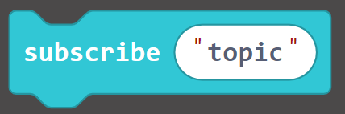{:width="25%"}

Subscribes to MakerCloud topic via KittenWiFi after connecting to MakerCloud
It is recommended to put it in "When activated" and after the block of "Connect MakerCloud MQTT".

**Process MakerCloud MQTT message "data" "topic"**

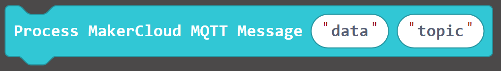{:width="55%"}

When KOI receives an MQTT message, it adds the data and topic to this block, and forwards it to the corresponding message block below.
It needs to be used with the "on Mqtt Data" block extended by KOI.

**When MQTT "topic" receives a text message**

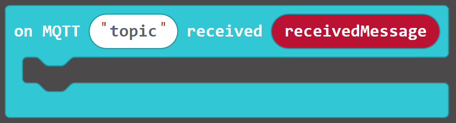{:width="60%"}

When the specified topic receives a text message, this block will run.

**When MQTT "topic" receives key text pair message**

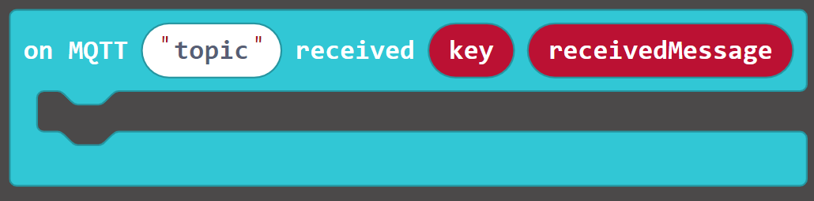{:width="70%"}

When the specified topic receives a key text message, this block will run

**When MQTT "topic" receives a key-value pair message**

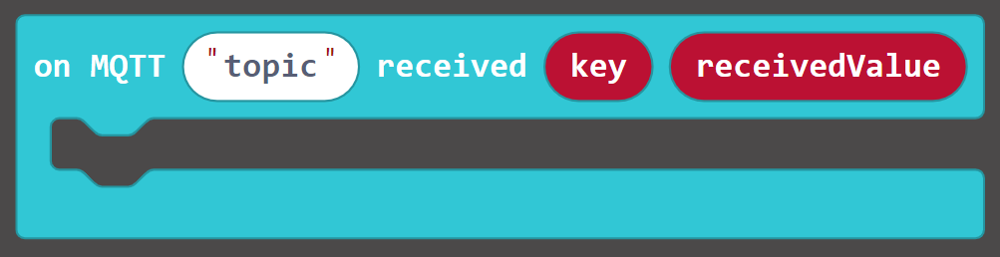{:width="70%"}

When the specified topic receives a key-value pair message, this block will run

Users can use the corresponding subscription blocks according to the data type.

### Exercising - Displaying received text messages
#### Learning Focus
- Learn how to receive text messages from subscribed topics through KOI

#### Saying "hello" to micro:bit
##### Goals:
- Subscribe to topics
- Receive MQTT messages from MakerCloud

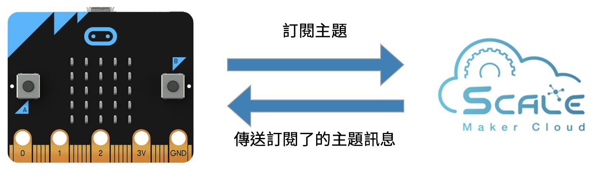{:width="90%"}

**Preparation on MakerCloud:**

1. Create a project
2. Create a topic

**Programming on MakeCode:**

1. Create a New Project
2. Add the KOI extension
   [https://github.com/KittenBot/pxt-koi]()
3. Add the MakerCloud KOI Extension
   [https://github.com/scaleinnotech/pxt-makercloud-koi]()
4. When starting:
   Update KOI interface, connect to WiFi and MakerCloud
5. Join the subscribe to MakerCloud topic block, then paste the name of the topic being subscribed to
   
   {:width="70%"}
     
   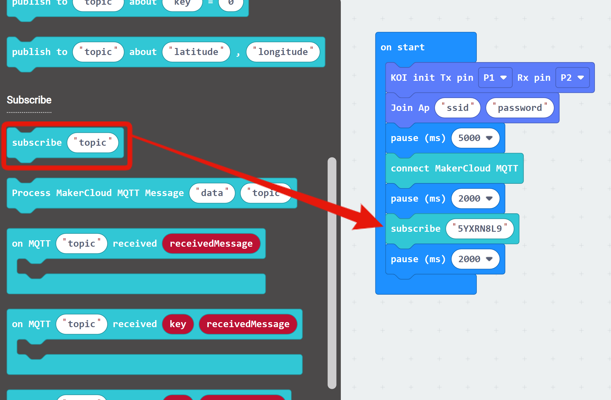{:width="90%"}
     
   
6. Add the "on Mqtt Data" block from the KOI extension, and then add the "Processing MakerCloud MQTT Message" block.
   Add the received data and topic to the "Processing MakerCloud MQTT Message" block.
   
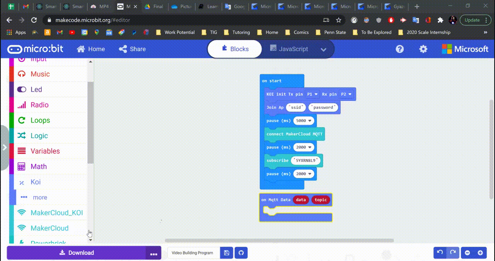
     

7. Add "When MQTT receives text message" and paste the name of the  you are using
  
   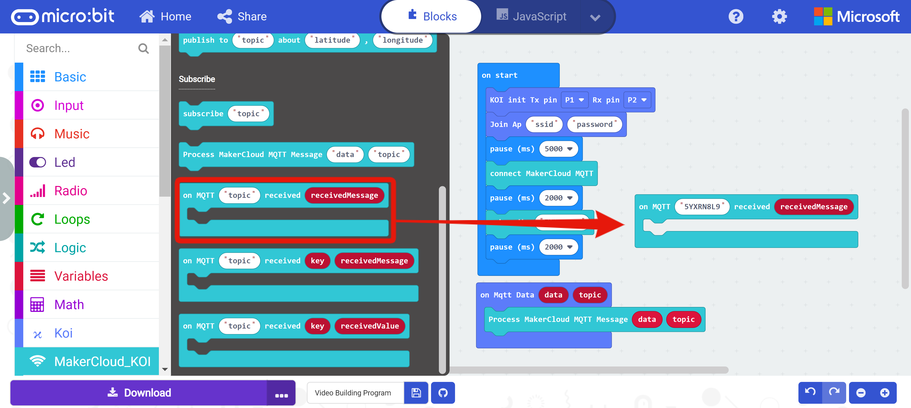
     
   
8. Display the received text message
   
   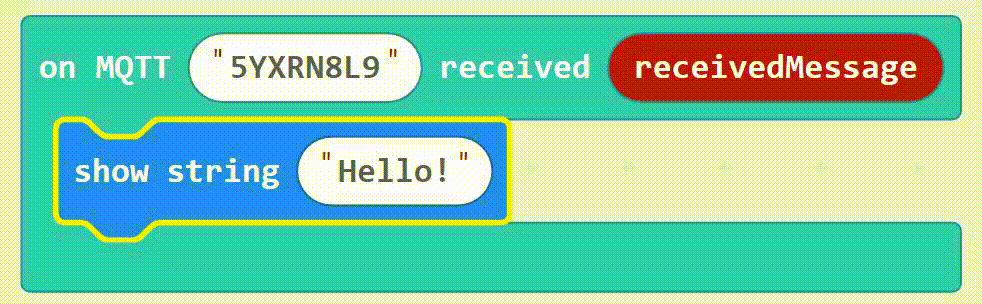{:width="40%"}
     
   
9. Download program to micro:bit

When finished, return to the project homepage pn MakerCloud.
Click the "Details" button on the topic to enter the topic homepage.
In the text input box of "Send Message to topic", enter "hello" and click "Send".

After a message is sent from MakerCloud, the LEDs on the micro:bit will display "hello".

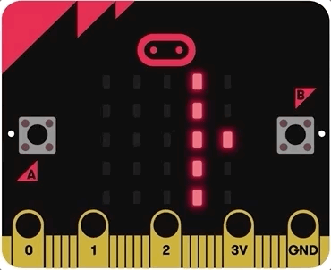{:width="40%"}