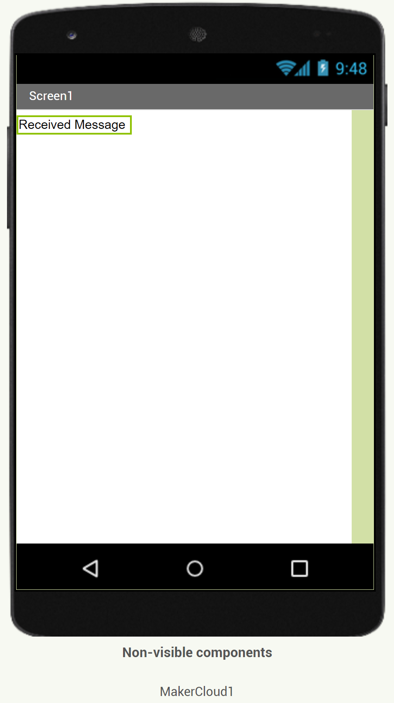
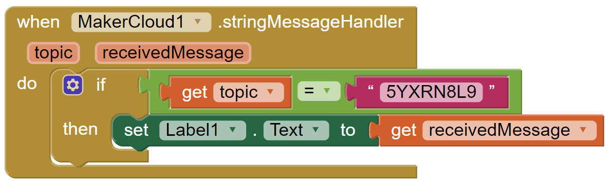

# 使用App Inventor 2訂閱主題
在編程訂閱主題訊息到創客雲前，使用者必先學習如何令App Inventor 2連接創客雲MQTT，連接方法可根據硬件參考上面的教學。  
[使用App Inventor 2 連接創客雲](../../ch4_connect/ai2/connect_ai2.md)

[TOC]

## 訂閱積木
在創客雲 AI2 extension中，有不同類型的訂閱積木。

**訂閱主題**  
{:width="40%"}  
在連接創客雲後，訂閱創客雲主題。  
建議放在「當Screen初始化」之中及「呼叫MakerCloudMQTT」之後。

**當MakerCloud.stringMessageHandler**  
{:width="50%"}  
當收到文字訊息，便會運行此積木

**當MakerCloud.keyStringMessageHandler**  
{:width="55%"}  
當收到鍵文字對訊息，便會運行此積木

**當MakerCloud.keyValueMessageHandler**  
{:width="55%"}  
當收到鍵值對訊息，便會運行此積木

**當MakerCloud.coordinateMessageHandler**  
{:width="55%"}  
當收到經緯度訊息，便會運行此積木

使用者可以根據數據類型使用相對應的訂閱積木。

## 訂閱文字訊息
#### 學習重點
- 學習如何透過AI2從訂閱的主題收到文字訊息

#### 目標
- 訂閱主題
- 從創客雲接收MQTT文字訊息

{:width="90%"}

**在AI2編程前，我們需要在創客雲上:**

1. 創建項目
2. 創建主題

**然後便可到AI2編程:**

1. 新增專案
  
2. 加入創客雲 AI2 extension  
   [創客雲 AI2 extension](../../ch4_connect/ai2/extension/scale.MakerCloud.aix) (按右鍵另存新檔）
  
3. 加入「MakerCloud」和「標籤」到Screen1  
{:width="40%"}
  
4. 在MakerCloud的元件屬性中，修改USERNAME  
   {:width="35%"}

**程式設計**

1. 加入連接創客雲積木  
   當screen初始化，執行「呼叫MakerCloudMQTT」
  
2. 加入訂閱創客雲主題積木，然後複製並貼上需訂閱的主題名稱  
   {:width="70%"}
     
   
     

3. 加入「當MakerCloud.stringMessageHandler」積木  

  
4. 設標籤1的文字為「receivedMessage」  
   {:width="65%"}

完成編程後，回到創客雲的物聯網主頁。  
按下主題中的「詳細資料」按鈕，進入主題主頁。  
在「發送消息到主題」的文字輸入框中，輸入「hello」，然後按「發送」。  

此時，App上的標籤會同時顥示「hello」。

**注意: 如果訂閱多於一個主題，必須在收到訊息後比較topic**
{:width="70%"}

