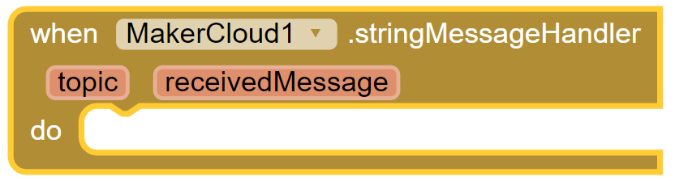
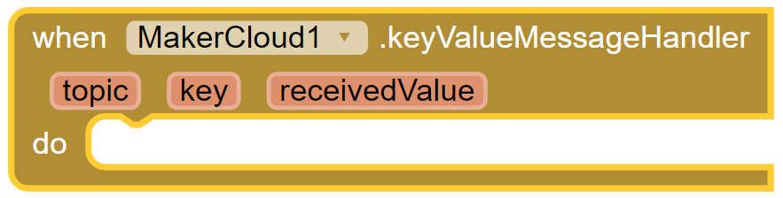
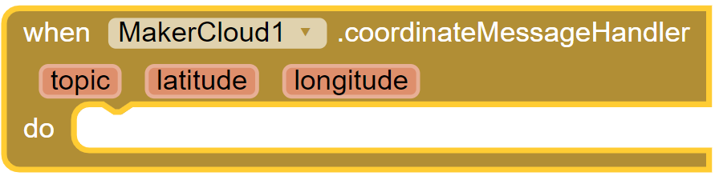
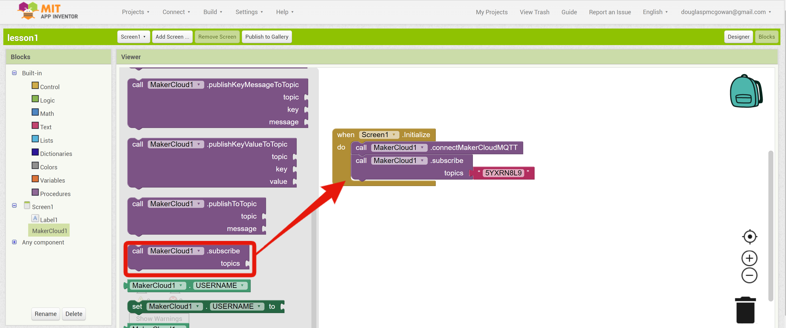

# Use App Inventor 2 to subscribe to topics
Before programming and subscribing to topics on MakerCloud, users must first learn how to connect App Inventor 2 to MakerCloud via MQTT. For instructions, refer to the following link:
[Using App Inventor 2 to connect to MakerCloud](../../ch4_connect/ai2/connect_ai2.md)

[TOC]

## Subscription blocks
In MakerCloud AI2 extension, there are different types of subscription blocks.

**Subscribing to a Topic**

{:width="40%"}

Subscribes to a topic after connecting to MakerCloud.
We recommend it in "When Screen is initialized" and after "Connect MakerCloudMQTT".

**When MakerCloud.stringMessageHandler**

{:width="50%"}

When a text message on the subscribed topic is received, this block will run

**When MakerCloud.keyStringMessageHandler**

{:width="55%"}

When a key text message is received, this block will run.

**When MakerCloud.keyValueMessageHandler**

{:width="55%"}

When a key-value pair message is received, this block will run

**MakerCloud.coordinateMessageHandler**  

{:width="55%"}  

When a latitude and longitude message is received, this block will run

Use the subscription block that corresponds to the data type you want to receive.

## Subscribing to topics and receiving text messages
#### Learning Focus:
- Learn how to receive text messages from subscribed topics through AI2

#### Goals:
- Subscribe to topics
- Receive MQTT text messages from MakerCloud and display them on the screen

{:width="90%"}

**Preparation on MakerCloud:**

1. Create a project
2. Create a topic

**Programming on AI2:**

1. Create a project
     
2. Add the 
   [MakerCloud AI2 extension](../../ch4_connect/ai2/extension/scale.MakerCloud.aix) (right click to save a new file)
     
3. Add the "MakerCloud" extension and a "Received Message" label to Screen1
   
{:width="40%"}
     

4. In the component properties of MakerCloud, set the USERNAME to "maxwong"
   
{:width="35%"}

**Designing the program**

1. Add the Connect MakerCloud Block to the "When Screen1 is initialized"
     
2. Add a "subscribe to MakerCloud" topic block, then copy and paste the name of the topic you want to subscribe to.
   
{:width="70%"}
     
   
     

3. Add a "When MakerCloud.stringMessageHandler" building block
   

     

4. Set the text of label 1 to "receivedMessage" and place the block inside the "When MakerCloud.stringMessageHandler" block
   
{:width="65%"}

When finished, return to the homepage of Internet of Things in your project.
Press the "Details" button in the topic to enter the topic homepage.
In the text input box of "Send Message to Subject", enter "hello" and click "Send".

The label on the App should show "hello".

**Note: If you subscribe to more than one topic, you should use logic blocks to check the topic after receiving the message and before displaying it**

{:width="70%"}

