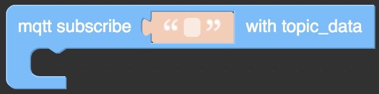
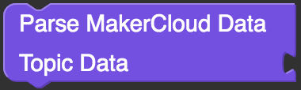
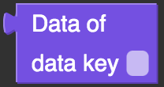
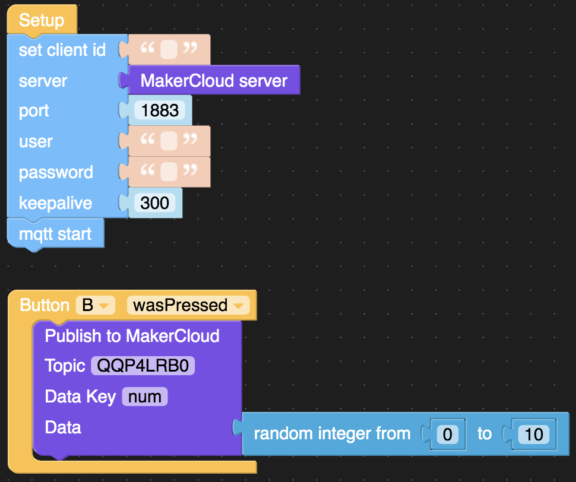
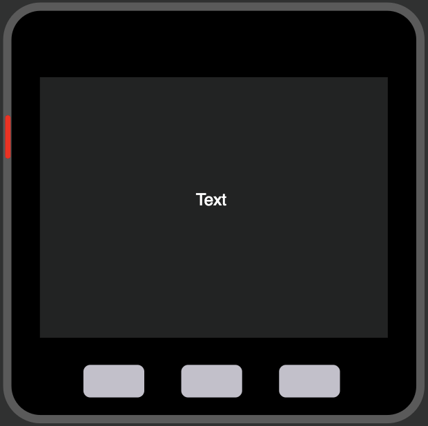
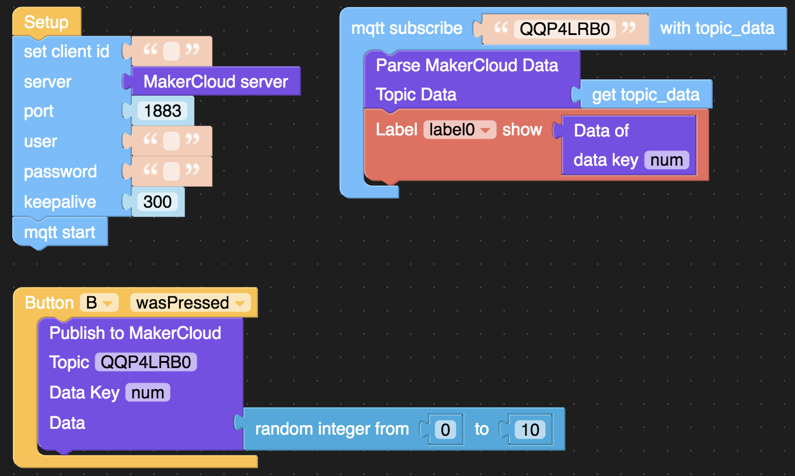

# Using M5Stack to subscribe to topics on MakerCloud
Before programming and subscribing to topics on MakerCloud, users must connect M5Stack to MakerCloud via MQTT.  For instructions, refer to the following link.
[Using M5Stack to connect to MakerCloud](../../ch4_connect/m5stack/connect_m5stack.md)

[TOC]

## Subscription blocks
By using the MQTT subscription building block in UiFlow and cooperating with the data processing building block of MakerCloud Custom, you can completely receive and process MQTT messages on MakerCloud.

**Subscription Blocks**

{:width="50%"}

After connecting to MakerCloud, this block subscribes to a topic on MakerCloud. When an MQTT message is received, this block will run.

**Obtaining data**

{:width="20%"}

After receiving an MQTT message, use this block to obtain the data in the message.

**Processing MakerCloud Data**

{:width="30%"}

This block processes the received MakerCloud MQTT messages and divides them into key-value pairs.

**Getting a value**

{:width="15%"}

This block gets a value in response to receiving a key

## Receiving key-value pair messages
#### Learning Focus
- Learn how to receive key-value pair messages from subscribed topics through M5Stack

#### Goals
- Subscribe to topics
- Receive MQTT key-value pair messages from MakerCloud

In this exercise, the user will receive random numbers from the program made in the  publishing exercise, so please refer to this link before starting.
[Publishing random numbers through M5Stack](../../../ch5_publish/m5stack/publish_m5stack/#_2)

**Designing the program**

1. Connect M5Stack to Wi-Fi, then connect M5Stack to UiFlow
2. [Download the MakerCloud UiFlow Custom](https://cutt.ly/makercloud)
3. Add the building blocks required to connect to MakerCloud
4. Add the building blocks required to publish random numbers to MakerCloud by clicking B
   
{:width="70%"}

5. Add a "UiFlow Subscription Block" and enter the topic name that you want to subscribe to
6. In the Subscription Block, add the "Processing MakerCloud Data" block. Then add the "UiFlow Get Data" block to "Topic data"
7. Add "label0" to the interface of M5Stack
   
{:width="40%"}

8. Because the key sent to MakerCloud is "num", the "data key" is also "num". Set the text of "label0" as the "get value" block, and enter "num" to "data key"
   

When finished, download the programming to M5Stack. When Button B is pressed, M5Stack will publish a random number to MakerCloud.
At the same time, M5Stack should receive random numbers from MakerCloud and display them on the screen.