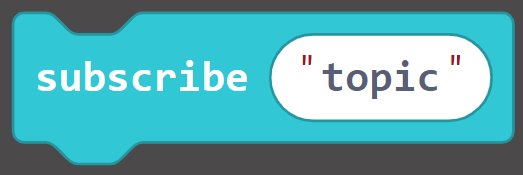
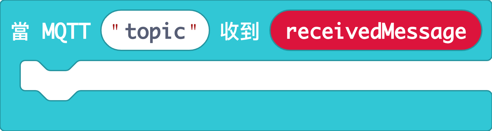
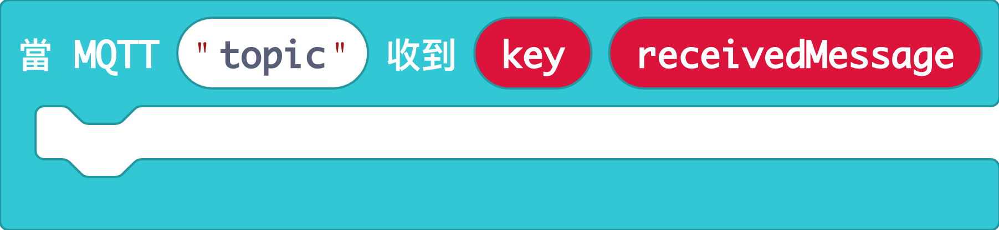
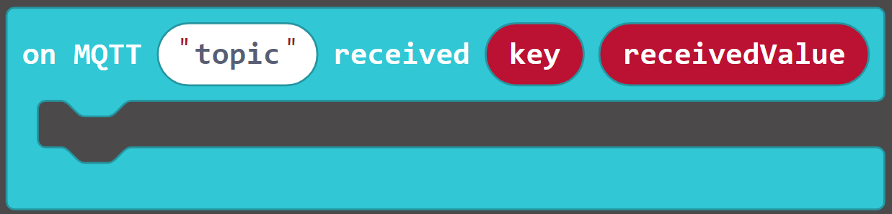
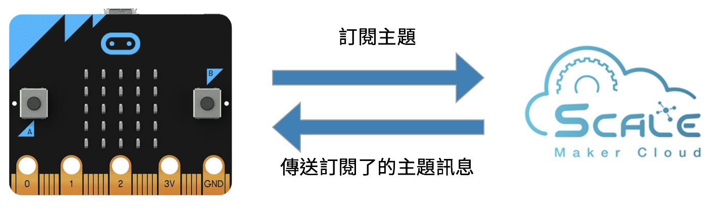
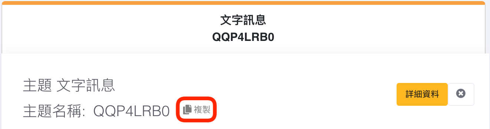
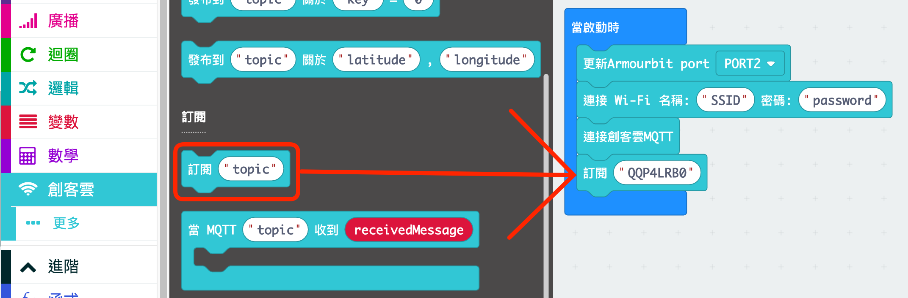
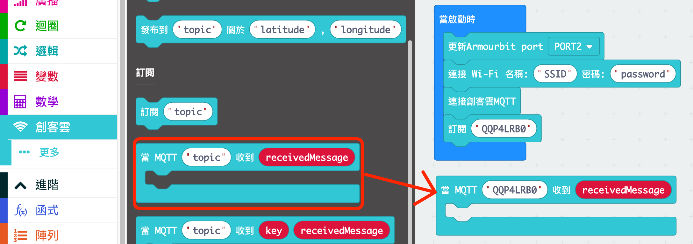
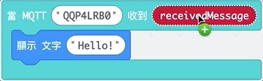
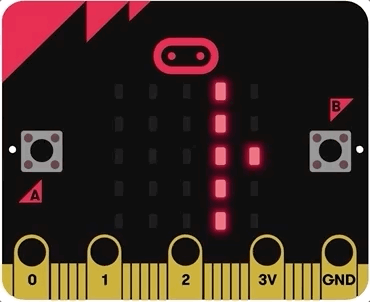

# Using BBC micro:bit to subscribe to topics
Before programming and subscribing to topics on MakerCloud, the user must first connect the micro:bit to the MakerCloud via MQTT. For instructions, refer to the following link:
[Using BBC micro:bit to connect to MakerCloud](../../ch4_connect/microbit/connect_microbit.md)

[TOC]

### KittenWiFi
Even if you use a different micro:bit expansion board, as long as you connect to MakerCloud, you can use the same program blocks to execute based on received messages and subscribe to topics. The following uses Armour:bit as a demonstration.
**Note that you must connect to Wi-Fi and to MakerCloud via MQTT when you start each program.**
### Subscription Blocks
In the MakerCloud Extension, there are different types of subscription blocks.

**Subscribing to a Topic**

{:width="25%"}

After connecting to MakerCloud, this block subscribes to a MakerCloud topic via KittenWiFi.
It is recommended to put it in "on start" and after the "Connect MakerCloud MQTT" block.

**When a topic receives a text message (Event Trigger)**

{:width="60%"}

When the specified topic receives a text message, this block will run

**When a topic receives a key text pair message**

{:width="70%"}

When the specified receives a key text message, this block will run

**When a topic receives a key-value message**

{:width="70%"}

When the specified topic receives a key-value pair message, this block will run.

You can use the subscription blocks that correspond to the data type that you are using.

### Receiving text messages
#### Learning Focus
- Learn how to receive text messages from subscribed topics via KittenWiFi

#### Practice: Say "hello" to micro:bit
##### Goals
- Subscribe to topics
- Receive MQTT messages from MakerCloud and display them on the micro:bit

{:width="90%"}

**Preparation on MakerCloud:**

1. Create a project
2. Create a topic

**Programming on MakeCode:**

1. Create a project
2. Add the MakerCloud KittenWiFi extension:
   [https://github.com/maxwong-scale/pxt-makercloud-V2]()
3. On start:
   Update Armourbit port, connect WiFi and MakerCloud MQTT
4. Add the "subscribe to topic" block, then copy and paste the name of the topic you are subscribing to
   
{:width="70%"}
  
   

  

5. Add the "When a topic receives a text message" block, and paste the name of the subscribed topic

  

6. Display the received text message on the micro:bit
   
{:width="40%"}
  

7. Download the program to micro:bit

When finished, return to the Internet of Things homepage of your project on MakerCloud.
Press the "Details" button in the theme to enter the theme homepage.
In the "Send Message to Topic" box, enter "hello" and click "Send".

After the message is sent from MakerCloud, the LEDs on the micro:bit should display "hello".

{:width="40%"}