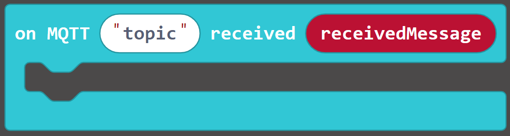
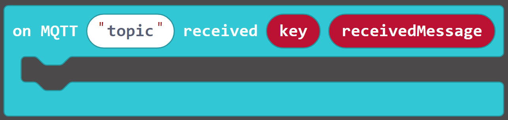
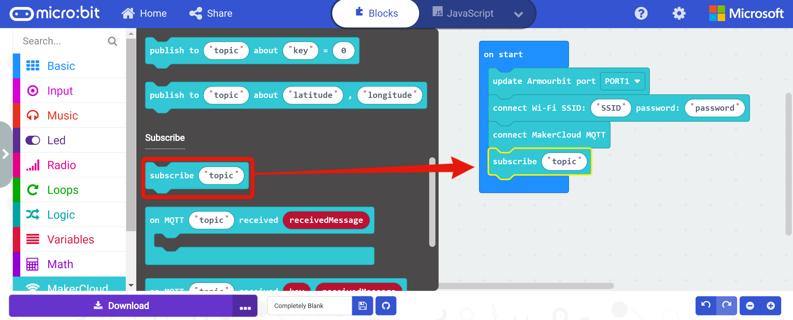
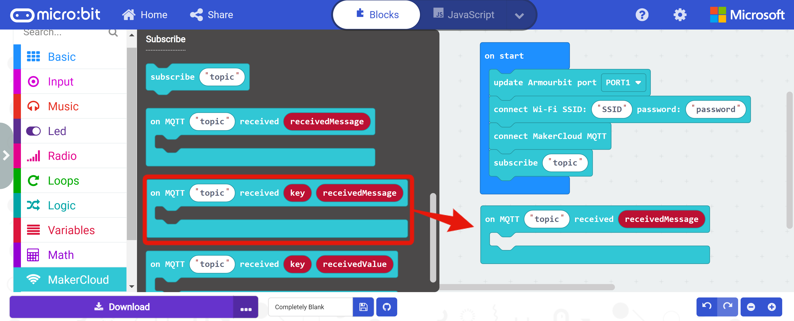
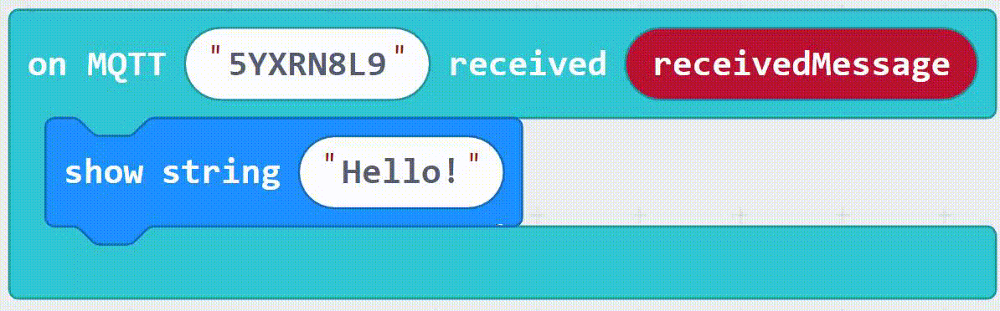

# 使用BBC micro:bit訂閱主題
在編程訂閱主題訊息到創客雲前，使用者必先學習如何令micro:bit連接創客雲MQTT，連接方法可根據硬件參考上面的教學。  
[使用BBC micro:bit連接創客雲](../../ch4_connect/microbit/connect_microbit.md)

[TOC]

## KittenWiFi
即使使用不同的micro:bit擴展板，只要成功連接創客雲後，便可以使用以下同樣的發布積木編程發布訊息。而以下使用Armour:bit作為示範。  
**注意每次編程必須要在當啟動時先連接Wi-Fi和創客雲MQTT。**
### 訂閱積木
在創客雲擴展中，有不同類型的訂閱積木。

**訂閱主題**  
{:width="25%"}  
在連接創客雲後，透過KittenWiFi訂閱創客雲主題。  
建議放在「當啟動時」之中及「連接創客雲MQTT」積木之後。

**當MQTT "topic"收到文字訊息**  
{:width="60%"}  
當指定主題收到文字訊息，便會運行此積木

**當MQTT "topic"收到鍵文字對訊息**  
{:width="70%"}  
當指定主題收到鍵文字對訊息，便會運行此積木

**當MQTT "topic"收到鍵值對訊息**  
{:width="70%"}  
當指定主題收到鍵值對訊息，便會運行此積木

使用者可以根據數據類型使用相對應的訂閱積木。

### 訂閱文字訊息
#### 學習重點
- 學習如何透過KittenWiFi從訂閱的主題收到文字訊息

#### 練習 - 向micro:bit打招呼
##### 目標
- 訂閱主題
- 從創客雲接收MQTT訊息  
{:width="90%"}

**在Makecode編程前，我們需要在創客雲上:**

1. 創建項目
2. 創建主題

**然後便可到Makecode編程:**

1. 新增專案
2. 加入創客雲KittenWiFi擴展  
   [https://github.com/maxwong-scale/pxt-makercloud-V2]()
3. 當啟動時:  
   更新KittenWiFi接口、連接WiFi及創客雲MQTT
4. 加入訂閱創客雲主題積木，然後複製並貼上需訂閱的主題名稱  
{:width="70%"}  

  
5. 加入「當MQTT 收到文字訊息」，然後貼上已訂閱的主題名稱  

  
6. 把接收到的文字訊息顯示出來  
{:width="40%"}
  
7. 下載編程到micro:bit

完成編程後，回到創客雲的項目主頁。  
點擊主題描述，進入主題主頁。在「發送消息到主題」的文字輸入框中，輸入「hello」，然後按「發送」。  

從創客雲發送訊息後，micro:bit上的LED便會顯示「hello」。  
{:width="40%"}