#Exploring the Different Features of Charts on MakerCloud

There are many available features in the chart detail page. Access the chart detail page by clicking the name of the chart in the chart tab in MakerCloud

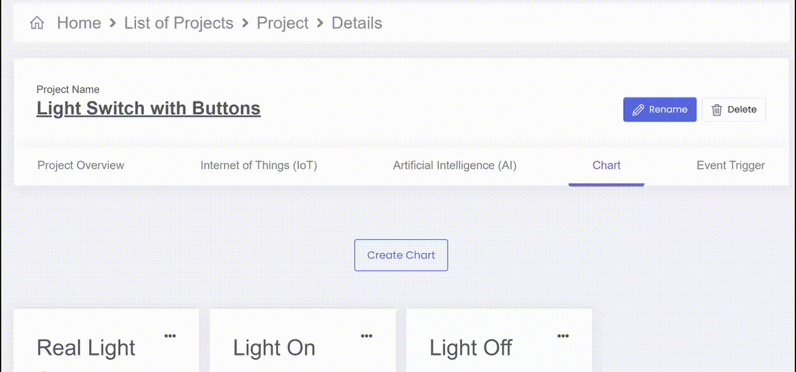

#####Live

In the chart details page, you can view the live results by clicking the live tab on the right. 

You can also adjust the timeframe that you are looking at the data through, select the amount of data points that you want to see, and select certain data points.

By hovering over a data point, you can view the Value sent, Data type, Topic, Time sent, and Device.

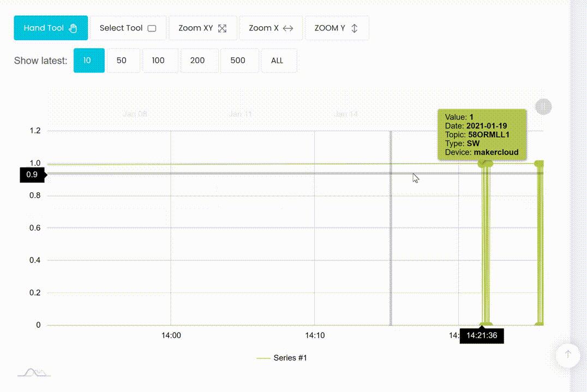

You can also zoom on the X axis, Y axis or both.

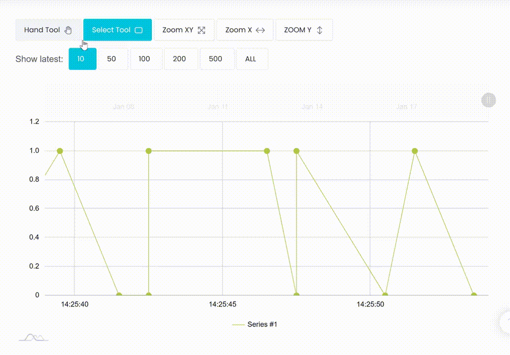

#####History

In the chart details page, you can view information about your data by clicking "History" on the right.
You can look at the:

- maximum and minimum
- average
- sum
- count
You can adjust the timeframe by which these are calculated with a custom start and stop time. 
  
- Additionally you can adjust the frequency with which your data information is calculated. There are 4 options: Month, Day, Hour, and Minute.
- For example: By customizing a 5-minute timeframe and selecting "minute", it will calculate the sum and average for each minute in which data was received inside the timeframe.

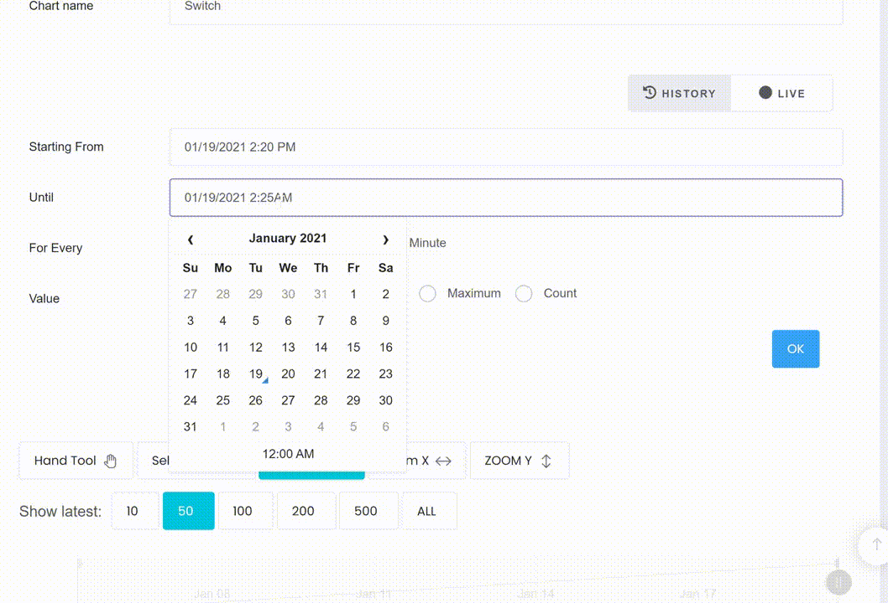

### Exercise: Publishing data from a Smart lamppost

##### Goal:
Be able to continuously publish Temperature, Humidity, Light Level and Rain Level to MakerCloud
, utilizing the Powerbrick sensors and Powerbrick MakeCode extension.

###### Instructions:

1. Use your creativity to build your own lamppost that has a powerbrick rainlevel sensor, temperature/humidity sensor and brightness sensor.
- This is just an example:

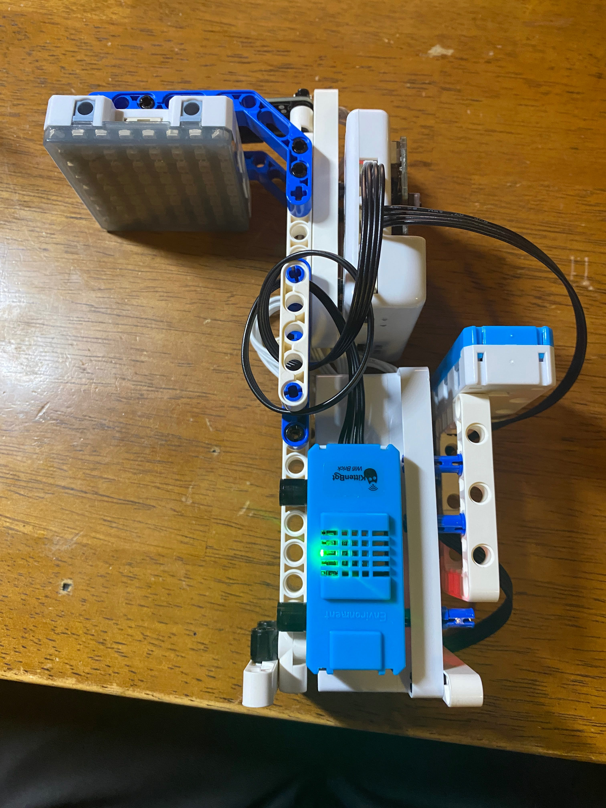{:width="50%"}

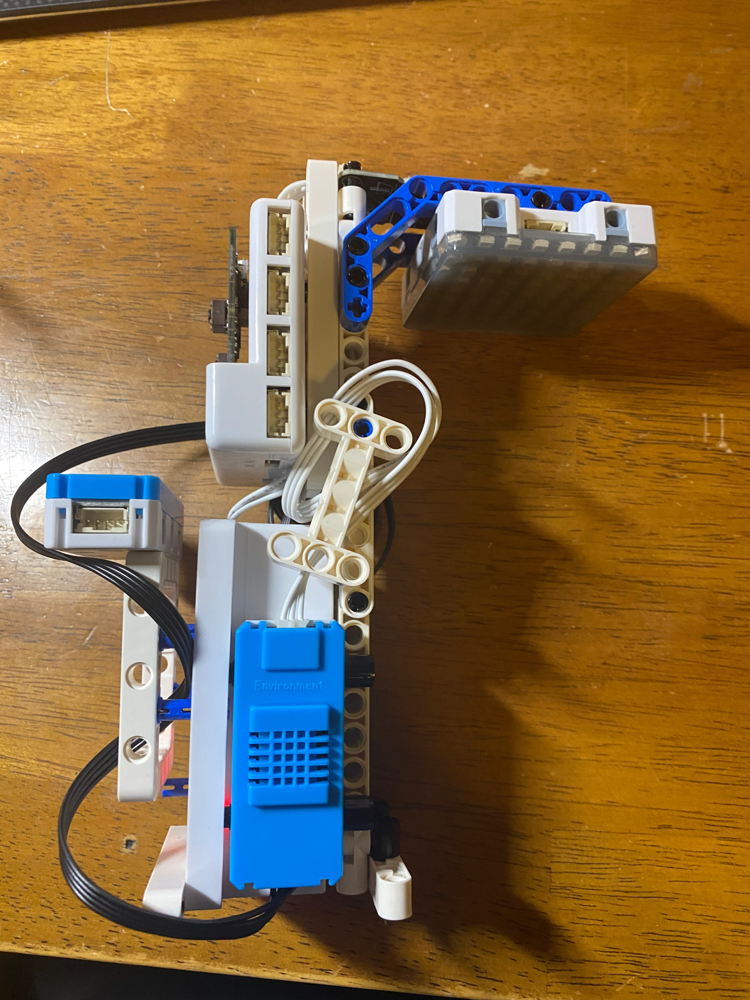{:width="50%"}

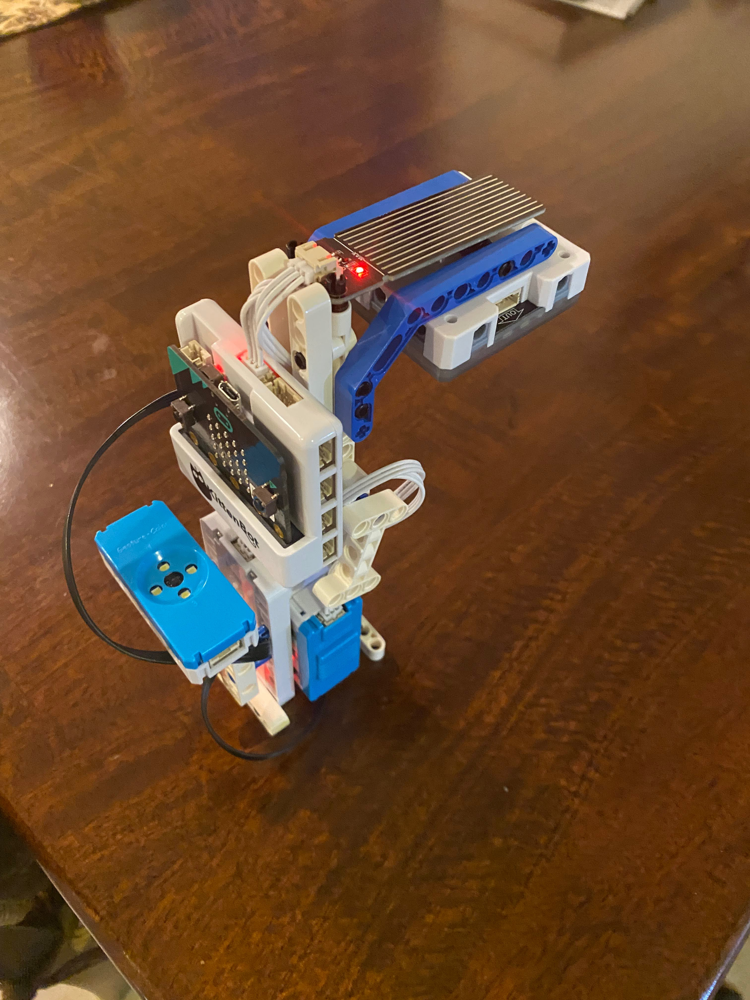{:width="50%"}

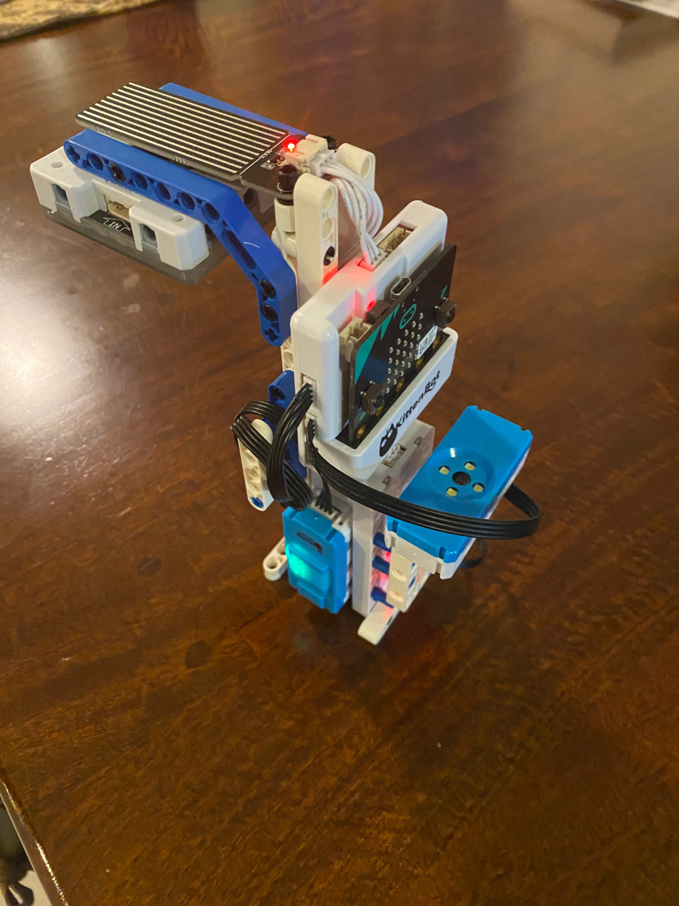{:width="50%"}

2. Create a project and topic in MakerCloud
On MakeCode, add the Powerbrick extension.
  
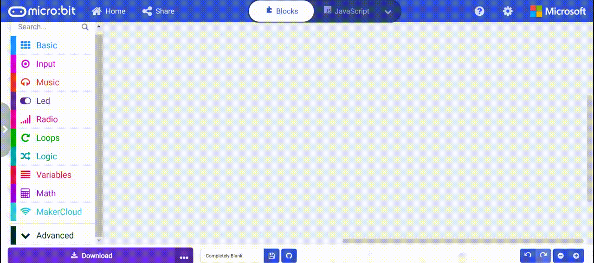
3. Program a forever loop in Makecode that publishes data every second

 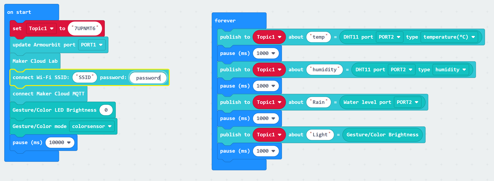
  
4. View the data on MakerCloud with the data viewer and through the automatically created charts.
  
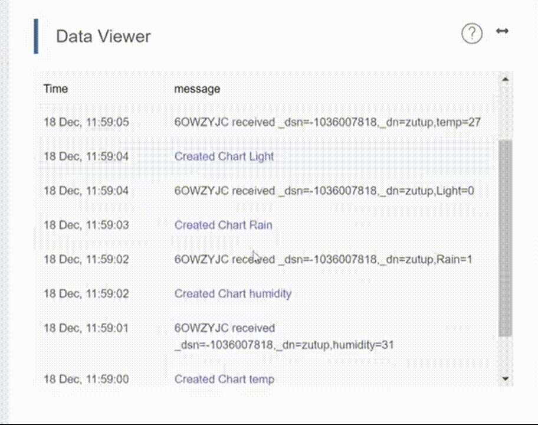{:width="70"}

You will be able to utilize the features of the chart detail page when viewing the data from your powerbrick Smart Lamppost.
