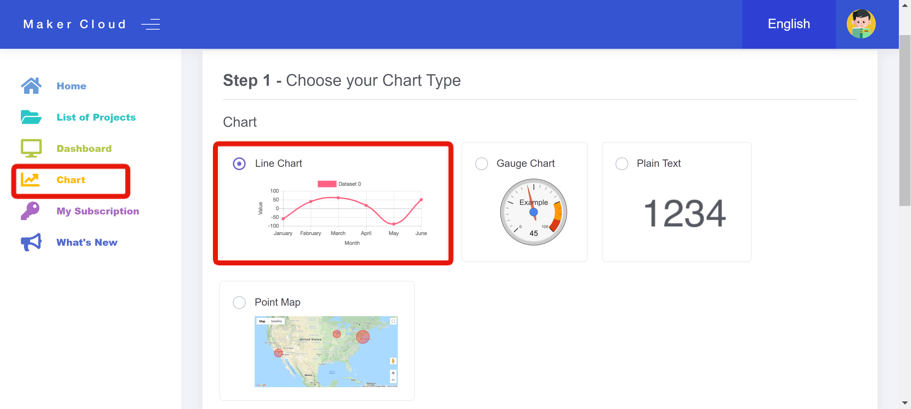
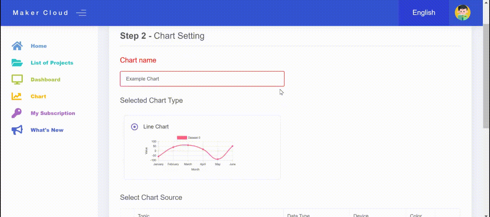
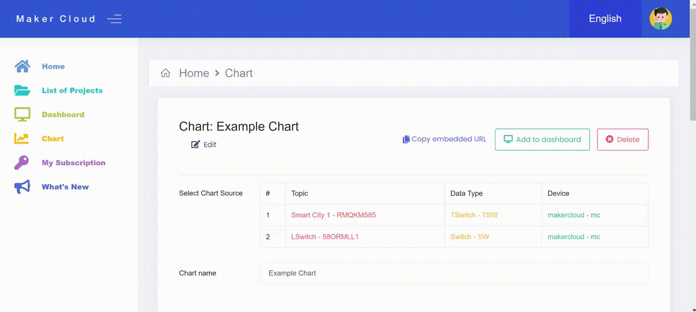
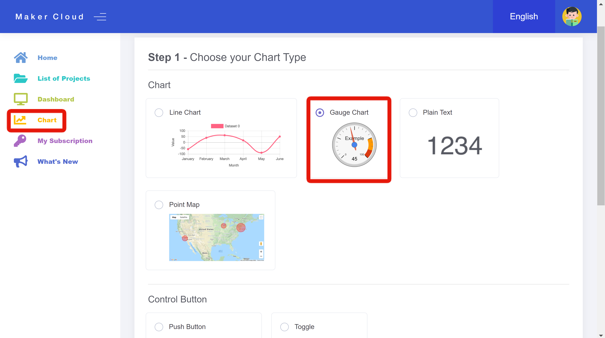
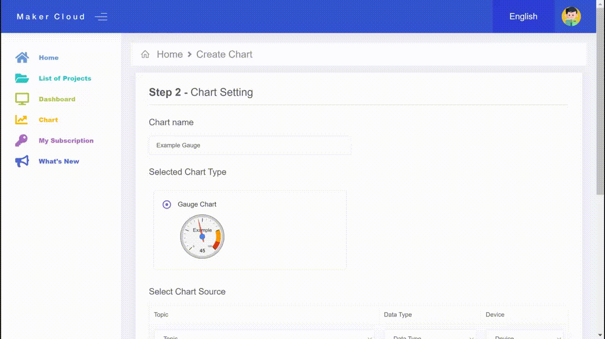
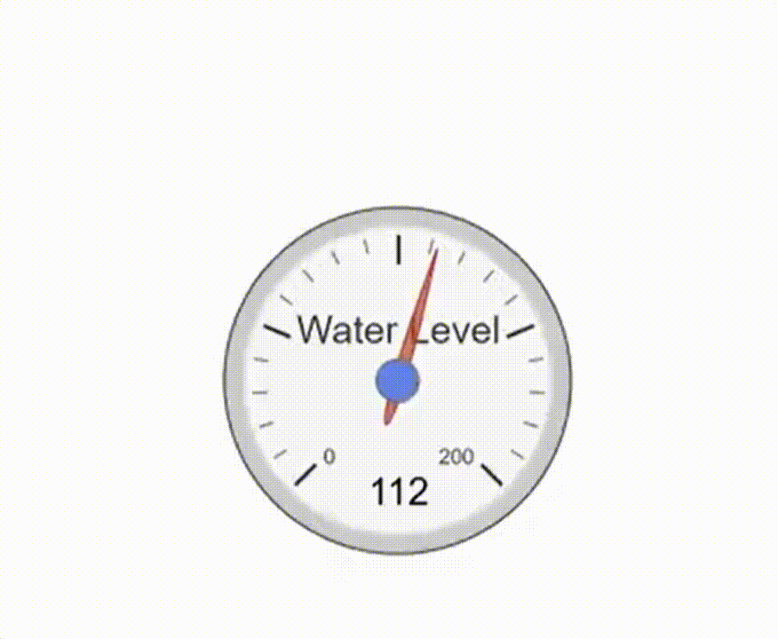
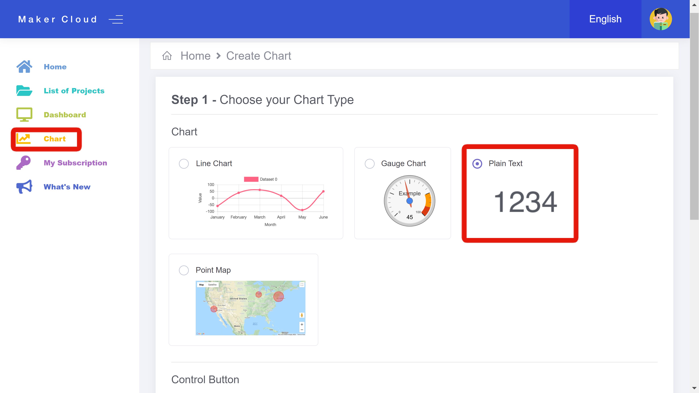
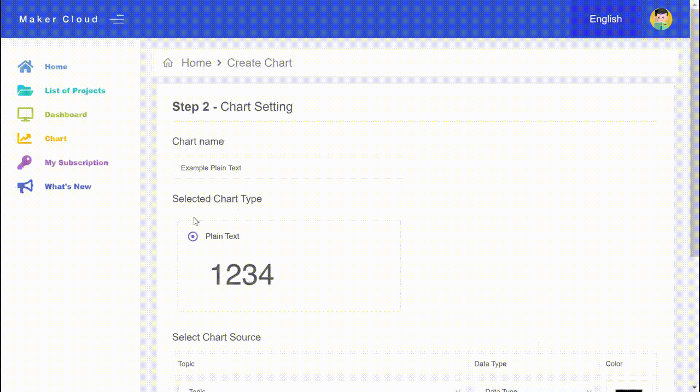

# Exploring the different Custom Charts Available on MakerCloud

In MakerCloud, there are three different charts that users can manually create and customize:

## Line Charts

#### Creating a Line Chart

Enter the "Chart" tab and select "Line Chart". At the bottom of the page, click "Next".

#### Using and Customizing a Line Chart

Then, you can add several different lines to the chart by selecting a variety of topics, data types, devices and colors.

Once you have created your line chart, you will have the features of a typical MakerCloud chart
, and you will also be able to select and unselect specific data sources.

## Gauge Charts

#### Creating a Gauge Chart

Enter the "Chart" tab and select "Gauge Chart". At the bottom of the page, click "Next".

#### Using and Customizing a Gauge Chart

After creating a "Chart Name", select the topic, data type and device that the gauge will monitor and display.

Select the "Display" Text that you will see on the gauge, and select the minimum and maximum values that will be on the gauge.

Once you have created the Gauge chart, you will be able to see the current/most recent values of the data type on the device that you previously selected.

{:width=60%}

## Plain Text Charts

#### Creating a Plain Text Chart

Enter the "Chart" tab and select "Plain Text". At the bottom of the page, click "Next".

#### Using and Customizing a Plain Text Chart

After creating a "Chart Name", select the topic and data type that the plain text chart will monitor and display.

Once you create the plain text chart, you will be able to see the current value of the data type you selected. If there is not a recent value, the plain text chart will display "N/A".

