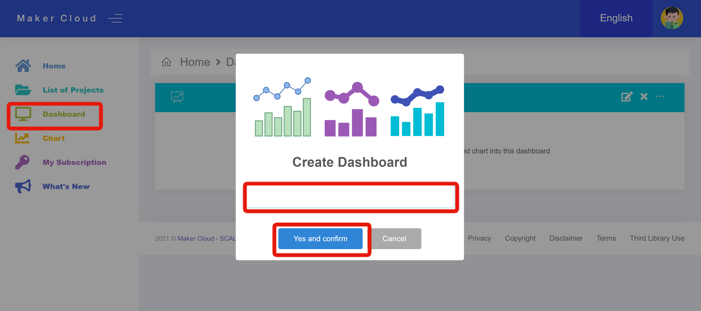
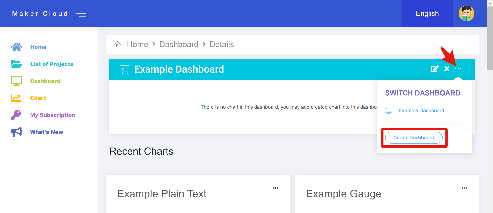
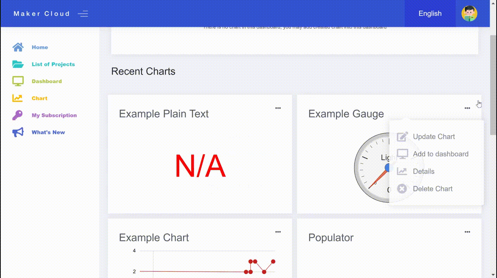

# Dashboards

[TOC]

Users can use dashboards to easily see multiple charts and data sources at once, improving their workflow.

### Creating a Dashboard

Click the "Dashboard" Tab. 

If you have not Created a Dashboard yet, it will automatically prompt you to. Enter a name and click "Yes and Confirm".

If you have already made a dashboard, click on the three dots on the top right of your current dashboard to either switch between dashboards or create another one.

### Using and Customizing a Dashboard

- Underneath your new dashboard, you will see the charts you have most recently used or created. 
- By clicking on the 3 dots in the top right corners of the chart icons, you can then add them to the dashboard.
- This feature is available with any chart or widget you are using in MakerCloud, not just the ones that have been recently used
- Once you have added a chart or charts to your dashboard, reload the webpage to see your charts populate the dashboard.
- From your dashboard, you can still access the detail pages of the charts on your dashboard.

The Dashboard is a helpful feature for users as they can coordinate different charts, widgets, and data sources.
It is especially helpful for gauge and plain text charts as the user can constantly monitor those charts with ease.

