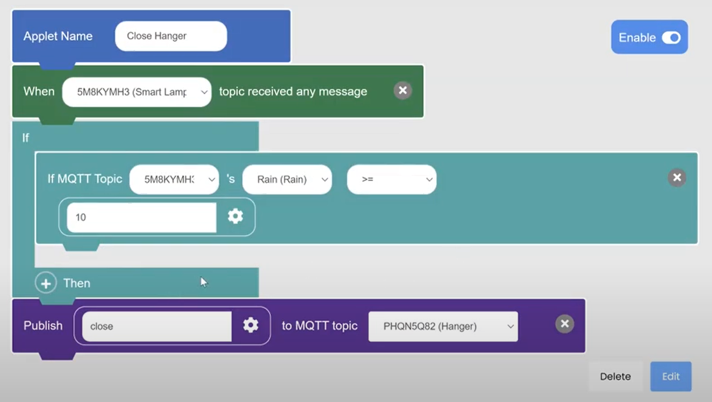
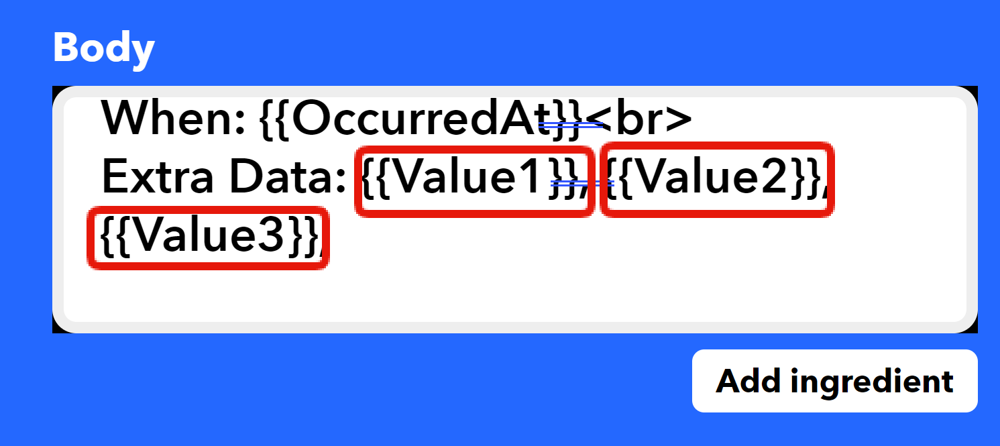
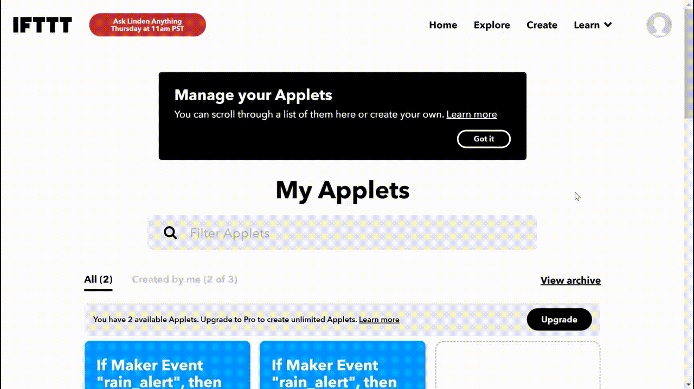
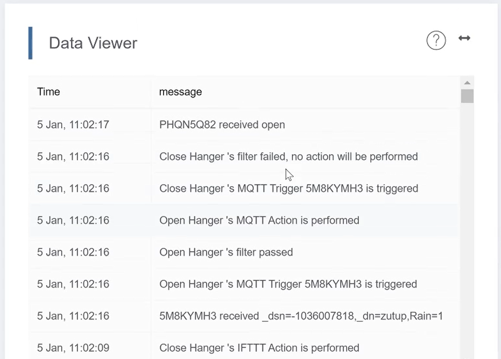

# Exploring the Connection between IFTTT and Event Trigger on MakerCloud

Users can create IFTTT applets that connect to MakerCloud through the use of webhooks.

[TOC]

### Setting up IFTTT

- Go to [ifttt.com]().

- If you do not yet have an account, click sign up. You can connect your Apple, Google or Facebook account, or you can enter an email or password.
- If you already have an account, sign in.

IFTTT will allow you to create 3 applets without a paid subscription. We will explore two kinds of applets you can make that connect with MakerCloud.

## Exercise 1: Sending Email alerts with IFTTT

#### Goal:
To continuously publish rain data to MakerCloud, and to have an email alert sent whenever the rain level breaches a specified threshhold.

##### Preparation on MakerCloud:
- If you have not yet completed the connection between the smart lamppost and smarthanger with event trigger, then create a project, topic and data type/
- If you already have completed that exercise, than go to that project. 

##### Programming and Publishing with Microbit:
- Have your smart Lamppost, and make sure it is publishing water level data.
- For instructions on building the smart lamppost and programming it to publish data, please refer to this link:
- Note that you only need to publish water level data for this project.

##### Adding to your Applet in Event Trigger:
- If you have not yet completed the other event trigger exercise, go to "Event Trigger" and create this applet in your MakerCloud project:
  

- For instructions on the features of event trigger on MakerCloud, please refer to the following link:
- If you have already completed the event trigger with smart devices exercise, open the "Close Hanger" Applet you created earlier in Event Trigger by clicking "Applet List" and selecting "Close Hanger".

- Add an IFTTT Action to your applet.

- You will add the information to your IFTTT action once you have created your IFTTT applet.

##### Creating an IFTTT Applet
- Go to [ifttt.com/home](). Click "Create".
- Click "Add" on the "If This" block.
- When you reach the "Choose a Service" Menu, enter in the search bar "webhook". Select "Webhooks".
- Click "Receive a web request". You may be prompted to connect the webhook service to your IFTTT account.
- Type in an event name such as "rain_alert". Click "Create Trigger"
  

- Click "Add" on the "Then That" block.
- When you reach the "Choose a Service" Menu, enter in the search bar "email". Select "email".
- Click "Send me an email". If you have not yet connected an email address with email, you will be prompted to. Connect an email address of your choosing.
- On the Menu that appears next, you can edit the email alert that you will receive when your webhook is triggered. You may edit the message as you like.
- Notice that in the "Body" section, there is "Value 1", "Value 2", and "Value 3". These correspond with the values that you can edit on your event trigger applet.

- In your event trigger applet in MakerCloud, you can enter any text or values that you want to be in the email alert.
- When finished, click "Create Action".
- You will be given an overview of your Applet. Click "Continue".
- Then you will be prompted to review your applet. You can edit the title if you want. Click "Finish" when you are done editing the applet.

##### Finishing the Event Trigger Applet in MakerCloud

- In MakerCloud, enter the name you made for your IFTTT applet into the "IFTTT Webhook Event" input box.
- To find your webhook key, go to [ifttt.com]().
- Click on your account icon on the top right. Click "My Services".
- Click "Webhooks". When you reach the webhooks page, click "Documentation" in the upper right.
- Your key will be displayed in the webpage.
  

- Copy it and paste it into the "IFTTT Webhook Key" text input box.
- As previously discussed, you can enter text or numbers into the three values in the "Optional Message" input box.
- When finished, click "Edit" or "Create" on the bottom right.

After you complete all of the steps, you should receive email alerts when the rain level on your sensor breaches the threshold that you programmed.

Your data viewer in MakerCloud should look like this.

