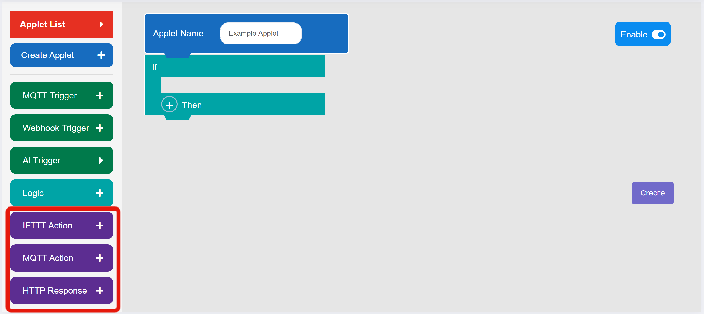
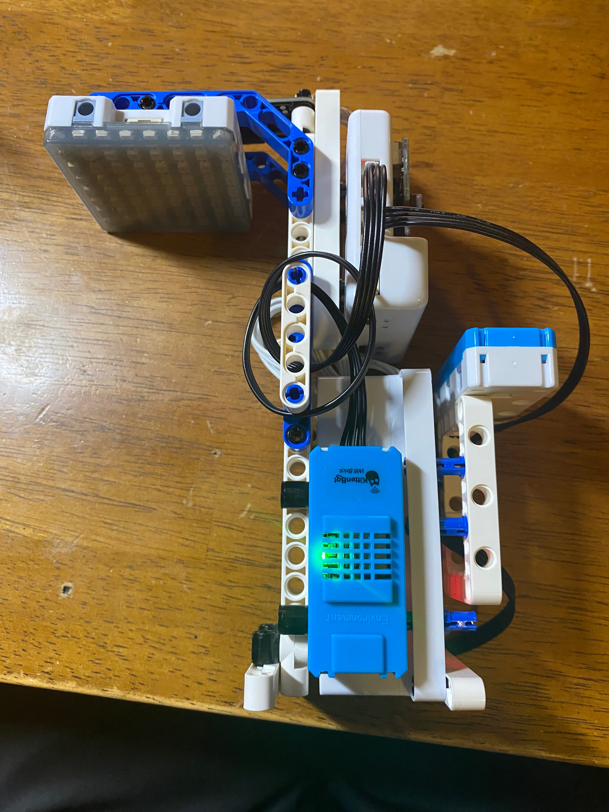
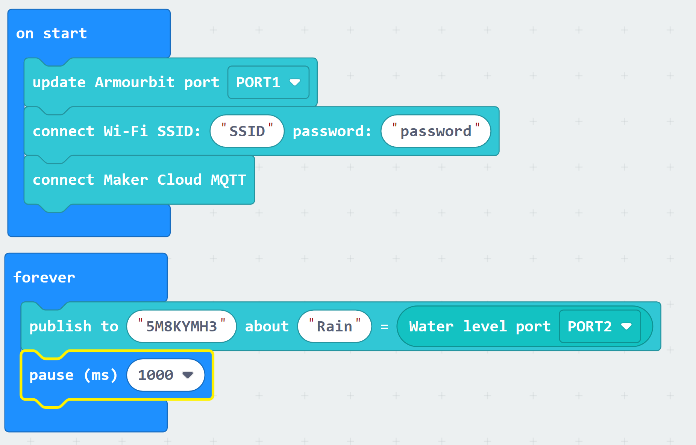

# Exploring the Event Trigger Feature in MakerCloud

[TOC]

### Creating an Event Trigger Applet

Create a project.

Click the "Event Trigger" Tab on the right. If you have not created an applet yet, you will be prompted to create one. 
Enter a name for the applet, and add the blocks that you want to use. When you are finished, click "Create" at the bottom to create your applet.

### Using and Customizing Event Trigger Applets

##### Triggers
You can add three different riggers to your event trigger applet:

- **MQTT Trigger:** this triggers the applet whenever a message is sent to the selected topic
- **Webhook Trigger:** this triggers the applet whenever the named webhook is activated
- **AI Trigger:** this has three subdivisions:
1. _Dialogflow Trigger:_ this triggers the applet whenever the named Dialogflow Intent is triggered
2. _Object Detection:_ this triggers the applet whenever the selected object is detected using MakerCloud's AI Object Detection
3. _Face Detection:_ this triggers the applet whenever a face is detected using MakerCloud's AI Face Detection
    

    
##### Logic
You can add MQTT-based if/then logic to your applet. 

- Using Condition 1, you can check the contents of a general MQTT message on a topic using a variety of comparators.
- Using Condition 2, you can check the contents of a message on a topic and data type using a variety of comparators. You can check the contents of key-value messages or simple messages sent to the selected data type.
  

- By Selecting "Add to same level", you can add it to the base level of logic.
- By selecting "Add to sub level", you can create a sub level of logic to increase the detail of your applet. When you add a second statement or sub level, click "AND" to switch between an and statement and an or statement. 
- Here is an example of an applet using logic where it uses a sub level to employ an "and" statement inside an or statement.

##### Action/Response
You can add two different actions and one response to your event trigger applet:

- IFTTT Action: this activates the named IFTTT webhook with the specified values in the optional message.
- MQTT Action: this publishes a simple of key-value message to the selected topic.
- HTTP Response: this sends a simple or key-value http message.

## Exercise: Connect Smart Devices with Event Trigger

**Goal:** to establish a connection between a Powerbrick Smart Lamppost and a Powerbrick Smart Hanger using two Event Trigger applets on MakerCloud

##### 1. Preparation on MakerCloud
Create a project and two topics on MakerCloud (one of the topics will be for the lamppost, and the other will be for the hanger). Open a new event trigger applet.

##### 2. Powerbrick Construction
Construct a powerbrick smart lamppost, as well as the powerbrick smart hanger.

Here is an example for a smart lamppost:

{:width="50%"}

{:width="50%"}

{:width="50%"}

{:width="50%"}

Please view the instructions for the smart hanger here:

#### 3. Programming on MakeCode:

###### 3.1 Programming for Smart Lamppost:
Program the lamppost to constantly publish rain data to MakerCloud

###### 3.2 Programming for Smart Hanger:
Program the hanger to open and close based on messages it receives from MakerCloud

#### 4. Programming the Applets on MakerCloud:

###### 4.1 Program an "Opening" applet that: 

- Triggers when it receives a key-value message on the "Rain" data type that your lamppost is publishing to.
- Uses logic to check if the rain level is above a threshold and:
  - Sends an "open" message to the hanger topic the rain level is under the threshold

###### 4.2 Program a "Closing" applet that:

- Triggers when it receives a key-value message on the "Rain" data type that your lamppost is publishing to.
- Uses logic to check if the rain level is above a threshold and:
  - Sends a "close" message to the lamppost topic if the rain level is above the threshold

Note that there must be two topics, one for the hanger and one for the lamppost. They cannot operate on the same topic.

This should connect the smart lamppost and smart hanger; here is an example of what it should look like:

