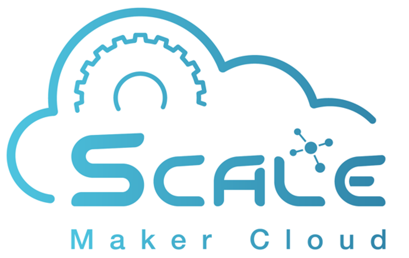

# MakerCloud MakerCloud
{:width="40%"}
#[https://makercloud.io/](https://makercloud.io/)
Maker Cloud is an IoT integration platform independently developed by SCALE Innotech Limited. Through a simple and easy-to-use interface, students can easily create smart applications, build technological skills and understand the concepts of system design.

#### Table of Contents
- [Getting started](ch0_registration/register.md)
- [Project](ch1_project/project.md)

**Connect to Maker Cloud**

- [Introduction to MQTT](ch2_MQTT/mqtt.md)
- [Topics](ch3_Topic/topic.md)
- [Using BBC micro:bit to connect to Maker Cloud](ch4_connect/microbit/connect_microbit.md)
- [Using App Inventor 2 to connect to Maker Cloud](ch4_connect/ai2/connect_ai2.md)
- [Using Python to connect to Maker Cloud](ch4_connect/python/connect_python.md)
- [Using M5Stack to connect to Maker Cloud](ch4_connect/m5stack/connect_m5stack.md)

**Release**

- [Publishing from MakerCloud](ch5_publish/makercloud/makercloud.md)
- [Using BBC micro:bit to publish messages](ch5_publish/microbit/publish_microbit.md)
- [Using App Inventor 2 to publish messages](ch5_publish/ai2/publish_ai2.md)
- [Publishing messages using Python](ch5_publish/python/publish_python.md)
- [Using M5Stack to publish messages](ch5_publish/m5stack/publish_m5stack.md)

**Subscription**

- [Subscribing to topics using BBC micro:bit](ch6_subscribe/microbit/subscribe_microbit.md)
- [Subscribing to topics using App Inventor 2](ch6_subscribe/ai2/subscribe_ai2.md)
- [Subscribing to topics using Python](ch6_subscribe/python/subscribe_python.md)
- [Subscribing to topics using M5Stack](ch6_subscribe/ai2/subscribe_ai2.md)

**MakerCloud - Widgets**
