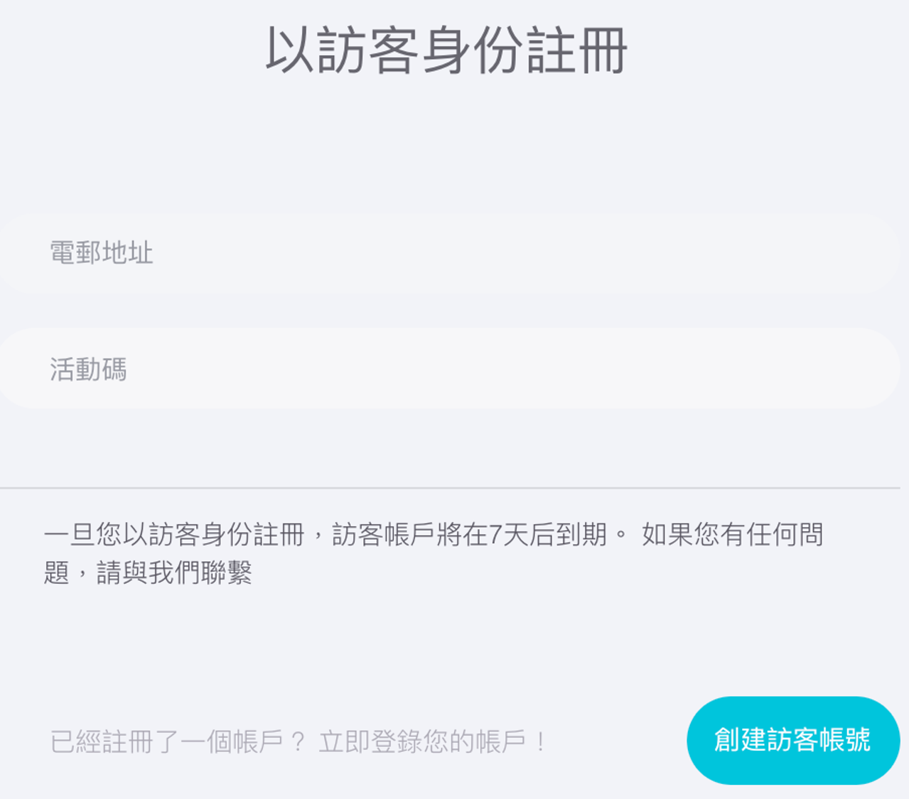
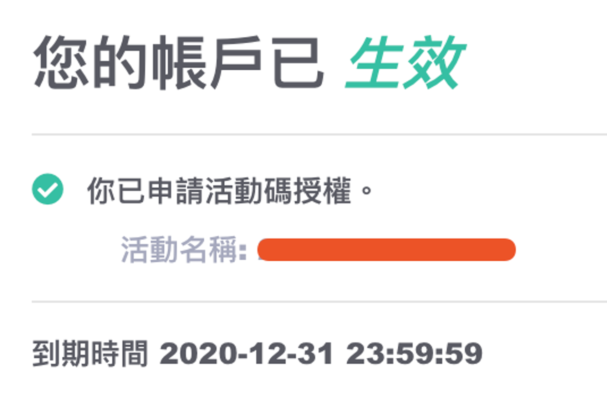
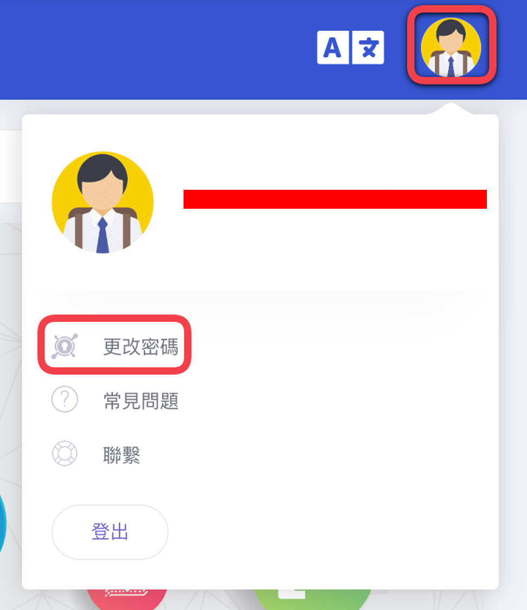

# 開始使用
[TOC]

## 使用授權碼註冊MakerCloud
前往MakerCloud主頁並按下“註冊賬戶”按鈕  
[https://makercloud.scaleinnotech.com/]()  
{:width="60%"}

選擇“以授權碼註冊帳戶”  
{:width="60%"}

輸入“電郵地址”及“授權碼”，然後按下“創建訪客帳號”  
建議做用Google服務的電郵地址註冊，日後登入都較為方便  
{:width="60%"}

成功創建帳號後，你可以查閱授權碼的詳細資料  
{:width="40%"}

## 使用活動碼註冊MakerCloud
前往MakerCloud主頁並按下“註冊賬戶”按鈕  
[https://makercloud.scaleinnotech.com/]()  
{:width="60%"}

選擇“以活動碼註冊帳戶”  
{:width="60%"}

輸入“電郵地址”及“活動碼”，然後按下“創建訪客帳號”  
建議做用Google服務的電郵地址註冊，日後登入都較為方便  
{:width="60%"}

成功創建帳號後，你可以查閱活動碼的詳細資料  
{:width="40%"}

## 更改密碼
如果你是使用Google帳戶註冊，只要在主頁使用Google登錄便可，無須更改密碼  
{:width="60%"}

非Google註冊者，可在加上角的頭像打開選單，然後選擇“更改密碼”  
{:width="60%"}

如你是第一次使用並沒有現有密碼，請把“現有密碼”留空  
{:width="60%"}

## 登入MakerCloud
如果你是使用Google帳戶註冊，只要在主頁使用Google登錄便可，無須使用密碼  
{:width="60%"}

非Google的使用者，可輸入用戶名稱即電郵地址各密碼登入  
{:width="60%"}